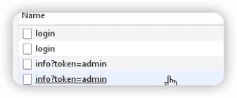

谷粒学苑
------

[尚硅谷_谷粒学苑-微服务+全栈在线教育实战项目](https://www.bilibili.com/video/BV1dQ4y1A75e)

```
Java基础

JDBC MySQL

JavaWeb

SSM

Java高级：Redis Nginx Maven Git 

SpringBoot
```


> 开启前提：
>
> 开启MySQL
>
> 配置Nginx，并开启
>
> 启动前端项目
>
> 启动后端项目
>

> [vue-element-admin](https://panjiachen.gitee.io/vue-element-admin-site/zh/)

---

> Day1

## 1 项目介绍

### 1.1 项目背景

#### 什么是在线教育

所有人离不开教育：早期教育、课外辅导、少儿英语、职业教育、出国留学、商学院、移民服务....而在信息化爆发式发展的趋势下，在线教育越来越凸显出优势：

1. 在线教育可以突破时间和空间的限制，提升了学习效率；
2. 在线教育可以跨越因地域等方面造成的教育资源不平等分配，使教育资源共享化，降低了学习的门槛。

基于在线教育的特点和优势，网络学校受到越来越多人的认可，各类新兴的网校及相关网站也不断涌现。显然，这代表着网校已经逐渐走进大众的生活并成为一种学习的主流趋势。因此很多人开始选择在线教育，特别是白领一族和大学生们。仅2012年一年，中国在线教育市场份额已经达到722亿元。

#### 在线教育是个行业分类

母婴  中国两类人的前最好赚妇女和儿童

学前教育

少儿外语

中小学生

高校学生

留学

职业考试

职业技能   [51CTO学堂](https://edu.51cto.com/)

成人外语

个人兴趣 美食杰


### 1.2 项目采用的商业模式

#### 在线教育的常见八种商业模式

1. C2C（Consumer To Consumer）

51cto

腾讯课堂

2. **B2C**（Business To Consumer）常用

https://www.imooc.com/

两个角色：管理员（添加、修改、删除）和普通用户（查询）

在线教育的核心模块：**课程模块**

3. **B2B2C**（商家到商家到用户）常用

电商平台常用模式

京东：自营 - 普通商家 - 普通用户


4. 垂直领域

51cto的微职位

网易云课堂的微专业

5. 直播、互动

学而思

6. 1对1

7. O2O（Online To Offline，线上到线下）

8. freeminum（免费增值）

学堂在线：课程免费，如果需要课程认证支付费用


### 1.3 项目实现的功能模块

**B2C模式**

**系统后台：管理员使用**：

1. 讲师管理模块

2. 课程分类管理模块

3. **课程管理模块**。

   添加、视频、描述、小节等等。

4. 统计分析模块

   课程使用情况（购买量、播放量），使用图标展示；注册人数、登录人数等。

5. 订单管理

6. banner管理

   幻灯片（或轮播图）

7. 权限管理

**系统前台：普通用户使用**：

1. 首页数据显示

2. 讲师列表和详情

3. 课程列表和课程详情

   视频在线播放，评论

4. 登录和注册

5. 微信扫码登录

6. 微信扫码支付


### 1.4 项目使用的技术

前后端分离开发

- 后端技术：

​	SpringBoot、SpringCloud、MyBatisPlus、Spring Security

​	Redis、Maven、easyExcel、jwt、OAuth2

- 前端技术：

​	Vue、element-ui、axios、nodejs

- 其它技术：

​	阿里云oss、阿里云视频点播服务、阿里云短信服务

​	微信支付和登录

​	docker

​	Jenkins

​	git


## 2 MyBatisPlus

https://baomidou.com/

MyBatis-Plus (opens new window)（简称 MP）是一个 MyBatis (opens new window)的增强工具，在 MyBatis 的基础上只做增强不做改变，为简化开发、提高效率而生。

### 基本使用

1. 建表

2. 建项目 springboot 2.2.1

3. 引入相关依赖  com.baomidou

3. idea安装lombok插件

4. 配置配置文件 application.properties

6. 编写代码 

   - MP提供的BaseMapper省去了mybatis中xml的编写，它提供了很多操作数据库的方法：

   ```java
   public interface BaseMapper<T> {
       int insert(T var1);
   
       int deleteById(Serializable var1);
   
       int deleteByMap(@Param("cm") Map<String, Object> var1);
   
       int delete(@Param("ew") Wrapper<T> var1);
   
       int deleteBatchIds(@Param("coll") Collection<? extends Serializable> var1);
   
       int updateById(@Param("et") T var1);
   
       int update(@Param("et") T var1, @Param("ew") Wrapper<T> var2);
   
       T selectById(Serializable var1);
   
       List<T> selectBatchIds(@Param("coll") Collection<? extends Serializable> var1);
   
       List<T> selectByMap(@Param("cm") Map<String, Object> var1);
   
       T selectOne(@Param("ew") Wrapper<T> var1);
   
       Integer selectCount(@Param("ew") Wrapper<T> var1);
   
       List<T> selectList(@Param("ew") Wrapper<T> var1);
   
       List<Map<String, Object>> selectMaps(@Param("ew") Wrapper<T> var1);
   
       List<Object> selectObjs(@Param("ew") Wrapper<T> var1);
   
       IPage<T> selectPage(IPage<T> var1, @Param("ew") Wrapper<T> var2);
   
       IPage<Map<String, Object>> selectMapsPage(IPage<T> var1, @Param("ew") Wrapper<T> var2);
   }
   ```

   - SpringBoot启动会寻找接口实现类的对象，但使用MP后没有实现类了，因此要在springboot启动类上加上一个注解 `@MapperScan("com.andyron.mpdemo.mapper")`
   - 在UserMapper上加上注解`@Repository`，就是把对象声明一下，防止之后使用时报错

6. 测试 


#### 查看MyBatis的SQL输出日志

就是输出最终生成的SQL语句

```properties
# mybatis的SQL输出日志
mybatis-plus.configuration.log-impl=org.apache.ibatis.logging.stdout.StdOutImpl
```

```
==>  Preparing: SELECT id,name,age,email FROM user
==> Parameters: 
<==    Columns: id, name, age, email
<==        Row: 1, andy222, 18, yyyyy@qq.com
<==        Row: 2, Jack, 20, test2@baomidou.com
<==        Row: 3, Tom, 28, test3@baomidou.com
<==        Row: 4, Sandy, 21, test4@baomidou.com
<==        Row: 5, Billie, 24, test5@baomidou.com
<==      Total: 5
```

#### 添加操作

MP自动生成19位的ID

#### 修改操作


#### 简单id查询

#### id批量查询

#### 简单条件查询


#### 简单id删除

#### id批量删除

#### 简单条件删除


### 主键的生成策略

#### 1 数据库自动增长

优点：

1. 简单，性能可接受
2. 数字ID天然排序，对分页或排序有帮助

缺点：

1. 不同数据库语法和实现不同，数据库迁移的时候或多数据库版本支持的时候需要处理。
2. 在单个数据库或读写分离或一主多从的情况下，只有一个主库可以生成。有单点故障的风险。
3. 在性能达不到要求的情况下，比较难于扩展。（不适用于海量高并发）
4. 如果遇见多个系统需要合并或者涉及到数据迁移会相当痛苦。
5. 分表分库的时候会有麻烦。
6. 并非一定连续，类似MySQL，当生成新ID的事务回滚，那么后续的事务也不会再用这个ID了。这个在性能和连续性的折中。如果为了保证连续，必须要在事务结束后才能生成ID，那性能就会出现问题。
7. 在分布式数据库中，如果采用了自增主键的话，有可能会带来尾部热点。分布式数据库常常使用range的分区方式，在大量新增记录的时候，IO会集中在一个分区上，造成热点数据。

优化方案：

针对主库单点，如果有多个Master库，则每个Master库设置的起始数字不一样，步长一样，可以是Master的个数。比如：Master1 生成的是 1，4，7，10，Master2生成的是2,5,8,11 Master3生成的是 3,6,9,12。这样就可以有效生成集群中的唯一ID，也可以大大降低ID生成数据库操作的负载。

#### 2 UUID  

每次随机生成一个唯一值。

排序不方便

#### 3 Redis  

通过redis的原子操作incr，incrby

#### 4 雪花算法  

19位数字

MP自带策略 


雪花算法的原理就是生成一个的 64 位比特位的 long 类型的唯一 id。

指定策略是在主键上添加注解：

```java
	@TableId(type = IdType.ID_WORKER)
    private Long id;
```

```java
public enum IdType {
    AUTO(0),  // 数据库自动增长
    NONE(1),	// 没有，需要自己处理
    INPUT(2), // 需要主动输入
    ID_WORKER(3),		// 雪花算法生成19位得数字
    UUID(4),		
    ID_WORKER_STR(5); // 雪花算法生成19位得字符串

}
```

### 自动填充

1. 数据库添加字段create_time，update_time

2. 实体类添加属性createTime，updateTime

3. 为实体类自动填充属性添加注解

   ```java
   		@TableField(fill = FieldFill.INSERT)
       private Date createTime;
       @TableField(fill = FieldFill.INSERT_UPDATE) // 插入和更新都填充值
       private Date updateTime;
   ```

4. 实现接口MetaObjectHandler

### 乐观锁

乐观锁是解决特定问题的一种解决方案，主要解决**==丢失更新==**

> 数据库中如果不考虑事务隔离性，会产生
>
> - 读问题：**脏读、不可重复读、幻读**，
>
> - 写问题：丢失更新问题（多个人同时修改同一条记录，最后提交的把之前的提交数据覆盖）。
>
> 

丢失更新问题的解决方案：

- 悲观锁（一般不用）： 串行。一个人操作时，其他人都不能操作。

- 乐观锁 `version`

​	乐观锁的现实应用：买票时，每个人都能看到剩余的一张票，但只有一个人能支付成功。


如果lucy在mary开始事务之前修改了数据（version变为2），那么mary获取的数据版本（1）和数据库中版本（2）不同，就不能再修改。

MP中乐观锁具体实现：

1. 数据库添加字段version

2. 实体类加对应字段

3. `@Version`

4. 配置乐观锁插件 `OptimisticLockerInterceptor`

   ```java
   @Configuration
   @MapperScan("com.andyron.mpdemo.mapper")
   public class MPConfig {
       @Bean
       public OptimisticLockerInterceptor optimisticLockerInterceptor() {
           return new OptimisticLockerInterceptor();
       }
   }
   ```

> 把在启动类中MP用于寻找mapper接口实现类的注解（`@MapperScan`），移到专门用于配置MP的配置类上。


### 分页

类似PageHelper

1. 配置分页插件

2. 编写分页代码

   ```java
   // 创建分页对象，参数：当前页，每页记录数
   Page<User> page = new Page<>(1, 3);
   // 查询结果所有数据都会被封装到page对象里
   userMapper.selectPage(page, null);
   
   // 通过page对象获取分页数据
   System.out.println(page.getCurrent());
   System.out.println(page.getRecords());  // 没页数据list集合
   System.out.println(page.getSize());
   System.out.println(page.getTotal());
   System.out.println(page.getPages());  // 总页数
   System.out.println(page.hasNext());  // 是否有下页
   System.out.println(page.hasPrevious());
   ```
   
   

### 逻辑删除

物理删除，逻辑删除

1. 表中添加字段deleted，实体类中添加对应属性。(默认值可以在数据库表设置，也可以通过MP中自动填充接口MetaObjectHandler实现)。

2. `@TabelLogic`

   ```java
   @TableLogic
       private Integer deleted;
   ```

3. 配置文件配置逻辑删除参数，mp默认1是删除，0是未删除，如果与默认值相同就不需要添加配置。

    ```properties
    mybatis-plus.global-config.db-config.logic-delete-value=1
    mybatis-plus.global-config.db-config.logic-not-delete-value=0
    ```

4. 配置逻辑删除插件`ISqlInjector`

    ```java
    @Bean
    public ISqlInjector sqlInjector() {
      return new LogicSqlInjector();
    }
    ```

5. 测试。删除操作语句不变

   ```java
   System.out.println(userMapper.deleteById(1539063991684653057l));
   ```

   ```
   ==>  Preparing: UPDATE user SET deleted=1 WHERE id=? AND deleted=0
   ==> Parameters: 1539063991684653057(Long)
   <==    Updates: 1
   ```

>  要查询已经逻辑删除的，要自己写SQL。


### 性能分析插件

用于输出每条SQL语句及其执行时间。

> 一般项目中有三种环境
>
> dev 开发环境
>
> test 测试环境
>
> prod 生产环境

配置插件：

```java
    /**
     * SQL性能分析插件。以红色输出每条SQL语句及其执行时间
     * 开发测试环境使用
     */
    @Bean
    @Profile({"dev", "test"})
    public PerformanceInterceptor performanceInterceptor() {
        PerformanceInterceptor performanceInterceptor = new PerformanceInterceptor();
        performanceInterceptor.setMaxTime(200);  // sql执行时间超过200ms就不执行了
        performanceInterceptor.setFormat(true);  // 是否对输出的sql格式化
        return performanceInterceptor;
    }
```

如果超过了指定时间就会报错：

```
org.mybatis.spring.MyBatisSystemException: nested exception is org.apache.ibatis.exceptions.PersistenceException: 
### Error querying database.  Cause: com.baomidou.mybatisplus.core.exceptions.MybatisPlusException:  The SQL execution time is too large, please optimize ! 
```

### 复杂一点条件查询


使用QueryWrapper构建条件

```java
QueryWrapper<User> wrapper = new QueryWrapper<>();

        // ge gt le lt
        // 查询age>=30
//        wrapper.ge("age", 30);

        // eq ne
//        wrapper.eq("name", "Andy");
//        wrapper.ne("name", "Andy");

        // between
//        wrapper.between("age", 20, 30);

        // like
//        wrapper.like("name", "J");

        // 排序
//        wrapper.orderByDesc("id");

        // last 在最后拼接一段SQL语句
        wrapper.last("limit 1");

        // 指定查询的列
        wrapper.select("id", "name");

        System.out.println(userMapper.selectList(wrapper));
    }
```


> 第二天


## 3 初始化项目

### 前后端分离开发概念


后端使用Java语言开发，开发IDE使用IDEA；

前端使用Vue，开发IDE使用VSCode。


crud

### 创建数据库guli

创建表`edu_teacher`

**数据库设计规约**（参考《阿里巴巴Java开发手册》）

- 表必备三字段：**id、gmt_create、gmt_modified**

G.M.T.(Greenwich Mean Time)格林威治标准时间

### 创建项目结构

为了开发时思路清晰。


模块说明：

```
guli_parent： 在线教学根目录（父工程），管理四个子模块：
	canal-client： canal数据库表同步模块（统计同步数据）
	common： 公共模块父节点
    common-util：工具类模块，所有模块都可以依赖于它
    service-base: service服务的base包，包含service服务的公共配置类，所有service模块依赖于它
    spring-security：认证与授权模块，需要认证授权的service服务依赖于它
  infrastructure：基础服务模块父节点
    api-gateway： api网关服务
  service: api接口服务父节点  
  	service-acl： 用户权限管理api接口服务（用户管理、角色管理和权限管理等）
    service-cms： cms api接口服务
    service-edu：教学相关api接口服务
    service-msm：短信api接口服务
    service-order：订单相关api接口服务
    service-oss：阿里云oss api接口服务
    service-statistics：统计报表api接口服务
    service-ucenter：会员api接口服务
    service-vod： 视频点播api接口服务
```

父工程的pom文件用来统一管理依赖，`<dependencyManagement>`标签中的包只是作为管理对象，并不会直接引入，实际引入在子模块中pom文件中。

```xml
	<properties>
        <java.version>1.8</java.version>
        <guli.version>0.0.1-SNAPSHOT</guli.version>
        <mybatis-plus.version>3.0.5</mybatis-plus.version>
        <velocity.version>2.0</velocity.version>
        <swagger.version>2.7.0</swagger.version>
        <aliyun.oss.version>2.8.3</aliyun.oss.version>
        <jodatime.version>2.10.1</jodatime.version>
        ...
    </properties>
		<dependencyManagement>
        <dependencies>
            <!--Spring Cloud-->
            <dependency>
                <groupId>org.springframework.cloud</groupId>
                <artifactId>spring-cloud-dependencies</artifactId>
                <version>Hoxton.RELEASE</version>
                <type>pom</type>
                <scope>import</scope>
            </dependency>

            <dependency>
                <groupId>org.springframework.cloud</groupId>
                <artifactId>spring-cloud-alibaba-dependencies</artifactId>
                <version>${cloud-alibaba.version}</version>
                <type>pom</type>
                <scope>import</scope>
            </dependency>
            <!--mybatis-plus 持久层-->
            <dependency>
                <groupId>com.baomidou</groupId>
                <artifactId>mybatis-plus-boot-starter</artifactId>
                <version>${mybatis-plus.version}</version>
            </dependency>
          	...
      </dependencies>
		</dependencyManagement>
```

有子模块的pom文件中还需要添加：

```xml
<packaging>pom</packaging>
```


## 4 讲师管理模块（后端）

### 1 模块service_edu中创建配置文件


### 2 使用MP代码生成功能，生成controller service mapper代码内容

```xml
        <!-- velocity 模板引擎, Mybatis Plus 代码生成器需要 -->
        <dependency>
            <groupId>org.apache.velocity</groupId>
            <artifactId>velocity-engine-core</artifactId>
        </dependency>
```


mp中的BaseMapper、IService


### 3 项目开始

1. 创建controller

2. 创建启动类EduApplication

3. 创建配置类，配置扫描mapper和其它配置

4. 启动、测试

5. 默认时间返回格式是

```
"gmtModified":"2019-10-30T03:53:03.000+0000"
```

统一返回的json时间格式，配置文件中添加：

```yaml
spring:
  jackson:
    # 返回JSON的全局时间格式
    date-format: yyyy-MM-dd HH:mm:ss
    time-zone: GMT+8
```


#### 讲师逻辑删除功能

1. 配置逻辑插件

   ```java
       @Bean
       ISqlInjector sqlInjector() {
           return new LogicSqlInjector();
       }
   ```

   

2. 在对应属性加注解

   ```java
   		@TableLogic
       private Integer isDeleted;
   ```

   

3. 编写controller方法

   ```java
   @DeleteMapping("{id}")
   public boolean removeTeacher(@PathVariable String id) {
     boolean flag = teacherService.removeById(id);
     return flag
   }
   ```

4. 如何测试？
   - swagger测试
   - postman

#### 整合swagger

swagger的作用：

- 生成在线接口文档

- 进行接口测试

整合步骤：

1. 建立公共模块common，再在其下面建立子模块service_base，创建Swagger的配置类。（放到公共模块中，让其他模块也能使用）

   ```java
   @Configuration
   @EnableSwagger2
   public class SwaggerConfig {
   
       @Bean
       public Docket webApiConfig() {
           return new Docket(DocumentationType.SWAGGER_2)
                   .groupName("webApi")
                   .apiInfo(webApiInfo())
                   .select()
                   .paths(Predicates.not(PathSelectors.regex("/admin/.*")))  // 路径中包括admin、error的不显示
                   .paths(Predicates.not(PathSelectors.regex("/error.*")))
                   .build();
       }
   
       private ApiInfo webApiInfo() {
           return new ApiInfoBuilder()
                   .title("网站-课程中心API文档")
                   .description("本文档描述了课程中心微服务接口定义")
                   .version("1.0")
                   .contact(new Contact("AndyRon", "http://andyron.com", "rongming.2008@163.com"))
                   .build();
       }
   }
   ```

2. 在模块service_edu中，要使用其它模块代码，就要在pom文件中引入：

    ```xml
    <!-- 引入service_base模块，然后才能使用其中代码功能 -->
    <dependency>
      <groupId>com.andyron</groupId>
      <artifactId>service_base</artifactId>
      <version>0.0.1-SNAPSHOT</version>
    </dependency>
    ```

    并且要在service_edu的启动类上添加组件扫描：

    ```java
    // 为了能使用service_base模块中的功能，要指定扩大扫描区域，指定扫描规则，默认只扫描当前模块下的类
    @ComponentScan(basePackages = {"com.andyron"})
    public class EduApplication {
    ...
    ```

3. 访问swagger  http://localhost:8001/swagger-ui.html


几个注解让swagger说明更仔细，

- @Api  定义在类上

- @ApiOperation  定义在方法上

- @ApiParam  定义在参数上


<font color=#FF263D>注意：报错</font>，提示引入不到其它模块下的swagger配置，如果把swagger放在本模块的启动类里配置，是没有问题的。

```
Unable to infer base url. This is common when using dynamic servlet registration or when the API is behind an API Gateway. The base url is the root of where all the swagger resources are served. For e.g. if the api is available at http://example.org/api/v2/api-docs then the base url is http://example.org/api/. Please enter the location manually: 
```

无意中解决：先把原来swagger的版本2.7换成2.10，然后再换回来，就解决了


### 4 统一返回数据格式

JSON数据格式的两种形式：**对象，数组**。一般混合使用。

列表：

```json
{
  "success": true,
  "code": 20000,
  "message": "成功",
  "data": {
    "total": 17,
    "items": [
      {},
      ...
    ]
  }
}
```

分页数据：

```json
{
  "success": true,
  "code": 20000,
  "message": "成功",
  "data": {
    "total": 17,
    "rows": [
      {},
      ...
    ]
  }
}
```

没有返回数据：

```json
{
  "success": true,
  "code": 20000,
  "message": "成功",
  "data": {}
}
```

失败：

```json
{
  "success": false,
  "code": 20001,
  "message": "失败",
  "data": {}
}
```

统一定义的结果：

```json
{
  "success": 布尔,
  "code": 数字,
  "message": 字符串,
  "data": HashMap
}
```


1. 创建common模块中，common_utils子模块
2. 创建返回码接口ResultCode
3. 统一返回结果类 R
4. 在service模块中引入common_utils
4. 修改controller中返回结果，都改为R


### 讲师分页功能

1. 配置mp分页插件
2. 编写讲师分页查询


### 条件查询

**多条件组合**查询带分页


1. 把条件值传递到接口

​	把条件值封装到对象（TeacherQuery）里面，把对象传递到接口（**VO**，View Object，显示层对象）

2. 根据条件值进行判断，拼接条件

   现在前端传输数据时，每个条件都会作为一个参数。实际开发中，使用`@RequestBody`注解 (必须是POST)更加方便，让所有条件参数作为一个json参数传输，

   ```java
   @RequestBody(required = false) TeacherQuery teacherQuery) { // false表示这个参数可以为空
   ```

   

> @RequestBody，使用JSON传递数据，把json数据封装到对应对象里面 
>
> @ResponseBody，返回json数据

> 实际开发中会把这些条件构建部分等都放到service（业务逻辑层），而不是controller。

### 添加讲师

自动填充：

1. 在相应实体类属性上添加注解`@TableField` 

2. 在service_base模块找添加一个自动填充类

   ```java
   @Component
   public class MyMetaObjectHandler implements MetaObjectHandler {
       @Override
       public void insertFill(MetaObject metaObject) {
           // 属性名称，不是数据库字段名称
           this.setFieldValByName("gmtCreate", new Date(), metaObject);
           this.setFieldValByName("gmtModified", new Date(), metaObject);
       }
   
       @Override
       public void updateFill(MetaObject metaObject) {
           this.setFieldValByName("gmtModified", new Date(), metaObject);
       }
   }
   
   ```

3. 添加接口方法

   ```java
       @ApiOperation("讲师添加")
       @PostMapping("addTeacher")
       public R addTeacher(@RequestBody EduTeacher eduTeacher) {
           boolean save = teacherService.save(eduTeacher);
           if (save) {
               return R.ok();
           } else {
               return R.error();
           }
       }
   ```

   > 注意：传递参数eduTeacher的json中，id、两个时间字段不需要。


### 讲师修改

1. 根据讲师id查询
2. 讲师修改， 测试是JSON中需要有id


### 统一异常处理

没有统一处理异常处理的情况：


在common模块中建立统一异常处理：

```java
@ControllerAdvice
public class GlobalExceptionHandler {

    // 指定出现扫描异常执行这个方法
    @ExceptionHandler(Exception.class)
    @ResponseBody // 为了返回数据，在controller有@RestController表示有返回值，其实@RestController也被@ResponseBody注解了
    public R error(Exception e) {
        e.printStackTrace();
        return R.error().message("执行了全局异常处理");
    }
  
} 
```

@ControllerAdvice

@ExceptionHandler

> @ControllerAdvice介绍
>
> - `ControllerAdvice`本质上是一个`Component`，因此也会被当成组件扫描。它是aop思想的一种实现，根据规则进行拦截处理。
>
> - @ControllerAdvice提供了很多规则指定方式，默认是advice所有的Controller。
>
> - `@ControllerAdvice("org.my.pkg")` 或者`@ControllerAdvice(basePackages={"org.my.pkg", "org.my.other.pkg"})`，则匹配指定包及其子包下的所有`Controller`。
>
> - 可通过指定注解来匹配。
>
>   比如自定义一个注解`CustomAnnotation`，那么`@ControllerAdvice（annotations={CustomAnnotation.class})`就表示匹配所有被这个注解修饰的Controller。
>
> 三种用法：
>
> 1. 处理全局异常
>
>    ```java
>    @ControllerAdvice
>    public class GlobalExceptionHandler {
>    ```
>
> 2. 预设全局数据
>
>    配合 `@ModelAttribute` 预设全局数据
>
> 3. 请求参数预处理
>
>     配合 `@InitBinder` 实现对请求参数的预处理


>  注意pom文件中模块之间不要重复引用，**依赖传递**（Maven）
>
> 


1. 全局异常处理（上面的）

2. 特定异常处理（根据特定异常给与特定的输出）。 机制：**先找特定异常处理，没有，再找全局异常处理。**

   ```java
       // 特定异常处理
       @ExceptionHandler(ArithmeticException.class)
       @ResponseBody
       public R error(ArithmeticException e) {
           e.printStackTrace();
           return R.error().message("执行了ArithmeticException异常处理");
       }
   ```

3. 自定义异常处理

   - 第一步，创建自定义异常类继承RuntimeException，写异常属性

   - 第二步，再统一异常类添加规则

     ```java
     @ExceptionHandler(GuliException.class)
     @ResponseBody
     public R error(GuliException e) {
       e.printStackTrace();
       return R.error().code(e.getCode()).message(e.getMsg());
     }
     ```

   - 第三步，执行自定义异常。自定义异常不是系统自带的异常，系统不会抛出，需要我们手动抛出

     ```java
     try {
       int i = 1/0;
     } catch(Exception e) {
       throw new GuliException(20001, "执行自定义异常处理...");
     }
     ```

     

> 第三天

### 统一日志处理

#### 配置日志级别

日志记录器（Logger）的行为是分等级的：OFF, FATAL, <u>ERROR, WARN, INFO, DEBUG</u>, ALL。低级别的会记录高级别的信息。

```yaml
logging:
  level:
    root: WARN
```

上面的就不会显示INFO级别的信息。

默认只能把日志输出到控制台，如果既想把日志输出到控制台又想输出到文件中，就需要日志工具（log4j、Logback等）。

#### Logback

[Logback manual](https://logback.qos.ch/manual/index.html)

1. 先把之前的日志配置删掉

   ```yaml
   #mybatis-plus:
   #  configuration:
   #    log-impl: org.apache.ibatis.logging.stdout.StdOutImpl
   #
   #logging:
   #  level:
   #    root: INFO  # 设置日志级别，默认就是INFO
   ```

2. 在resource在创建配置文件`logback-spring.xml`(比较固定的配置)

   ```xml
       ...
   		<property name="log.path" value="/Users/andyron/tmp/guili_log"/>
   
       <property name="CONSOLE_LOG_PATTERN"
                 value="%yellow(%date{yyyy-MM-dd HH:mm:ss}) |%highlight(%-5level) |%blue(%thread) |%blue(%file:%line) |%green(%logger) |%cyan(%msg%n)"/>
   		...
   ```

   默认会在指定的目录（guili_log）中生成三个日志文件log_warn.log、log_info.log、log_error.log（多了还会建立不同目录存放）。 

> **将错误日志输出到文件** 
>
> 错误日志不会直接输出到log_error.log文件中，需要配置：
>
> - 在GlobalExceptionHandler类上加上注解`@Slf4j`，
> - 添加异常输出语句`log.error(e.getMessage());`
>
> ```java
> @ControllerAdvice
> @Slf4j
> public class GlobalExceptionHandler {
> ...
>     // 自定义异常处理
>     @ExceptionHandler(GuliException.class)
>     @ResponseBody
>     public R error(GuliException e) {
>         // 把异常信息输出到日志文件中
>         log.error(e.getMessage()); 
>         e.printStackTrace();
>         return R.error().code(e.getCode()).message(e.getMsg());
>     }
> }
> ```
>
> 如果要把更多信息（堆栈信息）输出到文件中，可以自定义工具方法：
>
> ```java
> public class ExceptionUtil {
>     public static String getMessage(Exception e) {
>         StringWriter sw = null;
>         PrintWriter pw = null;
>         try {
>             sw = new StringWriter();
>             pw = new PrintWriter(sw);
>             // 将出错的栈信息输出到PrintWriter中
>             e.printStackTrace(pw);
>             pw.flush();
>             sw.flush();
>         } finally {
>             if (sw != null) {
>                 try {
>                     sw.close();
>                 } catch (IOException e1) {
>                     e1.printStackTrace();
>                 }
>             }
>             if (pw != null) {
>                 pw.close();
>             }
>         }
>         return sw.toString();
>     }
> }
> ```
>
> 用这个方法替代：
>
> ```
> log.error(ExceptionUtil.getMessage(e));
> ```


## 5 前端知识

前端工程师

全栈工程师

PRD（产品原型-产品经理）-PSD（视觉设计-UI工程师）-HTML/CSS/JavaScript（PC/移动端网页，实现网页端的视觉展示和交互-前端工程师）

### Vscode的安装和使用

vs插件：

Live server 内置服务器  右击打开

Vetur  vue工具

#### 创建工作区

1. 在本地创建空文件夹，比如**work01**
2. 使用vscode打开空文件夹
3. 把文件夹保存为工作区【将工作区另存为...】


> 实际，就是在对应目录中创建一个***.code-workspace文件。


### ES6

ECMAScript6，2015-6发布

ECMAScript是一套标准，一套规范，JavaScript很好遵循了这套规范。

#### ECMAScript 和Javascript 的关系

要讲清楚这个向题，需要回顾历史，1996年11 月，Javascript前创造者 Netscape 公司，决定将 Jawascript提交给标准化组织ECMA，希望这种语言能够成为国际标准。次年，ECMA 发布 262 号标准文件（ECMA-262）的第一版，规定了浏览器脚本语言的标准，并将这种语言称为 ECMAScript，这个版本就是1.0版。
因此，ECMAScript 和 JavaScript 的关系是，前者是后者的规格，后者是前者的一种实现（ 另外的 ECMAScript 方言还有Jscript和ActionScript)。

#### ES6和ES5

1. es6代码简洁，es5代码复杂
2. es6浏览器兼容性很差，es5代码浏览器兼容性很好

一般用es6写代码，然后用工具转换成es5在浏览器中运行

#### ES6基本语法

1. var 定义的变量没有范围限制， let 有作用范围

   ```js
   {
     var a = 10
     let b = 20
   }
   console.log(a)
   console.log(b)  // Uncaught ReferenceError: b is not defined
   ```

2. let 不能重复定义

   ```javascript
   var a = 1
   var a = 2
   
   let m = 10
   let m = 20 //  Uncaught SyntaxError: Identifier 'm' has already been declared
   ```

3. const 常量一旦定义，不能改变；定义必须初始化。

   ```javascript
   const PI = "3.1415"
   PI = 3          // Uncaught TypeError: Assignment to constant variable.
   
   const E  // Uncaught SyntaxError: Missing initializer in const declaration
   ```

4. 数组解构（解构赋值）

   ```js
   // 传统写法
   let a=1, b=2, c=3
   
   // es6写法
   let [x, y, z] = [10, 20, 30]
   console.log(x, y, z)
   
   ```

5. 对象解构（解构赋值）

   ```js
   let user = {name: "andy", age: 18}
   // 传统写法
   let name1 = user.name
   let age1 = user.age
   
   // es6写法
   let {name, age} = user // 注意：结构的变量必须是user中的属性
   console.log(name, age)
   ```

#### 模板字符串`

```js
// 1 `实现多行字符串
let st1 = `hello,
es6 demo!`
console.log(st1)
// 2 `可以让字符串中插入变量和表达式。变量名和表达式写在${}中。
let name = "Mike"
let age = 20
let str2 = `hello, ${name}, age is ${age+1}`
console.log(str2)
// 3 `里面也可以调用函数
function f() {
    return "have fun!"
}
let str3 = `Game start, ${f()}`
console.log(str3)

```

#### 声明对象的简写

```js
const age = 12
const name = "andy"

// 传统
const p1 = {age:age, name:name}
console.log(p1)
// ES6
const p2 = {age, name}
console.log(p2)
```

#### 定义方法简写

```js
// 传统方式
const p1 = {
    sayHi: function() {
        console.log("hi")
    }
}
p1.sayHi()
// ES6
const p2 = {
    sayHi(){
        console.log("hello")
    }
}
p2.sayHi()
```

#### 对象拓展运算符

拓展运算符（`...`）用于取出参数对象所有可遍历属性然后拷贝到当前对象。

```js
 // 1 对象复制
 let person1 = {"name": "andy", "age": 15}
 let person2 = {...person1}
 console.log(person2)

 // 2 合并对象
 let age = {age: 12}
 let name = {name: "mary"}
 let p = {...name, ...age}
 console.log(p)
```


#### 箭头函数

箭头函数提供了一个更加简洁的函数书写方式：**参数 => 函数体**。（有点类似Java中的lambta表达式）

```js
// 传统的方式创建方法
var f1 = function(m) {
    return m
}

// es6箭头函数写法
var f2 = m => m
console.log(f2(13))

var f3 = (a, b) => {
    let r = a + b
    return r
}
// 简化
var f4 = (a, b) => a + b
console.log(f3(2, 3))
console.log(f4(2, 3))
```

多用于匿名函数定义是使用


### Vue

#### Vue.js是什么

Vue (读音 /vju:/，类以于 view)是一套用于构建用户界面的渐进式框架。
Vue 的核心库只关注视图层，不仅易于上手，还便于与第三方库或既有项目整台。另一方面，当与现代化的工具键以及各种支持类库结合使用时，Vue 也完全能够为复杂的单页应用提供驱动。

#### 初始化Vue.js

> vscode快速生成html模板文件方法： !+tab；直接打html:5。

1. 创建html

2. 引入vue.js

3. 创建带id的div，`<div id="app"></div>`

4. 编写vue代码，固定结构

   ```html
   <script>
     new Vue({
       el: '#app', // 绑定vue作用的范围
       data: { // 在data定义变量和初始值
         message: "Hello。。。Vue！"
       }
     })
   </script>
   ```

   

Vue的完整固定写法：

```html
    <div id="app">
        <!-- {{}} 插值表达式，绑定vue中的data数据 -->
        {{message}}
    </div>
    <script src="https://unpkg.com/vue/dist/vue.js"></script>
    <script>
        // 创建一个Vue对象
        new Vue({
            el: '#app', // 绑定vue作用的范围
            data: { // 在data定义变量和初始值
                message: "Hello。。。Vue！"
            },
          	created() { // 页面渲染之前执行
              	// 调用定义的方法
              
            },
          	methods: { // 编写具体的方法
            }
        })
    </script>
```

**==插值表达式==**


#### 抽取Vue的代码片段

VSCode中代码简化的快捷方式

> 文件（mac版的是code） -> 首选项 ->  用户代码片段 ->  新建`vue-html.code-snippets`

```json
{
	"vue html": {
		"scope": "html",
		"prefix": "vuehtml",
		"body": [
			"<!DOCTYPE html>",
			"<html lang=\"en\">",
			"",
			"<head>",
			"	<meta charset=\"UTF-8\">",
			"	http-equiv=\"X-UA-Compatible\" content=\"IE=edge\">",
			"	<meta name=\"viewport\" content=\"width=device-width, initial-scale=1.0\">",
			"<title>Document</title>",
			"</head>",
			"<body>",
			"	<div id=\"app\">",
			"	</div>",
			"	<script src=\"vue.min.js\"></script>",
			"	<script>",
			"		new Vue({",
			"			el: '#app',",
			"			data: { ",
			"				$1",
			"			}",
			"		})",
			"	</script>",
			"</body>",
			"</html>"
		],
		"description": "my vue template in html"
	}
}
```


#### Vue基本语法

#####  1 基本数据渲染和指令

单向数据绑定

v-bind指令(指令带有前缀`v-`)

一般用在标签属性里面，获取值。写在属性前面

```html
		<div id="app">
        <h1 v-bind:title="message">
            {{content}}
        </h1>
        <!-- 简写 -->
        <h2 :title="message">
            {{content}}
        </h2>
    </div>
    <script src="vue.min.js"></script>
    <script>
        new Vue({
            el: '#app',
            data: { 
                content: '我是标题',
                message: '页面加载于' + new Date().toLocaleString()
            }
        })
    </script>
```

##### 2 双向数据绑定

v-model

发生变化其它地方也跟着发生变化。

```html
		<div id="app">
        <input type="text" v-bind:value="searchMap.keyWord"></input>
        <br>
        <input type="text" v-model="searchMap.keyWord"></input>

        <p>查询的值：{{searchMap.keyWord}}</p>
    </div>
    <script src="vue.min.js"></script>
    <script>
        new Vue({
            el: '#app',
            data: { 
                searchMap: {
                    keyWord: "AndyRon"
                }
            }
        })
    </script>
```

##### 3 事件

v-on

```html
		<div id="app">
        <!-- vue绑定事件 -->
        <button v-on:click="search()">查询</button>
        <!-- 简写 -->
        <button @click="search()">查询1</button>

    </div>
    <script src="vue.min.js"></script>
    <script>
        new Vue({
            el: '#app',
            data: { 
                searchMap: {
                    keyWord: "AndyRon"
                },
                // 查询结果
                results: {}
            },
            methods: { // 定义方法(可多个)
                search() {
                    console.log("search...")
                }
            }
        })
    </script>
```

##### 4 修饰符

阻止事件原本的默认行为，使用自己定义行为。

例如，`.prevent`修饰告诉v-on指令对于触发的事件调用`event.preventDefault()`

```html
		<div id="app">
        <form action="save" v-on:submit.prevent="onSubmit()">
            <input type="text" id="name" v-model="user.username" />
            <button type="submit">保存</button>
        </form>
    </div>
    <script src="vue.min.js"></script>
    <script>
        new Vue({
            el: '#app',
            data: { 
                user: {}
            },
            methods: {
                onSubmit() {
                    if (this.user.username) {
                        console.log('提交表单')
                    } else {
                        alert("请输入用户名")
                    }
                }
            }
        })
    </script>
```

##### 5 条件渲染

v-if

v-else

> v-show 类似v-if，但v-if是惰性加载，v-show不是效率差，一般不用

```html
		<div id="app">
        <input type="checkbox" v-model="ok">是否选中</input>
        <h1 v-if="ok">AndyRon</h1>
        <h1 v-else>andyron</h1>
    </div>
    <script src="vue.min.js"></script>
    <script>
        new Vue({
            el: '#app',
            data: { 
                ok: false
            }
        })
    </script>
```

##### 6 列表渲染

v-for

简单列表渲染：

```html
<div id="app">
  <ul>
    <li v-for="n in 10">{{n}}</li>
  </ul>
  <ul>
    <li v-for="(n, index) in 10">{{n}} -- {{index}}</li>
  </ul>
</div>
```

遍历数据列表：

```html
<div id="app">
  <table>
    <tr v-for="user in userList">
      <td>{{user.id}}</td>
      <td>{{user.username}}</td>
      <td>{{user.age}}</td>
    </tr>
  </table>
</div>
<script src="vue.min.js"></script>
<script>
  new Vue({
    el: '#app',
    data: { 
      userList: [
        {id: 1, username: 'andy', age: 18},
        {id: 2, username: 'tom', age: 28},
        {id: 3, username: 'jack', age: 38}
      ]
    }
  })
</script>
```

#### Vue组件（重点）

组件（Component）是Vue.js最强大的功能之一。

组件可以**扩展**HTML元素，封装可重用的代码。

组件系统让我们可以独立可复用的小组件来构建大型应用，几乎任意类型的应用的界面都可以抽象为一个组件树：


##### 局部组件

只能在当前文件中有效。Navbar可看着是自定义HTML元素（扩展）。

```html
		<div id="app">
        <Navbar></Navbar>
    </div>
    <script src="vue.min.js"></script>
    <script>
        new Vue({
            el: '#app',
            // 定义vue使用的组件
            components: { 
                'Navbar': {
                    template: '<ur><li>首页</li><li>学员管理</li></ur>'
                }
            }
        })
    </script>
```

##### 全局组件

```javascript
// 定义全局组件
Vue.component('Navbar', {
    template: '<ur><li>首页</li><li>学员介绍</li></ur>'
})
```

```html
<div id="app">
  <Navbar></Navbar>
</div>
<script src="vue.min.js"></script>
<script src="components/Navbar.js"></script>
<script>
  new Vue({
    el: '#app',
  })
</script>
```

#### 实例的生命周期


数据渲染（页面渲染）之前执行：beforeCreate、**created**

数据渲染之后执行：beforeMount、**mounted**

数据渲染之后有修改时执行：beforeUpdate、updated

vue对象销毁之前执行：beforeDestroy

```html
		<div id="app">
        <h1>{{message}}</h1>
    </div>
    <script src="vue.min.js"></script>
    <script>
        new Vue({
            el: '#app',
            data: { 
                message: "Hello。。。Vue！"
            },
            created() {
                debugger
                console.log("created...")
            },
            mounted() {
                debugger
                console.log("mounted...")
            }
        })
    </script>
```

`debugger`是js中断点调试标志。


#### 路由

`vue-router.min.js`要在vue之后引入

router-link

router-view

```html
		<div id="app">
        <h1>Hello World</h1>
        <p>
            <!--
                使用router-link组件来导航，它默认会被渲染成一个`<a></a>`标签；
                通过传入to属性指定连接
            -->
            <router-link to="/">首页</router-link>
            <router-link to="/student">会员管理</router-link>
            <router-link to="/teacher">讲师管理</router-link>
        </p>
        <!-- 
            路由出口
            路由匹配到的组件将渲染在router-view
        -->
        <router-view></router-view>
    </div>
    <script src="vue.min.js"></script>
    <script src="vue-router.min.js"></script>
    <!-- vue-router文件必须在vue文件之后引入 -->
    <script>
        // 1. 定义路由组件。可以从其它文件import进来
        const Welcome = {template: '<div>欢迎</div>'}
        const Student = {template: '<div>student list</div>'}
        const Teacher = {template: '<div>teacher list</div>'}
        
        // 2. 定义路由。每个路由应该映射一个组件
        const routes = [
            {path: '/', redirect: '/welcome'},      //设置默认指向的路径
            {path: '/welcome', component: Welcome},
            {path: '/student', component: Student},
            {path: '/teacher', component: Teacher}
        ]

        // 3. 创建router实例，然后传入routes配置
        const router = new VueRouter({
            routes      // 缩写。相当于 routes: routes
        })

        // 4. 创建和挂载根实例。从而让整个应用都有路由功能。
        new Vue({
            el: '#app',
            router
        })
    </script>
```


> 第四天

### axios

Axios 是一个基于 promise 的 HTTP 库，可以用在浏览器和 node.js 中。

axios是独立项目，不是vue的一部分，不过经常和vue一起使用，实现Ajax操作。

[axios中文网](http://www.axios-js.com/)

#### axios的使用

1. 引入vue和axios两个js文件
2. 创建一个JSON文件，用于模拟请求接口
3. 使用axios发送ajax请求，请求文件，得到数据，在页面显示

```html
    <div id="app">
        <!-- 把userList数组显示 -->
        <div v-for="user in userList">
            {{user.name}} -- {{user.age}}
        </div>

    </div>
    <script src="https://unpkg.com/vue/dist/vue.js"></script>
    <script src="https://unpkg.com/axios/dist/axios.min.js"></script>
    <script>
        // 创建一个Vue对象
        new Vue({
            el: '#app', // 绑定vue作用的范围
          	// 固定的结构
            data: { // 在data定义变量和初始值
                // 定义变量，值为空数组
                userList: []
            },
          	created() { // 页面渲染之前执行
              	// 调用定义的方法
                this.getUserList()
            },
          	methods: { // 编写具体的方法
                // 创建方法，查询所有用户数据
                getUserList() {
                    // 使用axios发送ajax请求，`axios.提交方式("请求接口路径").then(箭头函数).catch(箭头函数)`
                    axios.get("data.json")
                        .then(response => { // reponse就是请求之后的返回数据
                            console.log(response)
                            this.userList = response.data.data.items
                            console.log(this.userList)

                        })  // 请求成功执行then方法
                        .catch(error => {

                        })  // 请求失败执行catch方法
                }
            }
        })
    </script>
```

axios请求的一般形式：

```javascript
axios.提交方式("请求接口路径").then(箭头函数).catch(箭头函数)
```


### element-ui

[element官网](https://element.eleme.cn/#/zh-CN)

基于Vue，面向设计师和开发者组件库。饿了么前端出品。

通过文档会使用即可。


### nodejs

#### nodejs是什么？

1. nodejs是javascript的运行环境（类似java中的JDK），不要浏览器直接运行js代码。
2. 可以模拟服务器效果，类似Tomcat

#### 安装


#### 使用nodejs运行js

```bash
$ node demo.js
```

#### nodejs服务端应用开发

```javascript
// nodejs 简单模拟服务端
const http = require('http');
http.createServer(function(request, response) {
    // 发送HTTP头部
    response.writeHead(200, {'Content-Type': 'text/plain'});
    // 发送响应数据
    response.end('Hello Node.js')
}).listen(8888);
// 在终端打印信息
console.log('Server running at http://127.0.0.1:8888/')
```


#### 在vscode内置命令行运行

右击相应文件或目录，【在集成终端打开】；菜单栏中打开。

### npm

NPM（Node Package Manager），Node.js包管理工具。

> java后端开发中，Maven用来构建项目，管理jar依赖，联网下载依赖。

npm类似maven，用在前端开发中，管理前端js依赖，联网下载js依赖。

[npm官网](https://www.npmjs.com/)

安装nodejs时也安装了npm

#### 操作

1. npm项目初始化操作

   `npm init`，按步骤输入一些初始参数或者直接回车默认，生成`package.json`（类似maven的pom.xml）；

   `npm init -y`表示直接使用默认值初始化

2. npm下载js依赖`npm install [包名]`

> 修改npm镜像
>
> npm默认从https://www.npmjs.com/下载，国内速度比较慢。
>
> 淘宝npm镜像（https://npmmirror.com/）
>
> ```shell
> # 配置以后，npm install都会从淘宝的镜像地址下载
> $ npm config set registry https://registry.npm.taobao.org
> # 查看npm配置信息
> $ npm config list
> ```

> package-lock.json文件作用，就是当其他人在其他电脑中使用这个项目时，下载依赖锁定某个版本。
>
> package.json文件中的版本如`"jquery": "^3.6.0"`是变动的版本。


3. 根据package.json下载依赖

   在package.json文件目录下`npm install`


devDependencies节点：开发时的依赖包，项目打包到生产环境的时候不包含的依赖。使用`-D`或`-save-dev `参数将依赖添加到devDependencies节点：

```bash
 # 当前项目中安装，包安装在当前项目的node_modules目录里
 npm install -save-dev eslint
 或
 npm install -D eslint
```

其它一些命令

```bash
# 全局安装，包安装在，如我电脑是/usr/local/lib/node_modules
npm install -g 包名
# 安装指定版本
npm install jquery@2.1.x

npm update 包名
npm update -g 包名
npm install 包名
npm uninstall -g 包名

# 查看所有全局安装的包
npm list -g
```


### babel

babel是转码器，把es6代码转换为es5代码（因为es6兼容性很差）。

1. 安装babel工具

```bash
npm install -glabal babel-cli

babel --version
```

新建目录babeldemo；

初始化`npm init -y`

2. 编写es6的js文件`babeldemo/es6/1.js`

   ```javascript
   let input = [1, 2, 3]
   input = input.map(item => item + 1)
   console.log(input)
   ```

3. 创建babel配置文件`.babelrc`：

   ```json
   {
       "presets": ["es2015"],
       "plugins": []
   }
   ```

4. 安装es2015转码器

   ```bash
   npm install --save-dev babel-preset-es2015
   ```

5. 转码

   ```bash
   # 根据文件转换
   $ babel es6/1.js -o  dist/1.js
   # 根据目录转换
   $ babel es6 -d dist
   ```

   转换结果为：
   
   ```javascript
   "use strict";
   
   var input = [1, 2, 3];
   input = input.map(function (item) {
     return item + 1;
   });
   console.log(input);
   ```
   
   

### 模块化

#### 模块化是什么

1. 开发后端接口时候，开发controller service mapper，controller注入service，service注入mapper
   在后端中，类与类之间的调用称为**后端模块化操作**
2. 前端模块化，在前端中，js与js（文件）之间调用成为**前端模块化操作**

Javascript不是一个中模块化编程语言，它不支持“类”（class）、包（package）等概念，更不要说”模块“（module）了。

传统非模块化开发的缺点：

- 命名冲突
- 文件依赖

模块化规范：

- CommonJS模块化规范
- ES6模块化规范

#### es5实现模块化操作

1. `01.js`:

   ```js
   // 1 创建js方法
   const sum = function(a, b){
       return parseInt(a) + parseInt(b)
   }
   const subtract = function(a, b){
       return parseInt(a) - parseInt(b)
   }
   
   // 2 设置哪些方法可以被其它js文件调用
   module.exports = {
       sum,
       subtract
   }
   ```

2. `02.js`:

   ```js
   // 调用01.js里面的方法
   // 1 引入01.js文件
   const m = require('./01.js')
   
   // 2 调用
   console.log(m.sum(1, 2))
   console.log(m.subtract(10, 3))
   ```

3. 测试

   ```bash
   $ node 02.js
   3
   7
   ```

#### es6模块化写法一

**==注意：ES6的模块化无法在node.js中直接执行，需要用Babel编辑成ES5后再执行==**

在上面的babeldemo中建立文件modulees6-1

01.js：

```js
// 定义方法，设置哪些方法可以被其它js调用
export function getList() {
    console.log("getList.....")
}

export function save() {
    console.log("save......")
}
```

02.js：

```js
// 调用01.js的方法
import { getList, save } from "./01.js";

getList()
save()
```

现在直接用nodejs运行02.js是不行的，要转化为es5的再运行：

```shell
$ babel modulees6-1 -d modulees6-1-dist 
modulees6-1/01.js -> modulees6-1-dist/01.js
modulees6-1/02.js -> modulees6-1-dist/02.js
$ node modulees6-1-dist/02.js 
getList.....
save......
```


#### es6模块化写法二

更加简化一点

01.js：

```js
// 定义方法，设置哪些方法可以被其它js调用
export default {
    getList() {
        console.log("获取数据列表")
    },
    save() {
        console.log("保存数据")
    }
}
```

02.js：

```js
 // 调用01.js的方法，.js可以省略
 import m from './01.js'

 m.getList()
 m.save()
```

转换为es5运行：

```shell
$ babel modulees6-2 -d modulees6-2-dist 
modulees6-2/01.js -> modulees6-2-dist/01.js
modulees6-2/02.js -> modulees6-2-dist/02.js
$ node modulees6-2-dist/02.js 
获取数据列表
保存数据
```


### webpack

webpack是打包工具，把多种静态资源（如js、css、less）打包一个静态文件，减少页面请求次数。一般在项目开发完成，部署之前操作。


新建一个webpackdemo目录，初始化`npm init -y`。

打包js

1. 安装

```bash
$ npm install -g webpack webpack-cli
$ webpack -v
```

2. 创建子目录src，在其中创建三个js文件，common.js 和 utils.js 定义方法，在mian.js中引入前两个文件

   ```javascript
   exports.add = function(a ,b) {
       return a + b;
   }
   ```

   ```javascript
   exports.info = function(str) {
       document.write(str); // 浏览器输出
   }
   ```

   ```javascript
   const common = require('./common.js')
   const utils = require('./utils.js')
   
   common.info("hello world!" + utils.add(100, 200));
   ```

   

3. 创建webpack的配置文件`webpack.config.js`

   ```js
   const path = require("path"); // Node.js内置模块
   const { Template } = require("webpack");
   module.exports = {
       entry: './src/main.js', // 配置入口文件（打包入口）
       output: {
           path: path.resolve(__dirname, './dist'), //输出路径， __dirname：当前文件所在路径
           filename: 'bundle.js'  // 输出文件（打包之后的文件）
       }
   }
   ```

4. 打包

   ```bash
   $ webpack 
   $ webpack --mode=development # 没有黄色警告，生成的代码不是一行，便于看
   ```

5. 测试

   ```html
   <script src="dist/bundle.js"></script>
   ```

   

打包css

1. 创建css文件

   ```css
   body {
       background-color: red;
   }
   ```

2. 在main.js中引入css文件

   ```js
   require('./style.css')
   ```

3. 安装css加载工具

   ```bash
   $ npm install --save-dev style-loader css-loader
   ```

   webpack本身只能处理JavaScript模块，其它类型文件，需要使用loader进行转换。

   Loader可以理解是模块和资源的转换器。

   loader插件，css-loader是将css装载到JavaScript中；style-loader是让JavaScript认识css

4. 修改webpack配置文件

   ```js
   const path = require("path"); // Node.js内置模块
   module.exports = {
       entry: './src/main.js', // 配置入口文件
       output: {
           path: path.resolve(__dirname, './dist'), //输出路径， __dirname：当前文件所在路径
           filename: 'bundle.js'  // 输出文件
       },
       module: {
           rules: [
               {
                   test: /\.css$/,     // 打包规则应用到以css结尾的文件上
                   use: ['style-loader', 'css-loader']
               }
           ]
       }
   }
   ```

5. 打包

   ```bash
   $ webpack --mode=development
   ```

6. 测试

> 打包的另外一种方式：
>
> 可以配置项目的npm运行命令，修改package.json文件
>
> ```json
> "scripts": {
>  
>   "dev": "webpack --mode=development"
> 
> }
> ```
>
> 运行npm命令执行打包：
>
> ```bash
> npm run dev
> ```
>
> 

### 搭建项目前端页面环境


选取一个模板（框架）进行环境搭建 [vue-admin-template](https://gitee.com/panjiachen/vue-admin-template#http://panjiachen.github.io/vue-admin-template)  4.4

> 完整版的https://github.com/PanJiaChen/vue-element-admin，`src/components`中含有很可用插件或组件。

1. `git clone https://github.com/PanJiaChen/vue-admin-template.git`

2. 依赖安装 `npm install`

3. 启动：

   ```bash
   $ npm run dev
   
   > vue-admin-template@4.4.0 dev
   > vue-cli-service serve
   
    INFO  Starting development server...
   98% after emitting CopyPlugin
   
    DONE  Compiled successfully in 3870ms                                              下午10:56:12
   
   
     App running at:
     - Local:   http://localhost:9528/ 
     - Network: http://192.168.0.104:9528/
   ```

   


#### 前端项目环境说明

1. 前端框架入口

   `public/index.html`

   `src/main.js`

2. 前端项目环境使用的模板**vue-admin-template**主要使用了vue + element-ui
3. `build/`目录放项目构建的脚本文件（类似java中的class文件）

4. `config/`目录。旧版本

5. `src`目录

   ```
   src
   	api					定义调用方法
   	assets			静态资源
   	components	组件、额外插件
   	icons				相关图标
   	router			路由
   	store
   	styles
   	utils
   	views				项目中具体页面（***.vue）
   ```

   重点：api、router、views，这是之后开发经常修改的地方。

> 模板**vue-admin-template**，封装了开发中需要的es6通过babel转es5等很多功能

> ESlint开源的 JavaScript 代码检查工具
>
> Vscode ESlint插件，自动检查代码格式，缺点：检查太严格。
>
>  `.eslintrc.js`是配置文件:
>
> ```javascript
> {
>     rules: {
>         'semi': [2, 'never'],  // 不使用分号，否则报错
>         'quotes': [2, 'single'] // 使用单引号，否则报错
>     }
> }
> ```
>
> "semi" 和 "quotes" 是 ESLint 中 规则 的名称。第一个值是错误级别，可以使下面的值之一：
>
> - "off" or 0 - 关闭规则
> - "warn" or 1 - 将规则视为一个警告
> - "error" or 2 - 将规则视为一个错误


> 第五天

## 6 讲师管理前端开发

### 把系统登录功能改造成本地

临时改造成本地，便于开发，之后改为后端接口（spring secutiry）

1. 修改地址

老版本的使用，http://localhost:9528/dev-api/vue-admin-template/user/login

新版的配置文件在根目录的`.env.xxxx`文件中

```properties
# 后端service_edu的地址
VUE_APP_BASE_API = 'http://localhost:8001/'
```

> 登录文件是src/api/user.js，相关原理在src/store/modules/user.js

> 配置文件修改，需要重启

2. 查看前端对应login和info需要后端接口返回的信息

根据文件`src/store/modules/user.js`

1. login 需要返回token
2. info 需要返回 name、avatar

P72 

3. 开发登录后端相关接口

```java
@RestController
@RequestMapping("/eudservice/user")
@CrossOrigin  // 解决跨域
public class EduLoginController {

    /**
     * login
     */
    @PostMapping("login")
    public R login() {
        return R.ok().data("token", "admin");
    }

    /**
     * info
     */
    @GetMapping("info")
    public R info() {
        return R.ok().data("name", "admin")
                .data("avatar", "https://wpimg.wallstcn.com/f778738c-e4f8-4870-b634-56703b4acafe.gif");
    }
}
```


4. 修改前端请求地址，对应后端接口地址

`src/api/user.js`

```js
import request from '@/utils/request'

export function login(data) {
  return request({
    url: '/eudservice/user/login',
    method: 'post',
    data
  })
}

export function getInfo(token) {
  return request({
    url: '/eudservice/user/info',
    method: 'get',
    params: { token }
  })
}
```


5. 跨域解决方式


```
Access to XMLHttpRequest at 'http://localhost:8001/eudservice/user/login' from origin 'http://localhost:9528' has been blocked by CORS policy: Response to preflight request doesn't pass access control check: No 'Access-Control-Allow-Origin' header is present on the requested resource.
```

> 'Access-Control-Allow-Origin'
>
> **==跨域问题==**：通过一个地址去访问另一个地址，这个过程如果有三个地方任何一个不一样就会出现跨域问题。
>
> - 访问协议  http https
>
> - ip地址
>
> - 端口号

前端：http://localhost:9528

后端：http://localhost:8001

跨域解决几种方式：

1. 在后端controller上加上注解`@CrossOrigin`（常用）
2. 使用网关解决


> 
>
> **==同一个接口两次请求？==**
>
> 这是浏览器的一个机制，第一次是option方式请求，没有返回数据，用于检测接口是否正常联通，第二次正常请求数据。


### vue-admin-template框架使用过程

先模仿，再独立开发

#### 第一步，添加路由

`src/router/index.js`

```js
  {
    path: '/example',
    component: Layout,
    redirect: '/example/table',
    name: 'Example',
    meta: { title: 'Example', icon: 'el-icon-s-help' },
    children: [
      {
        path: 'table',
        name: 'Table',
        component: () => import('@/views/table/index'),
        meta: { title: 'Table', icon: 'table' }
      },
      {
        path: 'tree',
        name: 'Tree',
        component: () => import('@/views/tree/index'),
        meta: { title: 'Tree', icon: 'tree' }
      }
    ]
  },
```

#### 第二步，点击某个路由，显示路由对应页面


#### 第三步：在api目录中创建js文件，定义接口地址和相关参数

页面（`***.vue`）中一般需要引入用于请求数据的js文件，如`src/views/table/index.vue`中：

```javascript
import { getList } from '@/api/table'
```

那么就需要编写`src/api/table.js`：

```javascript
import request from '@/utils/request'

export function getList(params) {
  return request({
    url: '/vue-admin-template/table/list',
    method: 'get',
    params
  })
}
```

#### 第四部：在创建的vue页面引入js文件，调用方法实现功能

### 讲师列表前端实现

1. 添加路由

   ```js
     {
       path: '/teacher',
       component: Layout,
       redirect: '/teacher/table',  // 直接访问/teacher，跳转的位置
       name: '讲师管理',
       meta: { title: '讲师管理', icon: 'example' },
       children: [
         {
           path: 'table',
           name: '讲师列表',
           component: () => import('@/views/edu/teacher/list'),
           meta: { title: '讲师列表', icon: 'table' }
         },
         {
           path: 'save',
           name: '添加讲师',
           component: () => import('@/views/edu/teacher/save'),
           meta: { title: '添加讲师', icon: 'tree' }
         }
       ]
     },
   ```

   

2. 创建路由对应的页面

   页面默认结构(***.vue)

   ```vue
   <template>
       <div class="app-container">
           讲师添加
       </div>
   </template>
   
   <script>
   </script>
   ```

   

3. 在api文件夹中创建`edu/teacher.js`文件，定义访问接口的地址：

   ```js
   import rquest from '@/utils/request'
   // request.js 封装了axios请求
   
   export default {
       // 1 讲师列表（条件查询）
       getTeacherListPage(current, limit, teacherQuery) {
           return rquest({
               url: `/eduservice/teacher/pageTeacherCondition/${current}/${limit}`,
               method: 'post',
               // teacherQuery条件对象，后端使用RequestBody获取数据，前端就要使用JSON来传递
               // data表示把对象转换json进行传递到后端接口
               data: teacherQuery
           })
       }
   }
   ```

4. 在讲师列表list.vue页面调用定义的接口方法，得到接口返回的数据

   ```vue
   <script>
   // 引入调用teacher.js文件
   import teacher from "@/api/edu/teacher";
   
   /*
   export default 表示被别人调用
   原始使用Vue，需要new Vue({})
   现在不需要这样写，在main.js中已经封装好了
   */
   export default { // 写核心代码位置
     	
     	// 两种写法形式都可以
       // data: {
   
       // },
       data() {  // 定义当页面中使用的变量和初始值
           return {
               list: null, // 查询之后接口返回集合
               page: 1, // 当前页
               limit: 10, // 每页记录数
               total: 0,
               teacherQuery: {} // 条件封装对象
           }
       }, 
       created() { // 页面渲染之前执行，一般调用methods定义的方法
           this.getList()
       },
       methods: { // 创建具体的方法，调用teacher.js定义的方法
           // 讲师列表的方法
           getList() {  // 可以把这边的getList方法名写成请求的teacher.getTeacherListPage相同，这边为了开发调式清晰故意写成不同
               teacher.getTeacherListPage(this.page, this.limit, this.teacherQuery)
                   .then(response => {  // 请求成功
                       // response是接口返回的数据
                       // console.log(response);
                       this.list = response.data.rows
                       this.total = response.data.total 
                   })
                   .catch(error => {console.log(error)})
           }
       }
   }
   </script>
   ```

5. 在list.vue文件中，使用element-ui组件把接口数据在页面中进行展示


6. 分页效果

   ```html
   <el-pagination 
               :total="total" 
               :current-page="page" 
               :page-size="limit" 
               layout="total, prev, pager, next, jumper"
               style="padding: 30px 0; text-algin: center;"
               @current-change="getList" 
   />
   ```

​		分页的方法修改，添加页码参数

7. 讲师列表条件查询

   添加条件输入表单：
   
   ```vue
   <!-- 查询表单 -->
   <el-form :inline="true" class="demo-form-inline">
     <el-form-item label="">
       <el-input v-model="teacherQuery.name" placeholder="讲师名"></el-input>
     </el-form-item>
     <el-form-item label="">
       <el-select v-model="teacherQuery.level" placeholder="讲师头衔" clearable >
         <el-option label="高级讲师" :value="1"></el-option>
         <el-option label="首席讲师" :value="2"></el-option>
       </el-select>
     </el-form-item>
   
     <el-form-item label="添加时间">
       <el-date-picker v-model="teacherQuery.begin" 
                       placeholder="选择开始时间"
                       type="datetime" 
                       value-format="yyyy-MM-dd HH:mm:ss"
                       default-time="00:00:00"></el-date-picker>
     </el-form-item>
   
     <el-form-item label="">
       <el-date-picker v-model="teacherQuery.end" 
                       placeholder="选择截止时间"
                       type="datetime"
                       value-format="yyyy-MM-dd HH:mm:ss"
                       default-time="00:00:00"></el-date-picker>
     </el-form-item>
   
     <el-button type="primary" icon="el-icon-search" @click="getList()">查询</el-button>
     <el-button type="default" @click="resetData()">清空</el-button>
   
   </el-form>
   ```

   清空：
   
   ```js
   resetData() {
     // 表单输入项数据清空，（因为是双向绑定）
     this.teacherQuery = {}
     // 查询所有讲师数据
     this.getList()
   }
   ```
   
   v-model 表示双向绑定

### 讲师删除

- 添加删除按钮，并绑定删除事件，并把id传递给删除事件

  ```vue
  <el-button type="danger" size="mini" icon="el-icon-delete" @click="removeDataById(scope.row.id)">删除</el-button>
  ```

- 在api目录的teacher.js中地址删除接口调用地址

  ```js
  // 2 讲师删除
  deleteTeacherId(id) {
    return request({
      url: `/eduservice/teacher/${id}`,
      method: 'delete'
    })
  }
  ```

- 页面调用，实现方法删除

  ```js
  removeDataById(id) {
    this.$confirm('此操作将永久删除讲师记录，是否继续？', '提示', {
      confirmButtonText: '确定',
      cancelButtonText: '取消',
      type: 'warning'
    }).then(() => { // 点击确定，执行then方法
      teacher.deleteTeacherId(id)
        .then(response => { // 删除成功
        // 提示信息
        this.$message({
          type: 'success',
          message: '删除成功！'
        });
        // 回到列表页面
        this.getList()
      })
    })     
  }
  ```
  
>  这边没有写catch错误是处理情况，因为框架已经帮忙处理了，当然也可以写。但是如果自己写了，有的浏览器会执行两次（自己写的一次+框架执行的一次），所以就统一不写了。

### 讲师添加

点击添加讲师按钮，进入表单页面，输入讲师信息。

```vue
<template>
    <div class="app-container">
      讲师添加
      <el-form label-width="120px">
        <el-form-item label="讲师名称">
            <el-input v-model="teacher.name" placeholder=""></el-input>
        </el-form-item>
        <el-form-item label="讲师排序">
            <el-input-number v-model="teacher.sort" controls-position="right" :min="0" ></el-input-number>
        </el-form-item>
        <el-form-item label="讲师头衔">
            <el-select v-model="teacher.level" placeholder="请选择" clearable >
              <!-- 数据类型一定要和取出的json中的一致，否则没法回填。因此，这里value使用动态绑定的值，保证器数据类型是number -->
              <el-option label="高级讲师" :value="1"></el-option>
              <el-option label="首席讲师" :value="2"></el-option>
            </el-select>
        </el-form-item>
        <el-form-item label="讲师资历">
            <el-input v-model="teacher.career" ></el-input>
        </el-form-item>
        <el-form-item label="讲师简介">
            <el-input v-model="teacher.intro" placeholder="" :rows="10" type="textarea"></el-input>
        </el-form-item>

        <!-- 讲师头像：TODO -->

        <el-form-item label="">
            <el-button type="primary" :disabled="saveBtnDisabled" @click="saveOrUpdate">保存</el-button>
        </el-form-item>
      </el-form>
    </div>
</template>

<script>
import  teacherApi  from "@/api/edu/teacher";

export default {
    data() {
        return {
            teacher: {
                name: '',
                sort: 0,
                level: 1,
                career: '',
                intro: '',
                avatar: ''
            },
            saveBtnDisabled: false  // 保存按钮是否禁用
        }
    },
    created() {

    },
    methods: {
        saveOrUpdate() {
            this.saveTeacher()
        },
        saveTeacher() {
            teacherApi.addTeacher(this.teacher)
                .then(response => {
                    // 提示信息
                    this.$message({
                        type: 'success',
                        message: '添加成功!'
                    })
                    // 回到列表页面，路由跳转（重定向）
                    this.$router.push({path: '/teacher/table'})
                })
        }
    }
}
</script>
```

vue中的路由跳转（写法固定）：

```javascript
this.$router.push({path: ''})
```

### 讲师修改

1. 每条记录后面添加修改按钮

   ```vue
   <router-link :to="'/teacher/edit/' + scope.row.id">
     <el-button type="primary" size="mini" icon="el-icon-edit">修改</el-button>
   </router-link>
   ```

2. 点击修改按钮进入表单页面，进行数据回显（根据讲师id查询数据显示）

3. 通过路由跳转进入数据回显页面，在路由index.js页面添加**(隐藏)路由**

   ```js
         {
           path: 'edit/:id',  // :id相当于占位符
           name: '',
           component: () => import('@/views/edu/teacher/save'),
           meta: {title: '编辑讲师', noCache: true},
           hidden: true   // 不需要在左侧菜单栏显示
         }
   ```

4. 在表单页面实现数据回显

   - 在teacher.js定义根据id查询接口

     ```js
     getTeacherInfo(id) {
       return request({
         url: `/eduservice/teacher/getTeacher/${id}`,
         method: 'get'
       })
     }
     ```

   - 在页面调用接口实现数据回显

     save.vue

     ```js
     // 根据讲师id查询
     getInfo(id) {
       teacherApi.getTeacherInfo(id)
         .then(response => {
         this.teacher = response.data.teacher
       })
     }
     ```

   - 调用 根据id查询的方法。由于添加和修改使用同一个页面(save)，通过判断路由是否有id来区别：

     ```js
     created() { // 页面渲染之前执行
       // 判断路径是否有id值
       if (this.$route.params && this.$route.params.id) {
         this.getInfo(this.$route.params.id)
       }
     },
     ```
     
     vue中获取路由的参数的的固定用法：
     
     ```vue
     this.$route.params
     ```

5. 修改实现

   - 在teacher.js定义修改接口

     ```js
     updateTeacherInfo(teacher) {
       return request({
         url: `/eduservice/teacher/updateTeacher/`,
         method: 'post',
         data: teacher
       })
     }
     ```

   - 在页面调用修改方法

     ```js
     saveOrUpdate() {
       // 根据teacher是否有id判断修改还是添加
       if (!this.teacher.id) {
         this.saveTeacher()
       } else {
         this.updateTeacher()
       }
     },
     // 修改讲师
     updateTeacher() {
         teacherApi.updateTeacherInfo(this.teacher)
           .then(response => {
           // 提示信息
           this.$message({
             type: 'success',
             message: '修改成功!'
           })
           // 回到列表页面，路由挑战（重定向）
           this.$router.push({path: '/teacher/table'})
         })
     }
     ```


### 路由切换问题

> 问题描述：点击修改，在表单进行了数据回显，此时再点击添加讲师时，表单应该都是清空，但上次数据回显还在。

原因：vue-router路由切换时，如果两个路由都渲染同一个组件，组件会重用（也就是create()方法只执行一次）。

原因：多次路由跳转同一页面时，在页面中created方法只会执行第一次，和面的跳转不会执行。

解决方式：使用vue的监听，当路由变化时就调用`$route(to, from)`方法。

```js
created() { // 页面渲染之前执行
        this.init()
},
watch: { // 监听
  $route(to, from) { // 路由发生变化，此方法就会执行
    this.init()
  }
},
methods: {
  init() {
    // 判断路径是否有id值
    if (this.$route.params && this.$route.params.id) {
      this.getInfo(this.$route.params.id)
    } else {
      // 清空表单
      this.teacher = {}
    }
  }
  ...
}
```


> 第六天

讲师头像上传

### 阿里oss

https://www.aliyun.com/

达到一定存储量会收费

控制台，首先创建bucket


#### java代码操作阿里oss，上传文件到阿里云oss操作

1. 准备工作：创建阿里云oss许可证（阿里云颁发的id和秘钥）

**创建Access Key**


[阿里oss-SDK-Java](https://help.aliyun.com/document_detail/32007.html)

2. 建立子模块`service_oss`

3. 引入依赖

   ```xml
   <dependency>
     <groupId>com.aliyun.oss</groupId>
     <artifactId>aliyun-sdk-oss</artifactId>
   </dependency>
   <!-- 日期工具栏依赖 -->
   <dependency>
     <groupId>joda-time</groupId>
     <artifactId>joda-time</artifactId>
   </dependency>
   ```

4. 配置文件

   ```properties
   server.port=8002
   
   # 服务名
   spring.application.name=service-oss
   
   spring.profiles.active=dev
   
   # 阿里云oss配置
   aliyun.oss.file.endpoint=
   aliyun.oss.file.keyid=
   aliyun.oss.file.keysecret=
   aliyun.oss.file.bucketname=
   ```

   

5. 创建启动类

   启动报错：

   ```
   Failed to configure a DataSource: 'url' attribute is not specified and no embedded datasource could be configured.
   
   Reason: Failed to determine a suitable driver class
   ```

   原因：启动时，没找到数据库配置。但本模块不需要操作数据库

   解决方式：在启动类注解上加上注解，让其不去加载数据库配置

   ```java
   @SpringBootApplication(exclude = DataSourceAutoConfiguration.class)
   ```


#### 上传讲师头像

1. 创建常量类，读取配置文件相关内容。

Spring的注解`@Value`，接口`InitializingBean`

```java
/**
 @Component 表示把类交给spring管理
 @Value 会把值赋值给对应属性，再通过SpEL表达式直接读取配置文件中参数；这样就保证spring启动时，读取配置文件中对应参数，并复制给对应属性
 继承Spring接口InitializingBean会在上面操作加载完后，执行afterPropertiesSet方法；这样就可以定义公开的静态常量
 */
@Component
public class ConstantPropertiesUtils implements InitializingBean {

    @Value("${aliyun.oss.file.endpoint}")
    private String endpoint;
    @Value("${aliyun.oss.file.keyid}")
    private String keyid;
    @Value("${aliyun.oss.file.keysecret}")
    private String keysecret;
    @Value("${aliyun.oss.file.bucketname}")
    private String bucketname;

    /**
     * 定义公开静态常量
     */
    public static String END_POINT;
    public static String KEY_ID;
    public static String KEY_SECRET;
    public static String BUCKET_NAME;

    @Override
    public void afterPropertiesSet() throws Exception {
        END_POINT = endpoint;
        KEY_ID = keyid;
        KEY_SECRET = keysecret;
        BUCKET_NAME = bucketname;
    }
}
```


2. 创建controller，创建service

`MultipartFile`

3. 在service中实现上传文件到oss

使用swagger测试http://localhost:8002/swagger-ui.html


两个问题：

1. 同名文件覆盖

2. 文件按日期归类

```java
// 在文件名称里添加随机唯一值，让文件不要被覆盖
String uuid = UUID.randomUUID().toString().replaceAll("-", "");
filename = uuid + filename;

// 把文件按日期进行分类 2021/11/11/xxxx01.jpg
String datePath = new DateTime().toString("yyyy/MM/dd");
filename = datePath + "/" + filename;
```

   


### Nginx概念回顾

反向代理服务器

三个功能：

1. 请求转发

   

   路径匹配

2. 负载均衡（分配可能是轮询、请求时间长短等来判断）

   

   有很多负载均衡算法：

   - 轮询，
   - 请求时间长短（那个服务器访问时间短就访问谁）
   - 随机法
   - 加权轮询法

3. 动静分离

   动静分离从目前实现角度来讲大致分为两种：

   - 把静态文件独立成单独的域名，放在独立的服务器上，也是目前主流推崇的方案
   - 动态跟静态文件混合在一起发布，通过 nginx 来分开（通过 location 指定不同的后缀名实现不同的请求转发）。


> ==注意：==
>
> 多路复用：Nginx开启可能有多个进程
>
> Nginx开启后，关闭命令行不会关闭Nginx


安装使用关闭

```shell
brew install nginx

/opt/homebrew/etc/nginx/nginx.conf

ps -ef | grep nginx

nginx

nginx -s stop
```


配置Nginx转发规则：

```
    server {
        listen      9001;
        server_name localhost;

        location ~ /eduservice/ {  # ~ 表示正则匹配，只要访问路径中有eduservice就进入这里
            proxy_pass http://localhost:8001;
        }

        location ~ /eduoss/ {
            proxy_pass http://localhost:8002;
        }

    }
```

修改前端请求地址为Nginx的地址：

```
# Nginx注释（注释不要写在一行的后面，要不然访问出问题，配置行后面空格字符都不要有）
VUE_APP_BASE_API = 'http://localhost:9001/' 

```

重启nginx，重启前端项目，访问测试，查看是否访问是9001

### 上传头像前端部分

上传图像组件：

Image Cropper

PanThumb

1. 拷贝这两个组件代码到前端项目`src/components/`

2. 样式：

   ```vue
   <!-- 讲师头像-->
   <el-form-item label="讲师头像">
     <pan-thumb :image="teacher.avatar"/>
     <el-button type="primary" icon="el-icon-upload" @click="imagecropperShow=true">更换头像</el-button>
   
     <!-- v-show： 是否显示上传组件
   :key 类似于id，如果一个页面多个图片上传控件，可以做区分
   :url  后台上传的url地址
   @close 关闭上传组件
   @crop-upload-success 上传成功后的回调
   field类似input标签的file属性
   -->
     <image-cropper
                    v-show="imagecropperShow"
                    :width="300"
                    :height="300"
                    :key="imagecropperKey"
                    :url="BASE_API + '/eduoss/fileoss'"
                    field="file"
                    @close="close"
                    @crop-upload-success="cropSuccess" />
   
   </el-form-item>
   ```

   

3. 在`data()`中定义变量和初始值：

```js
imagecropperShow: false,
imagecropperKey: 0, // 上传组件key值
BASE_API: process.env.BASE_API, // 
```

4. 引入组件和声明组件

```js
import ImageCropper from "@/components/ImageCropper"
import PanThumb from "@/components/PanThumb"

export default {
    components: {ImageCropper, PanThumb},
  ...
```

5. 编写close方法和上传成功的方法


> 注意：前端框架为了防止出现图片名为中文等情况，默认把图片名称都改为了file.png。

问题：


## 7 课程分类管理

表`edu_subject`

```mysql
CREATE TABLE `edu_subject` (
  `id` char(19) DEFAULT NULL COMMENT '课程类别ID',
  `title` varchar(10) NOT NULL COMMENT '类别名称',
  `parent_id` char(19) NOT NULL DEFAULT '0' COMMENT '父ID',
  `sort` int(10) unsigned NOT NULL DEFAULT '0' COMMENT '排序字段',
  `gmt_create` datetime NOT NULL COMMENT '创建时间',
  `gmt_modified` datetime NOT NULL COMMENT '更新时间',
  KEY `idx_parent_id` (`parent_id`)
) ENGINE=InnoDB DEFAULT CHARSET=utf8mb4 ROW_FORMAT=COMPACT COMMENT='课程科目';
```

二级分类


### EasyExcel写

Excel导入导出的应用场景：

1. 数据导入：减轻导入工作量
2. 数据导出：统计信息归档
3. 数据传输：不同系统之间的数据传输

[EasyExcel](https://github.com/alibaba/easyexcel)，阿里，比以前Apache poi、jxl更高效，高效的原因是一行一行地解析模式，并将一行的解析结果以观察者的模式通知处理（AnalysisEventListener）。


1. 引入依赖

>  easyexcel是对poi的封装，所以也需要引入poi，而且版本是有一定对应关系的，easyexcel的2.1.1对应poi的3.17

```xml
<!--  需要apache poi的依赖，在service模块中已经引入  -->
<dependency>
  <groupId>com.alibaba</groupId>
  <artifactId>easyexcel</artifactId>
  <version>2.1.1</version>
</dependency>
```

2. 创建实体类（在service_edu的test中）

   ```java
   @Data
   public class DemoData {
       /**
        * 设计Excel表头，列对应的属性
        */
       @ExcelProperty("学生编号")
       private Integer sno;
       @ExcelProperty("学生姓名")
       private String sname;
   }
   ```

   

3. 测试

   ```java
   @Test
   public void writeTest() {
     String fileName = "/Users/andyron/tmp/write.xlsx";
   
     EasyExcel.write(fileName, DemoData.class).sheet("学生列表").doWrite(getData());
   }
   
   private static List<DemoData> getData() {
     List<DemoData> list = new ArrayList<>();
     for (int i = 0; i < 10; i++) {
       DemoData data = new DemoData();
       data.setSno(i);
       data.setSname("andy"+i);
       list.add(data);
     }
     return list;
   }
   ```

   

### EasyExcel读

1. 在实体类中标记对应列关系

   ```java
   @ExcelProperty(value = "学生编号", index = 0)
   private Integer sno;
   @ExcelProperty(value = "学生姓名", index = 1)
   private String sname;
   ```

2. 创建监听器，进行excel的读取。读取操作都在这里写。

   ```java
   public class ExcelListenser extends AnalysisEventListener<DemoData> {
       /**
        * 一行一行读取Excel内容
        */
       @Override
       public void invoke(DemoData data, AnalysisContext analysisContext) {
           System.out.println("***" + data);
       }
   
       /**
        * 读取表头内容
        */
       @Override
       public void invokeHeadMap(Map<Integer, String> headMap, AnalysisContext context) {
           System.out.println("表头" + headMap);
       }
   
       /**
        * 读取完成之后
        */
       @Override
       public void doAfterAllAnalysed(AnalysisContext analysisContext) {
       }
   }
   ```

3. 测试

   ```java
   @Test
   public void readTest() {
     String fileName = "/Users/andyron/tmp/write.xlsx";
     EasyExcel.read(fileName, DemoData.class, new ExcelListenser()).sheet().doRead();
   }
   ```

### 课程分类添加

1. 使用代码生成器生成课程分类的相关代码

2. 创建实体类和Excel文件对应关系

   ```java
   @Data
   public class SubjectData {
   
       @ExcelProperty(value = "一级分类", index = 0)
       private String oneSubjectName;
   
       @ExcelProperty(value = "二级分类", index = 1)
       private String twoSubjectName;
   }
   ```

3. 创建对应service 

   ```java
   @Service
   public class EduSubjectServiceImpl extends ServiceImpl<EduSubjectMapper, EduSubject> implements EduSubjectService {
   
       @Override
       public void saveSubject(MultipartFile file, EduSubjectService eduSubjectService) {
           try {
               // 文件输入流
               InputStream in = file.getInputStream();
               EasyExcel.read(in, SubjectData.class, new SubjectExcelListenser(eduSubjectService)).sheet().doRead();
           } catch (Exception e) {
               e.printStackTrace();
           }
       }
   }
   ```

4. 创建监听器

   ```java
   public class SubjectExcelListenser extends AnalysisEventListener<SubjectData> {
       /*
           因为SubjectExcelListenser不能交给spring管理，需要自己new，不能通过@Autowire注入其它对象；
           数据库操作对象，通过有参构造注入
        */
       public EduSubjectService eduSubjectService;
       public SubjectExcelListenser() {
       }
       public SubjectExcelListenser(EduSubjectService eduSubjectService) {
           this.eduSubjectService = eduSubjectService;
       }
   
       @Override
       public void invoke(SubjectData subjectData, AnalysisContext analysisContext) {
           if (subjectData == null) {
               throw new GuliException(20001, "文件数据为空");
           }
   
           // 一行一行读取，每次读取两个值，第一个值是一级分类，第二个值是二级分类
           EduSubject existOneSubject = existOneSubject(eduSubjectService, subjectData.getOneSubjectName());
           // 没有一级分类，就添加
           if (existOneSubject == null) {
               existOneSubject = new EduSubject();
               existOneSubject.setTitle(subjectData.getOneSubjectName());
               existOneSubject.setParentId("0");
               eduSubjectService.save(existOneSubject);
           }
   
           String pid = existOneSubject.getId();
           EduSubject existTwoSubject = existTwoSubject(eduSubjectService, subjectData.getTwoSubjectName(), pid);
           if (existTwoSubject == null) {
               existTwoSubject = new EduSubject();
               existTwoSubject.setParentId(pid);
               existTwoSubject.setTitle(subjectData.getTwoSubjectName());
               eduSubjectService.save(existTwoSubject);
           }
   
       }
   
       /**
        * 判断一级分类不能重复添加
        */
       private EduSubject existOneSubject(EduSubjectService eduSubjectService, String name) {
           QueryWrapper<EduSubject> wrapper = new QueryWrapper<>();
           wrapper.eq("title", name);
           wrapper.eq("parent_id", "0");
           return eduSubjectService.getOne(wrapper);
       }
   
       /**
        * 判断一级分类不能重复添加
        */
       private EduSubject existTwoSubject(EduSubjectService eduSubjectService, String name, String pid) {
           QueryWrapper<EduSubject> wrapper = new QueryWrapper<>();
           wrapper.eq("title", name);
           wrapper.eq("parent_id", pid);
           return eduSubjectService.getOne(wrapper);
       }
   
       @Override
       public void doAfterAllAnalysed(AnalysisContext analysisContext) {
       }
   }
   ```

5. 创建接口

   ```java
   @PostMapping("addSubject")
   public R addSubject(MultipartFile file) {
     eduSubjectService.saveSubject(file, eduSubjectService);
     return R.ok();
   }
   ```

   

> day7
>
> 添加课程分类前端实现
>
> 课程分类列表显示功能（树形）
>
> 课程管理模块需求
>
> 添加课程基本信息功能

### 课程分类添加前端

1. 添加课程分类路由

2. 创建课程分类页面，并修改上面的路由对应的页面路径
3. 使用Element的“手动上传”组件


> 服务器本地的文件下载不行？
>
> ```html
> <a :href="'/public/static/01.xlsx'">点击下载模板</a>
> ```
>
> 

### 课程分类列表

树形结构显示。选择element中tree树形控件中的“节点过滤”：

```vue
				<el-input
            placeholder="输入关键字进行过滤"
            v-model="filterText">
        </el-input>

        <el-tree
            class="filter-tree"
            :data="data"
            :props="defaultProps"
            default-expand-all
            :filter-node-method="filterNode"
            ref="tree">
        </el-tree>
```

需要的数据格式：

```json
{
  "id": 1,
  "label": "一级 1",
  "children": [
    {
    "id": 4,
    "label": "二级 1-1"
    }
  ]
}
```

可以采用字符串拼凑的方式，但一般不这样做

#### 后端接口

1. 针对返回数据创建对应的实体类。一级和二级分类实体
2. 在两个实体类之间表示关系（一个一级分类有多个二级分类）

3. 编写具体封装代码

   ```java
       @Override
       public List<OneSubject> getAllSubject() {
           // 1 查询所有一级分类
           QueryWrapper<EduSubject> oneWrapper = new QueryWrapper<>();
           oneWrapper.eq("parent_id", "0");
           List<EduSubject> oneSubjects = baseMapper.selectList(oneWrapper);
   
           // 2 查询所有二级分类
           QueryWrapper<EduSubject> twoWrapper = new QueryWrapper<>();
           twoWrapper.ne("parent_id", "0");
           List<EduSubject> twoSubjects = baseMapper.selectList(twoWrapper);
   
           // 存储最终封装数据
           List<OneSubject> finalSubjects = new ArrayList<>();
           // 3 封装一级分类
           for (EduSubject subject : oneSubjects) {
               OneSubject oneSubject = new OneSubject();
               // 使用spring中的工具类，把一个对象的属性复制到另一个对象（目标对象有的属性）
               BeanUtils.copyProperties(subject, oneSubject);
   
               // 4 封装二级分类
               for (EduSubject tSubject : twoSubjects) {
                   if (subject.getId().equals(tSubject.getParentId())) {
                       TwoSubject twoSubject = new TwoSubject();
                       BeanUtils.copyProperties(tSubject, twoSubject);
                       oneSubject.getChildren().add(twoSubject);
                   }
               }
               finalSubjects.add(oneSubject);
           }
   
           return finalSubjects;
       }
   ```

   

#### 前端

```vue
<template>
    <div class="app-container">
        <el-input
            placeholder="输入关键字进行过滤"
            v-model="filterText"
            style="margin-bottom: 30px;">
        </el-input>

        <el-tree
            class="filter-tree"
            :data="data"
            :props="defaultProps"
            default-expand-all
            :filter-node-method="filterNode"
            ref="tree">
        </el-tree>

    </div>
</template>

<script>
import subject from '@/api/edu/subject'

export default {
    data() {
        return {
            filterText: '',
            data: [],
            defaultProps: {
                children: 'children',
                label: 'title'
            }
        };
    },
    created() {
        this.getSubjectList()
    },
    watch: {
        filterText(val) {
            this.$refs.tree.filter(val)
        }
    },
    methods: {
        getSubjectList() {
            subject.getSubjectList()
                .then( response => {
                    this.data = response.data.list
                })
        },
        filterNode(value, data) {
            if (!value) return true
            return data.title.toLowerCase().indexOf(value) !== -1
        }
    }
}
</script>
```

```javascript
        this.$router.push({path: '/subject/list'})
```


## 8 课程管理

### 分析

> 课程添加
>
> 1. 编辑课程基本信息
>
> 
>
> 注意细节：
>
> a. 创建vo实体类用于表单数据封装（因为表单数据和表对应的实体对象不一致）。
>
> b. 把表单提交过的数据添加到数据库，需要添加两张表：课程表和课程描述表。
>
> c. 讲师和课程分类要做成下拉列表显示，课程分类还要有二级联动效果。
>
> 2.  编辑课程大纲
>
> 
>
> 3. 课程最终发布
>
> 

#### 课程相关表之间的关系

> edu_coure	课程表：存储课程基本信息
>
> edu_coure_description	课程简介表：存储课程简介信息
>
> edu_chapter	课程章节表：存储课程章节信息
>
> edu_video	课程小节表：存储章节里面小节信息
>
> edu_teacher	讲师表
>
> edu_subject	分类表

表之间的关系：一对一，一对多，多对多


### 添加课程基本信息

1. 代码生成器，生成课程相关代码

   ```java
   strategy.setInclude("edu_chapter", "edu_course", "edu_course_description", "edu_video");
   ```

   删除EduCourseDescriptionController.java，不需要单独做操作简介，在课程中操作

2. 创建vo类封装表单提交的数据，CourseInfoVo

> 价格 BigDecimal 精度更准确


3. 编写controller和service

课程和简介表示一对一关系，添加时要注意id值一样

```java
    @Override
    public void saveCourseInfo(CourseInfoVo courseInfoVo) {
        // 1 向课程表中添加课程基本信息
        EduCourse course = new EduCourse();
        BeanUtils.copyProperties(courseInfoVo, course);
        if (baseMapper.insert(course) == 0) {
            throw new GuliException(20001, "添加课程信息失败");
        }
        // 2 向课程简介表中添加简介
        EduCourseDescription courseDescription = new EduCourseDescription();
        // 一对一关系，id要相同
        courseDescription.setId(course.getId());
        courseDescription.setDescription(courseInfoVo.getDescription());
        courseDescriptionService.save(courseDescription);
    }
```

EduCourseDescription的添加策略要改成`IdType.INPUT`：

```java
    @ApiModelProperty(value = "课程ID")
    @TableId(value = "id", type = IdType.INPUT)
    private String id;
```

### 添加课程信息前端

1. 添加课程管理路由。（添加一些隐藏路由，做页面跳转）

```javascript
  {
    path: '/course',
    component: Layout,  
    redirect: '/course/list', 
    name: '课程管理',
    meta: { title: '课程管理', icon: 'example' },
    children: [
      {
        path: 'list',
        name: '课程列表',
        component: () => import('@/views/edu/course/list'),
        meta: { title: '课程列表', icon: 'table' }
      },
      {
        path: 'info',
        name: '添加课程',
        component: () => import('@/views/edu/course/info'),
        meta: { title: '添加课程', icon: 'tree' }
      },
      {
        path: 'info/:id',
        name: 'EduCourseInfoEdit',
        component: () => import('@/views/edu/course/info'),
        meta: { title: '编辑课程基本信息', noCache: true },
        hidden: true
      },
      {
        path: 'chapter/:id',
        name: 'EduCourseChapterEdit',
        component: () => import('@/views/edu/course/chapter'),
        meta: { title: '编辑课程大纲', noCache: true },
        hidden: true
      },
      {
        path: 'publish/:id',
        name: 'EduCoursePublishEdit',
        component: () => import('@/views/edu/course/publish'),
        meta: { title: '发布课程', noCache: true },
        hidden: true
      }
    ]
  }
```


2. 编写表单页面，实现接口调用

先把流程走通

Element的Steps 步骤条


3. 添加之后，返回课程id。修改后端接口


4. 完善课程信息添加中的讲师

下拉列表

```vue
<!-- 课程讲师 -->
<el-form-item label="课程讲师">
  <el-select v-model="courseInfo.teacherId" placeholder="请选择">
    <el-option 
               v-for="teacher in teacherList"
               :key="teacher.id"
               :label="teacher.name"
               :value="teacher.id"
               />
  </el-select>
</el-form-item>
```


5. 课程分类二级联动


```vue
<!-- 课程分类 -->
<el-form-item label="课程分类">
  <el-select v-model="courseInfo.subjectParentId" placeholder="一级分类" @change="subjectOneChange">
    <el-option 
               v-for="subject in subjectOneList"
               :key="subject.id"
               :label="subject.title"
               :value="subject.id"
               />
  </el-select>

  <el-select v-model="courseInfo.subjectId" placeholder="二级分类" >
    <el-option 
               v-for="subject in subjectTwoList"
               :key="subject.id"
               :label="subject.title"
               :value="subject.id"
               />
  </el-select>
</el-form-item>
```

```javascript
// 选择一级分类，显示对应二级分类
subjectOneChange(value) { // value就是一级分类id，vue默认会把下拉列表中选择项值传过来，不要再定义了
  for(var i=0; i < this.subjectOneList.length; i++) {
    if (this.subjectOneList[i].id == value) {
      this.subjectTwoList = this.subjectOneList[i].children
      // 清空二级分类id
      this.courseInfo.subjectId = ''
    }
  }
}
```


6. 课程封面


> Day8
>
> 课程简介整合文本编辑器
>
> 课程大纲管理
>
> ​	课程大纲列表显示
>
> ​	章节添加修改删除
>
> ​	小结添加修改删除
>
> 课程信息确认
>
> ​	编写SQL语句实现（多表）


#### 课程简介 整合文本编辑器

复制组件

🔖  p115 框架版本不同，富文本组件有变化


#### 课程大纲列表功能

> 参考课程分类列表
>
> edu_chapter
>
> edu_video

1. 创建两个实体类（ChapterVo、VideoVo），章节和小节，在章节实体类中使用list表示小节


2. 编写封装代码


3. 前端

前端样式可采用类似课程分类中el的二级，不过这里为了练习，采用原始的ul

```vue
<ul class="chanpterList">
  <li v-for="chapter in chapterVideoList" :key="chapter.id">
    {{chapter.title}}

    <ul class="chanpterList videoList">
      <li v-for="video in chapter.children" :key="video.id">
        {{video.title}}
      </li>
    </ul>
  </li>
</ul>
```

