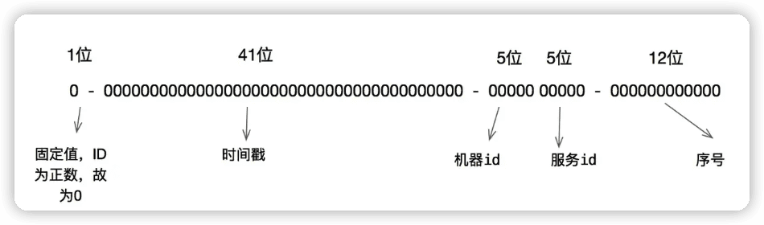
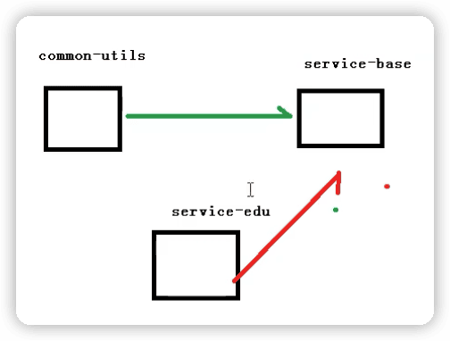
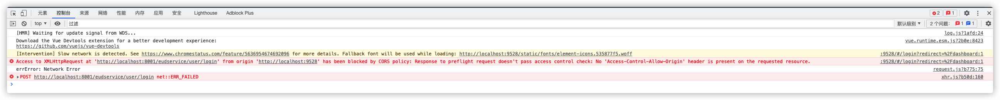
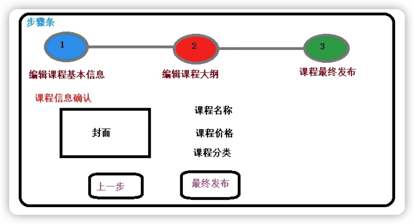
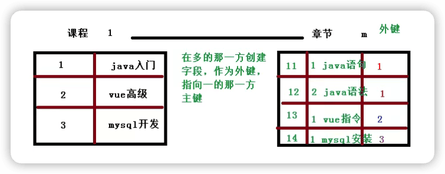
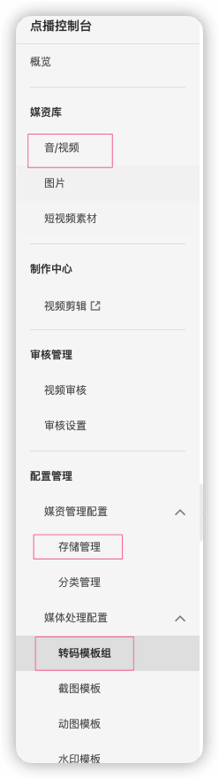
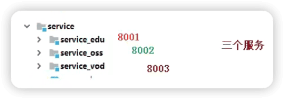
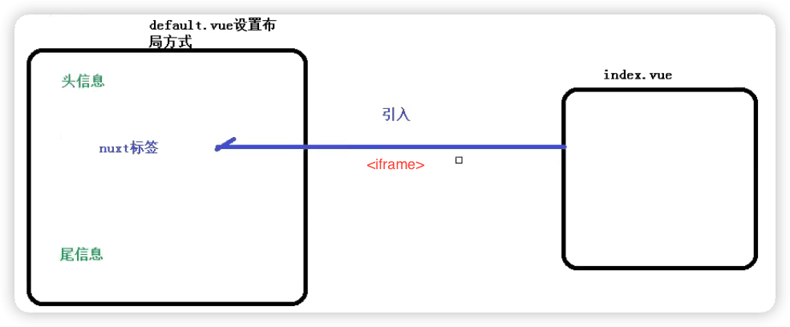
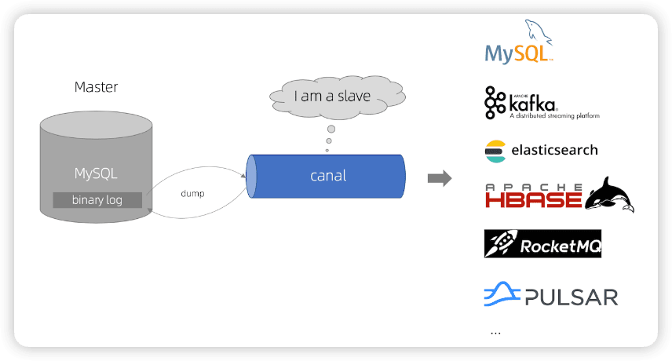

谷粒学苑
------

[尚硅谷_谷粒学苑-微服务+全栈在线教育实战项目](https://www.bilibili.com/video/BV1dQ4y1A75e)

```
Java基础

JDBC MySQL

JavaWeb

SSM

Java高级：Redis Nginx Maven Git 

SpringBoot
```


> 开启前提：
>
> - 开启MySQL `mysql.service start`
>
> - 配置Nginx，并开启 
>
> ```shell
> # 打开
> nginx
> 
> # 关闭
> nginx -s stop
> # 重启
> nginx -s reload
> ```
>
> 配置转发规则
>
> - 启动前端项目 `npm run dev`
>
> - 启动后端项目 
>
> - 访问swagger  http://localhost:8001/swagger-ui.html
>
> - Nacos
>
>   进入安装目录启动`sh startup.sh -m standalone` （standalone代表单机模式运行，非集群模式）
>
>   关闭 `sh shutdown.sh`
>
>   访问： http://localhost:8848/nacos
>
>   用户名密码： nacos/nacos

> [vue-element-admin](https://panjiachen.gitee.io/vue-element-admin-site/zh/)：是一个后台前端解决方案，它基于 [vue](https://github.com/vuejs/vue) 和 [element-ui](https://github.com/ElemeFE/element)实现。
>
> [element官网](https://element.eleme.cn/#/zh-CN)
>
> Nuxt: 前台前端
>
> 第三方：阿里云视频点播、阿里云短信、微信登录、阿里云对象存储OSS（图片）、echart

---

> Day1

## 1 项目介绍

### 1.1 项目背景

#### 什么是在线教育

所有人离不开教育：早期教育、课外辅导、少儿英语、职业教育、出国留学、商学院、移民服务....而在信息化爆发式发展的趋势下，在线教育越来越凸显出

优势：

1. 在线教育可以突破时间和空间的限制，提升了学习效率；
2. 在线教育可以跨越因地域等方面造成的教育资源不平等分配，使教育资源共享化，降低了学习的门槛。

基于在线教育的特点和优势，网络学校受到越来越多人的认可，各类新兴的网校及相关网站也不断涌现。显然，这代表着网校已经逐渐走进大众的生活并成为一种学习的主流趋势。因此很多人开始选择在线教育，特别是白领一族和大学生们。仅2012年一年，中国在线教育市场份额已经达到722亿元。

**适用行业**

具体来说在线培训学习系统可适合于：

1. 政府：现今我们的政府也提倡学习型组织，不断变化的政策环境、不断出现的新事物对政府公务员提出了更高的要求，而且政府机构的网络资源较佳，“在线培训系统”对公务员学习新知识和提高素质有很大帮助，更关键的是政府机构是垂直管理体制，只要在一个领域中创建并维护一套知识库，就可以让整个领域共享这宝贵的知识财富。

2. 学校：随着网络的兴起，各大中学校可通过建立网上学校，加强学校、老师、学生之间的相互交流沟通，提高教学质量，亦可建立公共教学资源库，建设精品课程，宣传学校的教育实力。

3. 行业：许多行业知识库体系庞大，专业多且层次深，因此行业一直注重知识和经验的积累，但这些宝贵的知识财富散落在各地，并没有利用和共享，因此，充分利用现有资源就能够创建一套丰富的知识库体系，让整个行业受益。

4. 企业：企业的知识库体系通常是企业的核心竞争力，使用“在线教育培训系统”，企业能够创建自己的知识库体系，并允许企业内部员工随时随地学习和分享这些知识。不断提升的员工素质和不断积累的企业知识库是企业能够保持长久的竞争力的关键。对于大型企业，还可以为合作伙伴及客户创建远程学习平台，提升和考核合作伙伴的专业技能并降低服务和支持成本。


#### 十个行业分类

在线教育是个行业分类

##### 1、母婴

**市场现状：**

尽管母婴在线教育市场已经发展多年，但行业总体仍处于赚吆喝不赚钱的状态，主要原因在于国内垂直母婴网站大多存在同质化竞争激烈和盈利模式单一问题，从在线教育的内容来看，大部分母婴网站功能类似大多是基础的母婴知识库问题，咨询交流社区的内容，特色区分并不明显。

**未来发展**：

中国母婴产业是朝阳产业，现在处于快速发展的初期，国内每年将近有2000万新生儿，0到36个月的婴幼儿超过6000万，加上还有2000万左右的孕妈妈，市场规模已经超过万亿，所以发展母婴及儿童产品的在线教育市场，前景非常广阔。

**代表网站**：

妈妈网 https://www.mama.cn/ 

类似社交网站，视频频道跳转到腾讯视频

母婴  中国两类人的钱最好赚：妇女和儿童

##### 2、学前教育

市场状况：
大多数企业缺乏有效的产品形态，没有充分的开发在线教育的巨大市场。
未来发展：
学前教育的市场，整体市场还处于起步阶段，随着针对孩子的培养和教育的重视，未来市场的发展将潜力无限。

代表网站：
宝宝巴士 https://www.babybus.com
网站以免费动画为主，核心产品是丰富的幼儿早教APP

##### 3、少儿外语

市场现状：
国内在线少儿外语教育领域持续风起云涌，比如新东方VIP ABC，51talk，Englishbreak，海绵外语，爱卡微口语，魔方英语，沪江网校等为代表的英语在线教育公司，以新东方，好未来，英孚为代表的传统培训机构，以及直接瞄准这一细分市场的创业公司，例如VIPKID
未来发展：
少儿外语的市场虽然广阔，但是已经拥有多家培训机构，线下的成本高昂等诸多因素而倒闭，目前市场发展处于最初探索期，产品升级迫在眉睫，大部分家长对这种在线教育形式仍然存在疑虑，但有越来越多的家长开始接受，随着认可程度的提高，未来市场同样有一定的潜力。

代表网站：
VIPKID https://www.vipkid.com.cn/
外教一对一在线教学

##### 4、中小学生

市场现状：

中小学在线教育呈现多样化发展，题库，英语家教等领域内均有产品获得千万美元以上投资，同时竞争压力在加剧，不断有创业者进入这个领域，或者传统教育机构开始布局，尤其在国内的一线城市，目前这方面影响力广泛的APP有很多，比如学而思网校学大教育网，一起作业网，猿题库文库，网游网学霸君等

未来发展：

O2O教育方式对中小学的影响极其深远，其中未来教育的发展中最重要的机会上门家教或者线下机构合作都能对原有的线上教育形成有效补充，目前几乎所有的教育机构都在尝试O2O模式

代表网站：

学而思 https://www.xueersi.com
录播、直播、一对一

##### 5、高校学生

市场现状：
目前市场主要集中在学历教育方面，国家对于网校的毕业证正在逐步认可，但是这方面教学的内容需要较高的知识基础，而且需要教学机构相当大的影响力，除了学历教育以外，就是学校自己开发的在线课程平台，专业性课程主要对内部学生开放，就其他基础性课程对公开课对外开放。
未来发展：
对于学历教育而言，无法有效的做到O2O模式，一般以移动端的学历考证知识的学习为主，现代社会对个人水平要求越来越高，在未来的趋势中，大学相关的在线教育领域会迎来一个快速的发展期。

代表网站：
中国大学慕课 http://www.icourse163.org 
由高教社联手网易推出，让每一个有提升愿望的用户能够学到中国知名高校的课程，并获得认证。
学堂在线 http://www.xuetangx.com/ 
由清华大学研发出的中文MOOC，面向全球提供在线课程。

##### 6、留学

市场现状：
教育部统计显示，中国目前每年的出国留学生总数在四十万人左右，其中本科及以下层面就读的人数增长迅猛，低龄化趋势明显，在线教育市场向二三线城市蔓延，与留学相关的在线教育培训机构迅速增加。
未来发展：
未来的发展离不开全球化，对于个人而言留学是一个增加阅历，提高教育经历，获得更高发展方式，未来的需求量将不断增长，同样进入该行业的教育机构或企业，也会增加金融教育机构与留学机构的结合是大势所趋。

代表网站：
启德考培在线 http://qide.edusoho.cn/
启德教育旗下的在线视频网站

##### 7、职业考试

市场现状：
职业教育的投融资情况表现稳定，目前仍是在线教育领域内的热门投资板块，中国在线教育市场中职业教育的占比高达30%以上，另外官方也鼓励发展职业教育。
未来发展：
职业考试主要是针对一些与职业相关的证书的考试，但是考试类的证书需要国家教育机构承认，因此对进入在线职业教育领域的要求较高。

代表网站：
中公教育 http://www.offcn.com/
公务员考试，各种职业资格认证考试，线下培训和网校

##### 8、职业技能

市场现状：
职业技能的培训，是目前在线教育市场发展迅速的领域，其中一些企业已经形成了一定的品牌，如腾讯课堂，网易云课堂，51CTO、中国会计网校等，总体占据了市场的85%使用率，另外现有在线职业教育服务和it培训等，聚焦于垂直领域，专业性虽强，但服务过于分散，规模较小，平台化在线职业教育有望通过提升用户搜索效率，降低寻找成本而获得用户青睐。
未来发展：
职业培训的未来市场十分广阔，并且与其他领域的盈利模式不同，容易盈利，大部分在线教育平台都是依靠这个领域的课程获得一定的利润。职业技能在未来的发展，潜力巨大，资格证书有望发展为线上服务的核心资源，但是对于新创企业而言，进入其中分享一块蛋糕并不是很容易，其他巨头占据了市场的主要份额，如果选择垂直化某个细分领域的进行运作，可获得意外的惊喜。

代表网站 ：
51cto http://edu.51cto.com/
最早一批的it职业技能网站

##### 9、成人外语

市场现状：
与少儿外语更注重基础性不同，成人外语主要是培优业务较多，更注重高水平的外语知识，同时小语种的学习人数也在增多。
未来发展：
随着从业者增加，在线教育，语言学习领域竞争不断加剧，部分语言学习产品因此竞争增加，提前遭遇发展瓶颈，越来越向大型语言教育机构汇聚，功能细分的小型垂直机构，未来的生存将更加艰难。O2O模式对于成人外语同样重要语言培训课程在线下拥有更高的用户体验，与传统培训机构合作，也能缓解线上线下的竞争关系

代表网站：
沪江外语 https://www.hujiang.com/

##### 10、个人兴趣

市场现状：
超过30%的用户表示在网上学习是满足个人的兴趣爱好，公开数据显示中国的兴趣爱好市场规模约为500亿元。
未来发展：
社会主流人群可支配收入的增长，促使兴趣培训市场，进一步提升，个人兴趣领域，在未来空间发展可以与k12教育基础教育的相媲美，随着个体对于精神满足的追求，国内市场将迎来一个长期稳定的发展期。

代表网站：
美食杰 https://www.meishij.net/
美食菜谱类，有图文和视频


### 1.2 项目采用的商业模式

在线教育的常见八种商业模式

##### 1、C2C模式（Consumer To Consumer 平台模式 ）

用户到用户，这种模式本质是将自己的流量或者用户转卖给视频或者直播的内容提供者，通过出售内容分成获利。
平台模式避开了非常沉重的内容和服务，扩张迅速，但实际这种模式也有缺陷，在线教育这两年的发展使内容迅速贬值，比较难带来更免费用户和流量。
代表网站：
51cto http://edu.51cto.com/
腾讯课堂 https://ke.qq.com/

##### 2、B2C模式（Business To Customer 会员模式）

商家到用户，这种模式是自己制作大量自有版权的视频，放在自有平台上，让用户按月付费或者按年付费。 这种模式简单，快速，只要专心录制大量视频即可快速发展，其曾因为 lynda 的天价融资而 大热。但在中国由于版权保护意识不强，教育内容易于复制，有海量的免费资源的竞争对手众多等原因，难以取得像样的现金流。
代表网站：
lynda https://www.lynda.com/  
慕课网 https://www.imooc.com/
谷粒学院 http://www.gulixueyuan.com/


两个角色：管理员（添加、修改、删除）和普通用户（查询）

在线教育的核心模块：**课程模块**


##### 3、B2B2C（商家到商家到用户） 

平台链接第三方教育机构和用户，平台一般不直接提供课程内容，而是更多承担教育的互联网载体角色，为教学过程各个环节提供全方位支持和服务。
代表网站：
51cto http://edu.51cto.com/
腾讯课堂 https://ke.qq.com/

电商平台**常用**模式

京东：自营 - 普通商家 - 普通用户

##### 4、垂直领域

这种模式需要糅合录播，直播，帮助服务等多种手段，对学生学习某一项内容负责。这种模式收费高，有较强的壁垒。这种产品一旦形成口碑，会有稳定的用户群和收入，但产品非常复杂，难度大，门槛高，即使单独一个项目都会耗费大量的人力物力，因此发展速度较慢。
代表网站：
51cto的微职位 http://edu.51cto.com/
网易云课堂的微专业 https://study.163.com/

##### 5、直播、互动

这种模式将传统课堂上的反馈，交互，答疑搬到线上。让用户容易接受，只要服务贴心，用 户就愿意买单，因此有丰富现金流。但缺陷是只能通过平台吸引用户，造成了竞争门槛过低， 模式雷同，对手众多，收益的永远是拥有流量或者用户的大平台。
代表网站：
腾讯课堂： https://ke.qq.com/
学而思 https://www.xueersi.com

##### 6、1 对 1

让一个讲师在一定时间内对一个学员进行辅导，学生按照时间支付费用。这种模式收费容易， 现金流好，产品难度不大，市场空间大，但是人力资源的获取消耗却是巨大的，如果师资上控制不好，比如优秀的讲师留不住，或者整体成本太大，都会导致 1 对 1 模式难以发展。
代表网站：
VIPKID https://www.vipkid.com.cn/
学而思 https://www.xueersi.com

##### 7、O2O 模式（Online To Offline 线上到线下）

就是通过免费内容或者运营，让线上平台获取用户和流量，将用户吸引到线下开课，或 者让学员到加盟的线下机构上课。这种模式形式简单，收益高，只要把控用户需求，吸引到用户，收费不成问题，而且符合传统的消费习惯。
代表网站：
启德教育 https://www.eic.org.cn/

##### 8、freemium（免费增值）

Freemium最早由AVC的Fred Wilson在2006年提出, 指的是用免费服务吸引用户，然后通过增值服务，将部分免费用户转化为收费用户，实现变现。Freemium模式中有“二八定律”的因素，即一小部分对价格不敏感的高端用户，愿意为一些额 外的功能付费，为服务提供者带来大部分收入。
代表网站：
中国大学慕课 http://www.icourse163.org 
通过免费的名校课程和高校建立合作，吸引用户。提供考研专栏和学校云增值服务
学堂在线 http://www.xuetangx.com/  
课程免费，如果希望得到课程的认证证书则要缴纳相应的费用

### 1.3 项目实现的功能模块

**B2C模式**

谷粒学院，是一个B2C模式的职业技能在线教育系统，分为前台用户系统和后台运营平台。

#### 系统模块

**系统后台：管理员使用**：

1. 讲师管理模块

2. 课程分类管理模块

3. **课程管理模块**。

   添加、视频、描述、小节等等。

4. 统计分析模块

   课程使用情况（购买量、播放量），使用图标展示；注册人数、登录人数等。

5. 订单管理

6. banner管理

   幻灯片（或轮播图）

7. 权限管理

**系统前台：普通用户使用**：

1. 首页数据显示

2. 讲师列表和详情

3. 课程列表和课程详情

   视频在线播放，评论

4. 登录和注册

5. 微信扫码登录

6. 微信扫码支付


### 1.4 项目使用的技术

前后端分离开发

- 后端技术：

​	SpringBoot、SpringCloud、MyBatisPlus、Spring Security

​	Redis、Maven、easyExcel、jwt、OAuth2

- 前端技术：

​	Vue、element-ui、axios、nodejs

- 其它技术：

​	阿里云oss、阿里云视频点播服务、阿里云短信服务

​	微信支付和登录

​	docker

​	Jenkins

​	git


#### 系统架构

**架构设计需要考虑的几个方面：**

- **性能：**主要考虑访问频率，每个用户每天的访问次数。项目初始阶段用户的访问量并不大，如果考虑做运营推广，可能会迎来服务器访问量骤增，因此要考虑**分布式部署，引入缓存**
- **可扩展性：**系统功能会随着用户量的增加以及多变的互联网用户需求不断地扩展，因此考虑到系统的可扩展性的要求需要**使用微服务架构，引入消息中间件**
- **高可用：**系统一旦宕机，将会带来不可挽回的损失，因此必须做负载均衡，甚至是异地多活这类复杂的方案。如果数据丢失，修复将会非常麻烦，只能靠人工逐条修复，这个很难接受，因此需要考虑存储高可靠。我们需要考虑多种异常情况：机器故障、机房故障，针对机器故障，我们需要设计 MySQL 同机房主备方案；针对机房故障，我们需要设计 MySQL 跨机房同步方案。
- **安全性：**系统的信息有一定的隐私性，例如用户的个人身份信息，不包含强隐私（例如玉照、情感）的信息，因此使用账号密码管理、数据库访问权限控制即可。
- **成本：**视频类网站的主要成本在于服务器成本、流量成本、存储成本、流媒体研发成本，中小型公司可以考虑使用云服务器和云服务。

## 2 MyBatisPlus

https://baomidou.com/

MyBatis-Plus (opens new window)（简称 MP）是一个 MyBatis (opens new window)的增强工具，在 MyBatis 的基础上只做增强不做改变，为简化开发、提高效率而生。

### 基本使用

1. 建表

2. 建项目 springboot 2.2.1

3. 引入相关依赖  com.baomidou

3. idea安装lombok插件

4. 配置配置文件 application.properties

6. 编写代码 

   - <u>MP提供的BaseMapper省去了mybatis中xml的编写</u>，它提供了很多操作数据库的方法：

   ```java
   public interface BaseMapper<T> {
       int insert(T var1);
   
       int deleteById(Serializable var1);
   
       int deleteByMap(@Param("cm") Map<String, Object> var1);
   
       int delete(@Param("ew") Wrapper<T> var1);
   
       int deleteBatchIds(@Param("coll") Collection<? extends Serializable> var1);
   
       int updateById(@Param("et") T var1);
   
       int update(@Param("et") T var1, @Param("ew") Wrapper<T> var2);
   
       T selectById(Serializable var1);
   
       List<T> selectBatchIds(@Param("coll") Collection<? extends Serializable> var1);
   
       List<T> selectByMap(@Param("cm") Map<String, Object> var1);
   
       T selectOne(@Param("ew") Wrapper<T> var1);
   
       Integer selectCount(@Param("ew") Wrapper<T> var1);
   
       List<T> selectList(@Param("ew") Wrapper<T> var1);
   
       List<Map<String, Object>> selectMaps(@Param("ew") Wrapper<T> var1);
   
       List<Object> selectObjs(@Param("ew") Wrapper<T> var1);
   
       IPage<T> selectPage(IPage<T> var1, @Param("ew") Wrapper<T> var2);
   
       IPage<Map<String, Object>> selectMapsPage(IPage<T> var1, @Param("ew") Wrapper<T> var2);
   }
   ```

   - SpringBoot启动会寻找接口实现类的对象，但使用MP后没有实现类了，因此要在springboot启动类上加上一个注解 `@MapperScan("com.andyron.mpdemo.mapper")`
   - 在UserMapper上加上注解`@Repository`，就是把对象声明一下，防止之后使用时报错

6. 测试 

#### 查看MyBatis的SQL输出日志

就是输出最终生成的SQL语句

```properties
# mybatis的SQL输出日志
mybatis-plus.configuration.log-impl=org.apache.ibatis.logging.stdout.StdOutImpl
```

```
==>  Preparing: SELECT id,name,age,email FROM user
==> Parameters: 
<==    Columns: id, name, age, email
<==        Row: 1, andy222, 18, yyyyy@qq.com
<==        Row: 2, Jack, 20, test2@baomidou.com
<==        Row: 3, Tom, 28, test3@baomidou.com
<==        Row: 4, Sandy, 21, test4@baomidou.com
<==        Row: 5, Billie, 24, test5@baomidou.com
<==      Total: 5
```

#### 添加操作

MP自动生成19位的ID

#### 修改操作


#### 简单id查询

#### id批量查询

#### 简单条件查询


#### 简单id删除

#### id批量删除

#### 简单条件删除


### 主键的生成策略

#### 1 数据库自动增长

优点：

1. 简单，性能可接受
2. 数字ID天然排序，对分页或排序有帮助

缺点：

1. 不同数据库语法和实现不同，数据库迁移的时候或多数据库版本支持的时候需要处理。
2. 在单个数据库或读写分离或一主多从的情况下，只有一个主库可以生成。有单点故障的风险。
3. 在性能达不到要求的情况下，比较难于扩展。（不适用于海量高并发）
4. 如果遇见多个系统需要合并或者涉及到数据迁移会相当痛苦。
5. 分表分库的时候会有麻烦。
6. 并非一定连续，类似MySQL，当生成新ID的事务回滚，那么后续的事务也不会再用这个ID了。这个在性能和连续性的折中。如果为了保证连续，必须要在事务结束后才能生成ID，那性能就会出现问题。
7. 在分布式数据库中，如果采用了自增主键的话，有可能会带来尾部热点。分布式数据库常常使用range的分区方式，在大量新增记录的时候，IO会集中在一个分区上，造成热点数据。

优化方案：

针对主库单点，如果有多个Master库，则每个Master库设置的起始数字不一样，步长一样，可以是Master的个数。比如：Master1 生成的是 1，4，7，10，Master2生成的是2,5,8,11 Master3生成的是 3,6,9,12。这样就可以有效生成集群中的唯一ID，也可以大大降低ID生成数据库操作的负载。

#### 2 UUID  

每次随机生成一个唯一值。

排序不方便

#### 3 Redis  

通过redis的原子操作incr，incrby

#### 4 雪花算法  

19位数字

MP自带策略 



雪花算法的原理就是生成一个的 64 位比特位的 long 类型的唯一 id。

指定策略是在主键上添加注解：

```java
	@TableId(type = IdType.ID_WORKER)
    private Long id;
```

```java
public enum IdType {
    AUTO(0),  // 数据库自动增长
    NONE(1),	// 没有，需要自己处理
    INPUT(2), // 需要主动输入
    ID_WORKER(3),		// 雪花算法生成19位得数字
    UUID(4),		
    ID_WORKER_STR(5); // 雪花算法生成19位得字符串类型

}
```

### 自动填充

1. 数据库添加字段gmtCreate，gmtModified

2. 实体类添加属性gmtCreate，gmtModified

3. 为实体类自动填充属性添加注解

   ```java
   @TableField(fill = FieldFill.INSERT)
   private Date gmtCreate;
   @TableField(fill = FieldFill.INSERT_UPDATE) // 插入和更新都填充值
   private Date gmtModified;
   ```

4. 实现接口MetaObjectHandler

### 乐观锁

乐观锁是解决特定问题的一种解决方案，主要解决**==丢失更新==**

> 数据库中如果不考虑事务隔离性，会产生
>
> - 读问题：**脏读、不可重复读、幻读**，
>
> - 写问题：丢失更新问题（多个人同时修改同一条记录，最后提交的把之前的提交数据覆盖）。
>
> 

丢失更新问题的解决方案：

- 悲观锁（一般不用）： 串行。一个人操作时，其他人都不能操作。

- 乐观锁 `version`

​	乐观锁的现实应用：买票时，每个人都能看到剩余的一张票，但只有一个人能支付成功。


如果lucy在mary开始事务之前修改了数据（version变为2），那么mary获取的数据版本（1）和数据库中版本（2）不同，就不能再修改。

MP中乐观锁具体实现：

1. 数据库添加字段version

2. 实体类加对应字段

3. `@Version`

4. 配置乐观锁插件 `OptimisticLockerInterceptor`

   ```java
   @Configuration
   @MapperScan("com.andyron.mpdemo.mapper")
   public class MPConfig {
       @Bean
       public OptimisticLockerInterceptor optimisticLockerInterceptor() {
           return new OptimisticLockerInterceptor();
       }
   }
   ```

> 把在启动类中MP用于寻找mapper接口实现类的注解（`@MapperScan`），移到专门用于配置MP的配置类上。


### 分页

类似PageHelper

1. 配置分页插件

2. 编写分页代码

   ```java
   // 创建分页对象，参数：当前页，每页记录数
   Page<User> page = new Page<>(1, 3);
   // 查询结果所有数据都会被封装到page对象里
   userMapper.selectPage(page, null);
   
   // 通过page对象获取分页数据
   System.out.println(page.getCurrent());
   System.out.println(page.getRecords());  // 没页数据list集合
   System.out.println(page.getSize());
   System.out.println(page.getTotal());
   System.out.println(page.getPages());  // 总页数
   System.out.println(page.hasNext());  // 是否有下页
   System.out.println(page.hasPrevious());
   ```
   
   

### 逻辑删除

物理删除，逻辑删除

1. 表中添加字段deleted，实体类中添加对应属性。(默认值可以在数据库表设置，也可以通过MP中自动填充接口MetaObjectHandler实现)。

2. `@TabelLogic`

   ```java
   @TableLogic
   private Integer deleted;
   ```

3. 配置文件配置逻辑删除参数，mp默认1是删除，0是未删除，如果与默认值相同就不需要添加配置。

    ```properties
    mybatis-plus.global-config.db-config.logic-delete-value=1
    mybatis-plus.global-config.db-config.logic-not-delete-value=0
    ```

4. 配置逻辑删除插件`ISqlInjector`

    ```java
    @Bean
    public ISqlInjector sqlInjector() {
      return new LogicSqlInjector();
    }
    ```

5. 测试。删除操作语句不变

   ```java
   System.out.println(userMapper.deleteById(1539063991684653057l));
   ```

   ```
   ==>  Preparing: UPDATE user SET deleted=1 WHERE id=? AND deleted=0
   ==> Parameters: 1539063991684653057(Long)
   <==    Updates: 1
   ```

>  要查询已经逻辑删除的，要自己写SQL。


### 性能分析插件

用于输出每条SQL语句及其执行时间。

> 一般项目中有三种环境
>
> dev 开发环境
>
> test 测试环境
>
> prod 生产环境

配置插件：

```java
    /**
     * SQL性能分析插件。以红色输出每条SQL语句及其执行时间
     * 开发测试环境使用
     */
    @Bean
    @Profile({"dev", "test"})
    public PerformanceInterceptor performanceInterceptor() {
        PerformanceInterceptor performanceInterceptor = new PerformanceInterceptor();
        performanceInterceptor.setMaxTime(200);  // sql执行时间超过200ms就不执行了
        performanceInterceptor.setFormat(true);  // 是否对输出的sql格式化
        return performanceInterceptor;
    }
```

如果超过了指定时间就会报错：

```
org.mybatis.spring.MyBatisSystemException: nested exception is org.apache.ibatis.exceptions.PersistenceException: 
### Error querying database.  Cause: com.baomidou.mybatisplus.core.exceptions.MybatisPlusException:  The SQL execution time is too large, please optimize ! 
```

### 复杂一点条件查询


使用QueryWrapper构建条件

```java
QueryWrapper<User> wrapper = new QueryWrapper<>();

        // ge gt le lt
        // 查询age>=30
//        wrapper.ge("age", 30);

        // eq ne
//        wrapper.eq("name", "Andy");
//        wrapper.ne("name", "Andy");

        // between
//        wrapper.between("age", 20, 30);

        // like
//        wrapper.like("name", "J");

        // 排序
//        wrapper.orderByDesc("id");

        // last 在最后拼接一段SQL语句
        wrapper.last("limit 1");

        // 指定查询的列
        wrapper.select("id", "name");

        System.out.println(userMapper.selectList(wrapper));
    }
```


> 第二天


## 3 初始化项目

### 前后端分离开发概念


后端使用Java语言开发，开发IDE使用IDEA；

前端使用Vue，开发IDE使用VSCode。


crud

### 创建数据库guli

创建表`edu_teacher`

**数据库设计规约**（参考《阿里巴巴Java开发手册》）

- 表必备三字段：**id、gmt_create、gmt_modified**

G.M.T.(Greenwich Mean Time)格林威治标准时间

### 创建项目结构

为了开发时思路清晰。


模块说明：

```
guli_parent： 在线教学根目录（父工程），管理四个子模块：
	canal-client： canal数据库表同步模块（统计同步数据）
	common： 公共模块父节点
    common-util：工具类模块，所有模块都可以依赖于它
    			统一返回数据格式
    service-base: service服务的base包，包含service服务的公共配置类，所有service模块依赖于它
    			swagger
    			统一异常处理
    spring-security：认证与授权模块，需要认证授权的service服务依赖于它
  infrastructure：基础服务模块父节点
    api-gateway： api网关服务
  service: api接口服务父节点  
  	service-acl： 用户权限管理api接口服务（用户管理、角色管理和权限管理等）
    service-cms： cms api接口服务
    service-edu：教学相关api接口服务
    service-msm：短信api接口服务
    service-order：订单相关api接口服务
    service-oss：阿里云oss api接口服务
    service-statistics：统计报表api接口服务
    service-ucenter：会员api接口服务
    service-vod： 视频点播api接口服务
```

父工程的pom文件用来统一管理依赖，`<dependencyManagement>`标签中的包只是作为管理对象，并不会直接引入，实际引入在子模块中pom文件中。

```xml
	<properties>
        <java.version>1.8</java.version>
        <guli.version>0.0.1-SNAPSHOT</guli.version>
        <mybatis-plus.version>3.0.5</mybatis-plus.version>
        <velocity.version>2.0</velocity.version>
        <swagger.version>2.7.0</swagger.version>
        <aliyun.oss.version>2.8.3</aliyun.oss.version>
        <jodatime.version>2.10.1</jodatime.version>
        ...
    </properties>
		<dependencyManagement>
        <dependencies>
            <!--Spring Cloud-->
            <dependency>
                <groupId>org.springframework.cloud</groupId>
                <artifactId>spring-cloud-dependencies</artifactId>
                <version>Hoxton.RELEASE</version>
                <type>pom</type>
                <scope>import</scope>
            </dependency>

            <dependency>
                <groupId>org.springframework.cloud</groupId>
                <artifactId>spring-cloud-alibaba-dependencies</artifactId>
                <version>${cloud-alibaba.version}</version>
                <type>pom</type>
                <scope>import</scope>
            </dependency>
            <!--mybatis-plus 持久层-->
            <dependency>
                <groupId>com.baomidou</groupId>
                <artifactId>mybatis-plus-boot-starter</artifactId>
                <version>${mybatis-plus.version}</version>
            </dependency>
          	...
      </dependencies>
		</dependencyManagement>
```

有子模块的pom文件中还需要添加：

```xml
<packaging>pom</packaging>
```


## 4 讲师管理模块（后端）

### 1 模块service_edu中创建配置文件


### 2 使用MP代码生成功能，生成controller service mapper代码内容

```xml
        <!-- velocity 模板引擎, Mybatis Plus 代码生成器需要 -->
        <dependency>
            <groupId>org.apache.velocity</groupId>
            <artifactId>velocity-engine-core</artifactId>
        </dependency>
```


mp中的BaseMapper、IService


### 3 项目开始

1. 创建controller

2. 创建启动类EduApplication

3. 创建配置类，配置扫描mapper和其它配置

4. 启动、测试

5. 默认时间返回格式是

```
"gmtModified":"2019-10-30T03:53:03.000+0000"
```

统一返回的json时间格式，配置文件中添加：

```yaml
spring:
  jackson:
    # 返回JSON的全局时间格式
    date-format: yyyy-MM-dd HH:mm:ss
    time-zone: GMT+8
```


#### 讲师逻辑删除功能

1. 配置逻辑插件

   ```java
       @Bean
       ISqlInjector sqlInjector() {
           return new LogicSqlInjector();
       }
   ```

   

2. 在对应属性加注解

   ```java
   		@TableLogic
       private Integer isDeleted;
   ```

   

3. 编写controller方法

   ```java
   @DeleteMapping("{id}")
   public boolean removeTeacher(@PathVariable String id) {
     boolean flag = teacherService.removeById(id);
     return flag
   }
   ```

4. 如何测试？
   - swagger测试
   - postman

#### 整合swagger

swagger的作用：

- 生成在线接口文档

- 进行接口测试

整合步骤：

1. 建立公共模块common，再在其下面建立子模块service_base，创建Swagger的配置类。（放到公共模块中，让其他模块也能使用）

   ```java
   @Configuration
   @EnableSwagger2
   public class SwaggerConfig {
   
       @Bean
       public Docket webApiConfig() {
           return new Docket(DocumentationType.SWAGGER_2)
                   .groupName("webApi")
                   .apiInfo(webApiInfo())
                   .select()
                   .paths(Predicates.not(PathSelectors.regex("/admin/.*")))  // 路径中包括admin、error的不显示
                   .paths(Predicates.not(PathSelectors.regex("/error.*")))
                   .build();
       }
   
       private ApiInfo webApiInfo() {
           return new ApiInfoBuilder()
                   .title("网站-课程中心API文档")
                   .description("本文档描述了课程中心微服务接口定义")
                   .version("1.0")
                   .contact(new Contact("AndyRon", "http://andyron.com", "rongming.2008@163.com"))
                   .build();
       }
   }
   ```

2. 在模块service_edu中，要使用其它模块代码，就要在pom文件中引入：

    ```xml
    <!-- 引入service_base模块，然后才能使用其中代码功能 -->
    <dependency>
      <groupId>com.andyron</groupId>
      <artifactId>service_base</artifactId>
      <version>0.0.1-SNAPSHOT</version>
    </dependency>
    ```

    并且要在service_edu的启动类上添加组件扫描：

    ```java
    // 为了能使用service_base模块中的功能，要指定扩大扫描区域，指定扫描规则，默认只扫描当前模块下的类
    @ComponentScan(basePackages = {"com.andyron"})
    public class EduApplication {
    ...
    ```

3. 访问swagger  http://localhost:8001/swagger-ui.html


几个注解让swagger说明更仔细，

- @Api  定义在类上

- @ApiOperation  定义在方法上

- @ApiParam  定义在参数上


<font color=#FF263D>注意：报错</font>，提示引入不到其它模块下的swagger配置，如果把swagger放在本模块的启动类里配置，是没有问题的。

```
Unable to infer base url. This is common when using dynamic servlet registration or when the API is behind an API Gateway. The base url is the root of where all the swagger resources are served. For e.g. if the api is available at http://example.org/api/v2/api-docs then the base url is http://example.org/api/. Please enter the location manually: 
```

无意中解决：先把原来swagger的版本2.7换成2.10，然后再换回来，就解决了


### 4 统一返回数据格式

JSON数据格式的两种形式：**对象，数组**。一般混合使用。

列表：

```json
{
  "success": true,
  "code": 20000,
  "message": "成功",
  "data": {
    "total": 17,
    "items": [
      {},
      ...
    ]
  }
}
```

分页数据：

```json
{
  "success": true,
  "code": 20000,
  "message": "成功",
  "data": {
    "total": 17,
    "rows": [
      {},
      ...
    ]
  }
}
```

没有返回数据：

```json
{
  "success": true,
  "code": 20000,
  "message": "成功",
  "data": {}
}
```

失败：

```json
{
  "success": false,
  "code": 20001,
  "message": "失败",
  "data": {}
}
```

统一定义的结果：

```json
{
  "success": 布尔,
  "code": 数字,
  "message": 字符串,
  "data": HashMap
}
```


1. 创建common模块中，common_utils子模块
2. 创建返回码接口ResultCode
3. 统一返回结果类 R
4. 在service模块中引入common_utils
4. 修改controller中返回结果，都改为R


### 讲师分页功能

1. 配置mp分页插件
2. 编写讲师分页查询


### 条件查询

**多条件组合**查询带分页


1. 把条件值传递到接口

​	把条件值封装到对象（TeacherQuery）里面，把对象传递到接口（**VO**，View Object，显示层对象）

2. 根据条件值进行判断，拼接条件

   现在前端传输数据时，每个条件都会作为一个参数。实际开发中，使用`@RequestBody`注解 (必须是POST)更加方便，让所有条件参数作为一个json参数传输，

   ```java
   @RequestBody(required = false) TeacherQuery teacherQuery) { // false表示这个参数可以为空
   ```

   

> @RequestBody，使用JSON传递数据，把json数据封装到对应对象里面 
>
> @ResponseBody，返回json数据

> 实际开发中会把这些条件构建部分等都放到service（业务逻辑层），而不是controller。

### 添加讲师

自动填充：

1. 在相应实体类属性上添加注解`@TableField` 

2. 在service_base模块找添加一个自动填充类

   ```java
   @Component
   public class MyMetaObjectHandler implements MetaObjectHandler {
       @Override
       public void insertFill(MetaObject metaObject) {
           // 属性名称，不是数据库字段名称
           this.setFieldValByName("gmtCreate", new Date(), metaObject);
           this.setFieldValByName("gmtModified", new Date(), metaObject);
       }
   
       @Override
       public void updateFill(MetaObject metaObject) {
           this.setFieldValByName("gmtModified", new Date(), metaObject);
       }
   }
   
   ```

3. 添加接口方法

   ```java
       @ApiOperation("讲师添加")
       @PostMapping("addTeacher")
       public R addTeacher(@RequestBody EduTeacher eduTeacher) {
           boolean save = teacherService.save(eduTeacher);
           if (save) {
               return R.ok();
           } else {
               return R.error();
           }
       }
   ```

   > 注意：传递参数eduTeacher的json中，id、两个时间字段不需要。


### 讲师修改

1. 根据讲师id查询
2. 讲师修改， 测试是JSON中需要有id


### 统一异常处理

没有统一处理异常处理的情况：


在service_base模块中建立统一异常处理：

```java
@ControllerAdvice
public class GlobalExceptionHandler {

    // 指定出现扫描异常执行这个方法
    @ExceptionHandler(Exception.class)
    @ResponseBody // 为了返回数据，在controller有@RestController表示有返回值，其实@RestController也被@ResponseBody注解了
    public R error(Exception e) {
        e.printStackTrace();
        return R.error().message("执行了全局异常处理");
    }
  
} 
```

@ControllerAdvice

@ExceptionHandler

> @ControllerAdvice介绍
>
> - `ControllerAdvice`本质上是一个`Component`，因此也会被当成组件扫描。它是aop思想的一种实现，根据规则进行拦截处理。
>
> - @ControllerAdvice提供了很多规则指定方式，默认是advice所有的Controller。
>
> - `@ControllerAdvice("org.my.pkg")` 或者`@ControllerAdvice(basePackages={"org.my.pkg", "org.my.other.pkg"})`，则匹配指定包及其子包下的所有`Controller`。
>
> - 可通过指定注解来匹配。
>
>   比如自定义一个注解`CustomAnnotation`，那么`@ControllerAdvice（annotations={CustomAnnotation.class})`就表示匹配所有被这个注解修饰的Controller。
>
> 三种用法：
>
> 1. 处理全局异常
>
>    ```java
>    @ControllerAdvice
>    public class GlobalExceptionHandler {
>    ```
>
> 2. 预设全局数据
>
>    配合 `@ModelAttribute` 预设全局数据
>
> 3. 请求参数预处理
>
>     配合 `@InitBinder` 实现对请求参数的预处理


>  注意pom文件中模块之间不要重复引用，**==依赖传递==**（Maven）
>
> 


1. 全局异常处理（上面的）

2. 特定异常处理（根据特定异常给与特定的输出）。 机制：**先找特定异常处理，没有，再找全局异常处理。**

   ```java
       // 特定异常处理
       @ExceptionHandler(ArithmeticException.class)
       @ResponseBody
       public R error(ArithmeticException e) {
           e.printStackTrace();
           return R.error().message("执行了ArithmeticException异常处理");
       }
   ```

3. 自定义异常处理

   - 第一步，创建自定义异常类继承RuntimeException，写异常属性

   - 第二步，再统一异常类添加规则

     ```java
     @ExceptionHandler(GuliException.class)
     @ResponseBody
     public R error(GuliException e) {
       e.printStackTrace();
       return R.error().code(e.getCode()).message(e.getMsg());
     }
     ```

   - 第三步，执行自定义异常。自定义异常不是系统自带的异常，系统不会抛出，需要我们手动抛出

     ```java
     try {
       int i = 1/0;
     } catch(Exception e) {
       throw new GuliException(20001, "执行自定义异常处理...");
     }
     ```

     

> 第三天

### 统一日志处理

#### 配置日志级别

日志记录器（Logger）的行为是分等级的：OFF, FATAL, <u>ERROR, WARN, INFO, DEBUG</u>, ALL。低级别的会记录高级别的信息。

```yaml
logging:
  level:
    root: WARN
```

上面的就不会显示INFO级别的信息。

默认只能把日志输出到控制台，如果既想把日志输出到控制台又想输出到文件中，就需要日志工具（log4j、Logback等）。

#### Logback

[Logback manual](https://logback.qos.ch/manual/index.html)

1. 先把之前的日志配置删掉

   ```yaml
   #mybatis-plus:
   #  configuration:
   #    log-impl: org.apache.ibatis.logging.stdout.StdOutImpl
   #
   #logging:
   #  level:
   #    root: INFO  # 设置日志级别，默认就是INFO
   ```

2. 在resource在创建配置文件`logback-spring.xml`(比较固定的配置)

   ```xml
       ...
   		<property name="log.path" value="/Users/andyron/tmp/guili_log"/>
   
       <property name="CONSOLE_LOG_PATTERN"
                 value="%yellow(%date{yyyy-MM-dd HH:mm:ss}) |%highlight(%-5level) |%blue(%thread) |%blue(%file:%line) |%green(%logger) |%cyan(%msg%n)"/>
   		...
   ```

   默认会在指定的目录（guili_log）中生成三个日志文件log_warn.log、log_info.log、log_error.log（多了还会建立不同目录存放）。 

> **将错误日志输出到文件** 
>
> 错误日志不会直接输出到log_error.log文件中，需要配置：
>
> - 在GlobalExceptionHandler类上加上注解`@Slf4j`，
> - 添加异常输出语句`log.error(e.getMessage());`
>
> ```java
> @ControllerAdvice
> @Slf4j
> public class GlobalExceptionHandler {
> ...
>     // 自定义异常处理
>     @ExceptionHandler(GuliException.class)
>     @ResponseBody
>     public R error(GuliException e) {
>         // 把异常信息输出到日志文件中
>         log.error(e.getMessage()); 
>         e.printStackTrace();
>         return R.error().code(e.getCode()).message(e.getMsg());
>     }
> }
> ```
>
> 如果要把更多信息（堆栈信息）输出到文件中，可以自定义工具方法：
>
> ```java
> public class ExceptionUtil {
>     public static String getMessage(Exception e) {
>         StringWriter sw = null;
>         PrintWriter pw = null;
>         try {
>             sw = new StringWriter();
>             pw = new PrintWriter(sw);
>             // 将出错的栈信息输出到PrintWriter中
>             e.printStackTrace(pw);
>             pw.flush();
>             sw.flush();
>         } finally {
>             if (sw != null) {
>                 try {
>                     sw.close();
>                 } catch (IOException e1) {
>                     e1.printStackTrace();
>                 }
>             }
>             if (pw != null) {
>                 pw.close();
>             }
>         }
>         return sw.toString();
>     }
> }
> ```
>
> 用这个方法替代：
>
> ```
> log.error(ExceptionUtil.getMessage(e));
> ```


## 5 前端知识

前端工程师

全栈工程师

PRD（产品原型-产品经理）-PSD（视觉设计-UI工程师）-HTML/CSS/JavaScript（PC/移动端网页，实现网页端的视觉展示和交互-前端工程师）

### Vscode的安装和使用

vs插件：

Live server 内置服务器  右击打开

Vetur  vue工具

#### 创建工作区

1. 在本地创建空文件夹，比如**work01**
2. 使用vscode打开空文件夹
3. 把文件夹保存为工作区【将工作区另存为...】


> 实际，就是在对应目录中创建一个***.code-workspace文件。

### ES6

ECMAScript6，2015-6发布

ECMAScript是一套标准，一套规范，JavaScript很好遵循了这套规范。

#### ECMAScript 和Javascript 的关系

要讲清楚这个向题，需要回顾历史，1996年11 月，Javascript前创造者 Netscape 公司，决定将 Jawascript提交给标准化组织ECMA，希望这种语言能够成为国际标准。次年，ECMA 发布 262 号标准文件（ECMA-262）的第一版，规定了浏览器脚本语言的标准，并将这种语言称为 ECMAScript，这个版本就是1.0版。
因此，ECMAScript 和 JavaScript 的关系是，前者是后者的==规格==，后者是前者的一种==实现==（ 另外的 ECMAScript 方言还有Jscript和ActionScript)。

#### ES6和ES5

1. es6代码简洁，es5代码复杂
2. es6浏览器兼容性很差，es5代码浏览器兼容性很好

一般用es6写代码，然后用工具转换成es5在浏览器中运行

#### ES6基本语法

1. var 定义的变量没有范围限制， let 有作用范围

   ```js
   {
     var a = 10
     let b = 20
   }
   console.log(a)
   console.log(b)  // Uncaught ReferenceError: b is not defined
   ```

2. let 不能重复定义

   ```javascript
   var a = 1
   var a = 2
   
   let m = 10
   let m = 20 //  Uncaught SyntaxError: Identifier 'm' has already been declared
   ```

3. const 常量一旦定义，不能改变；定义必须初始化。

   ```javascript
   const PI = "3.1415"
   PI = 3          // Uncaught TypeError: Assignment to constant variable.
   
   const E  // Uncaught SyntaxError: Missing initializer in const declaration
   ```

4. 数组解构（解构赋值）

   ```js
   // 传统写法
   let a=1, b=2, c=3
   
   // es6写法
   let [x, y, z] = [10, 20, 30]
   console.log(x, y, z)
   
   ```

5. 对象解构（解构赋值）

   ```js
   let user = {name: "andy", age: 18}
   // 传统写法
   let name1 = user.name
   let age1 = user.age
   
   // es6写法
   let {name, age} = user // 注意：结构的变量必须是user中的属性
   console.log(name, age)
   ```

#### 模板字符串`

```js
// 1 `实现多行字符串
let st1 = `hello,
es6 demo!`
console.log(st1)
// 2 `可以让字符串中插入变量和表达式。变量名和表达式写在${}中。
let name = "Mike"
let age = 20
let str2 = `hello, ${name}, age is ${age+1}`
console.log(str2)
// 3 `里面也可以调用函数
function f() {
    return "have fun!"
}
let str3 = `Game start, ${f()}`
console.log(str3)

```

#### 声明对象的简写

```js
const age = 12
const name = "andy"

// 传统
const p1 = {age:age, name:name}
console.log(p1)
// ES6
const p2 = {age, name}
console.log(p2)
```

#### 定义方法简写

```js
// 传统方式
const p1 = {
    sayHi: function() {
        console.log("hi")
    }
}
p1.sayHi()
// ES6
const p2 = {
    sayHi(){
        console.log("hello")
    }
}
p2.sayHi()
```

#### 对象拓展运算符

拓展运算符（`...`）用于取出参数对象所有可遍历属性然后拷贝到当前对象。

```js
 // 1 对象复制
 let person1 = {"name": "andy", "age": 15}
 let person2 = {...person1}
 console.log(person2)

 // 2 合并对象
 let age = {age: 12}
 let name = {name: "mary"}
 let p = {...name, ...age}
 console.log(p)
```

#### 箭头函数

箭头函数提供了一个更加简洁的函数书写方式：**参数 => 函数体**。（有点类似Java中的lambta表达式）

```js
// 传统的方式创建方法
var f1 = function(m) {
    return m
}

// es6箭头函数写法
var f2 = m => m
console.log(f2(13))

var f3 = (a, b) => {
    let r = a + b
    return r
}
// 简化
var f4 = (a, b) => a + b
console.log(f3(2, 3))
console.log(f4(2, 3))
```

多用于匿名函数定义是使用


### Vue

#### Vue.js是什么

Vue (读音 /vju:/，类以于 view)是一套用于构建用户界面的渐进式框架。
Vue 的核心库只关注视图层，不仅易于上手，还便于与第三方库或既有项目整台。另一方面，当与现代化的工具键以及各种支持类库结合使用时，Vue 也完全能够为复杂的单页应用提供驱动。

#### 初始化Vue.js

> vscode快速生成html模板文件方法： !+tab；直接打html:5。

1. 创建html

2. 引入vue.js

3. 创建带id的div，`<div id="app"></div>`

4. 编写vue代码，固定结构

   ```html
   <script>
     new Vue({
       el: '#app', // 绑定vue作用的范围
       data: { // 在data定义变量和初始值
         message: "Hello。。。Vue！"
       }
     })
   </script>
   ```

   

Vue的完整固定写法：

```html
    <div id="app">
        <!-- {{}} 插值表达式，绑定vue中的data数据 -->
        {{message}}
    </div>
    <script src="https://unpkg.com/vue/dist/vue.js"></script>
    <script>
        // 创建一个Vue对象
        new Vue({
            el: '#app', // 绑定vue作用的范围
            data: { // 在data定义变量和初始值
                message: "Hello。。。Vue！"
            },
          	created() { // 页面渲染之前执行
              	// 调用定义的方法
              
            },
          	methods: { // 编写具体的方法
            }
        })
    </script>
```

**==插值表达式==**

#### 抽取Vue的代码片段

VSCode中代码简化的快捷方式

> 文件（mac版的是code） -> 首选项 ->  用户代码片段 ->  新建`vue-html.code-snippets`

```json
{
	"vue html": {
		"scope": "html",
		"prefix": "vuehtml",
		"body": [
			"<!DOCTYPE html>",
			"<html lang=\"en\">",
			"",
			"<head>",
			"	<meta charset=\"UTF-8\">",
			"	http-equiv=\"X-UA-Compatible\" content=\"IE=edge\">",
			"	<meta name=\"viewport\" content=\"width=device-width, initial-scale=1.0\">",
			"<title>Document</title>",
			"</head>",
			"<body>",
			"	<div id=\"app\">",
			"	</div>",
			"	<script src=\"vue.min.js\"></script>",
			"	<script>",
			"		new Vue({",
			"			el: '#app',",
			"			data: { ",
			"				$1",
			"			}",
			"		})",
			"	</script>",
			"</body>",
			"</html>"
		],
		"description": "my vue template in html"
	}
}
```

#### Vue基本语法

#####  1 基本数据渲染和指令

单向数据绑定

v-bind指令(指令带有前缀`v-`)

一般用在标签属性里面，获取值。写在属性前面

```html
		<div id="app">
        <h1 v-bind:title="message">
            {{content}}
        </h1>
        <!-- 简写 -->
        <h2 :title="message">
            {{content}}
        </h2>
    </div>
    <script src="vue.min.js"></script>
    <script>
        new Vue({
            el: '#app',
            data: { 
                content: '我是标题',
                message: '页面加载于' + new Date().toLocaleString()
            }
        })
    </script>
```

##### 2 双向数据绑定

v-model

发生变化其它地方也跟着发生变化。

```html
		<div id="app">
        <input type="text" v-bind:value="searchMap.keyWord"></input>
        <br>
        <input type="text" v-model="searchMap.keyWord"></input>

        <p>查询的值：{{searchMap.keyWord}}</p>
    </div>
    <script src="vue.min.js"></script>
    <script>
        new Vue({
            el: '#app',
            data: { 
                searchMap: {
                    keyWord: "AndyRon"
                }
            }
        })
    </script>
```

##### 3 事件

v-on

```html
		<div id="app">
        <!-- vue绑定事件 -->
        <button v-on:click="search()">查询</button>
        <!-- 简写 -->
        <button @click="search()">查询1</button>

    </div>
    <script src="vue.min.js"></script>
    <script>
        new Vue({
            el: '#app',
            data: { 
                searchMap: {
                    keyWord: "AndyRon"
                },
                // 查询结果
                results: {}
            },
            methods: { // 定义方法(可多个)
                search() {
                    console.log("search...")
                }
            }
        })
    </script>
```

##### 4 修饰符

阻止事件原本的默认行为，使用自己定义行为。

例如，`.prevent`修饰告诉v-on指令对于触发的事件调用`event.preventDefault()`

```html
		<div id="app">
        <form action="save" v-on:submit.prevent="onSubmit()">
            <input type="text" id="name" v-model="user.username" />
            <button type="submit">保存</button>
        </form>
    </div>
    <script src="vue.min.js"></script>
    <script>
        new Vue({
            el: '#app',
            data: { 
                user: {}
            },
            methods: {
                onSubmit() {
                    if (this.user.username) {
                        console.log('提交表单')
                    } else {
                        alert("请输入用户名")
                    }
                }
            }
        })
    </script>
```

##### 5 条件渲染

v-if

v-else

> v-show 类似v-if，但v-if是惰性加载，v-show不是效率差，一般不用

```html
		<div id="app">
        <input type="checkbox" v-model="ok">是否选中</input>
        <h1 v-if="ok">AndyRon</h1>
        <h1 v-else>andyron</h1>
    </div>
    <script src="vue.min.js"></script>
    <script>
        new Vue({
            el: '#app',
            data: { 
                ok: false
            }
        })
    </script>
```

##### 6 列表渲染

v-for

简单列表渲染：

```html
<div id="app">
  <ul>
    <li v-for="n in 10">{{n}}</li>
  </ul>
  <ul>
    <li v-for="(n, index) in 10">{{n}} -- {{index}}</li>
  </ul>
</div>
```

遍历数据列表：

```html
<div id="app">
  <table>
    <tr v-for="user in userList">
      <td>{{user.id}}</td>
      <td>{{user.username}}</td>
      <td>{{user.age}}</td>
    </tr>
  </table>
</div>
<script src="vue.min.js"></script>
<script>
  new Vue({
    el: '#app',
    data: { 
      userList: [
        {id: 1, username: 'andy', age: 18},
        {id: 2, username: 'tom', age: 28},
        {id: 3, username: 'jack', age: 38}
      ]
    }
  })
</script>
```

#### Vue组件（重点）

组件（Component）是Vue.js最强大的功能之一。

组件可以**扩展**HTML元素，封装可重用的代码。

组件系统让我们可以独立可复用的小组件来构建大型应用，几乎任意类型的应用的界面都可以抽象为一个组件树：


##### 局部组件

只能在当前文件中有效。Navbar可看着是自定义HTML元素（扩展）。

```html
		<div id="app">
        <Navbar></Navbar>
    </div>
    <script src="vue.min.js"></script>
    <script>
        new Vue({
            el: '#app',
            // 定义vue使用的组件
            components: { 
                'Navbar': {
                    template: '<ur><li>首页</li><li>学员管理</li></ur>'
                }
            }
        })
    </script>
```

##### 全局组件

```javascript
// 定义全局组件
Vue.component('Navbar', {
    template: '<ur><li>首页</li><li>学员介绍</li></ur>'
})
```

```html
<div id="app">
  <Navbar></Navbar>
</div>
<script src="vue.min.js"></script>
<script src="components/Navbar.js"></script>
<script>
  new Vue({
    el: '#app',
  })
</script>
```

#### 实例的生命周期


数据渲染（页面渲染）之前执行：beforeCreate、**created**

数据渲染之后执行：beforeMount、**mounted**

数据渲染之后有修改时执行：beforeUpdate、updated

vue对象销毁之前执行：beforeDestroy

```html
		<div id="app">
        <h1>{{message}}</h1>
    </div>
    <script src="vue.min.js"></script>
    <script>
        new Vue({
            el: '#app',
            data: { 
                message: "Hello。。。Vue！"
            },
            created() {
                debugger
                console.log("created...")
            },
            mounted() {
                debugger
                console.log("mounted...")
            }
        })
    </script>
```

`debugger`是js中断点调试标志。


#### 路由

`vue-router.min.js`要在vue之后引入

router-link

router-view

```html
		<div id="app">
        <h1>Hello World</h1>
        <p>
            <!--
                使用router-link组件来导航，它默认会被渲染成一个`<a></a>`标签；
                通过传入to属性指定连接
            -->
            <router-link to="/">首页</router-link>
            <router-link to="/student">会员管理</router-link>
            <router-link to="/teacher">讲师管理</router-link>
        </p>
        <!-- 
            路由出口
            路由匹配到的组件将渲染在router-view
        -->
        <router-view></router-view>
    </div>
    <script src="vue.min.js"></script>
    <script src="vue-router.min.js"></script>
    <!-- vue-router文件必须在vue文件之后引入 -->
    <script>
        // 1. 定义路由组件。可以从其它文件import进来
        const Welcome = {template: '<div>欢迎</div>'}
        const Student = {template: '<div>student list</div>'}
        const Teacher = {template: '<div>teacher list</div>'}
        
        // 2. 定义路由。每个路由应该映射一个组件
        const routes = [
            {path: '/', redirect: '/welcome'},      //设置默认指向的路径
            {path: '/welcome', component: Welcome},
            {path: '/student', component: Student},
            {path: '/teacher', component: Teacher}
        ]

        // 3. 创建router实例，然后传入routes配置
        const router = new VueRouter({
            routes      // 缩写。相当于 routes: routes
        })

        // 4. 创建和挂载根实例。从而让整个应用都有路由功能。
        new Vue({
            el: '#app',
            router
        })
    </script>
```


> 第四天

### axios

Axios 是一个基于 promise 的 HTTP 库，可以用在浏览器和 node.js 中。

axios是独立项目，不是vue的一部分，不过经常和vue一起使用，实现Ajax操作。

[axios中文网](http://www.axios-js.com/)

#### axios的使用

1. 引入vue和axios两个js文件
2. 创建一个JSON文件，用于模拟请求接口
3. 使用axios发送ajax请求，请求文件，得到数据，在页面显示

```html
    <div id="app">
        <!-- 把userList数组显示 -->
        <div v-for="user in userList">
            {{user.name}} -- {{user.age}}
        </div>

    </div>
    <script src="https://unpkg.com/vue/dist/vue.js"></script>
    <script src="https://unpkg.com/axios/dist/axios.min.js"></script>
    <script>
        // 创建一个Vue对象
        new Vue({
            el: '#app', // 绑定vue作用的范围
          	// 固定的结构
            data: { // 在data定义变量和初始值
                // 定义变量，值为空数组
                userList: []
            },
          	created() { // 页面渲染之前执行
              	// 调用定义的方法
                this.getUserList()
            },
          	methods: { // 编写具体的方法
                // 创建方法，查询所有用户数据
                getUserList() {
                    // 使用axios发送ajax请求，`axios.提交方式("请求接口路径").then(箭头函数).catch(箭头函数)`
                    axios.get("data.json")
                        .then(response => { // reponse就是请求之后的返回数据
                            console.log(response)
                            this.userList = response.data.data.items
                            console.log(this.userList)

                        })  // 请求成功执行then方法
                        .catch(error => {

                        })  // 请求失败执行catch方法
                }
            }
        })
    </script>
```

axios请求的一般形式：

```javascript
axios.提交方式("请求接口路径").then(箭头函数).catch(箭头函数)
```

### element-ui

[element官网](https://element.eleme.cn/#/zh-CN)

基于Vue，面向设计师和开发者组件库。饿了么前端出品。

通过文档会使用即可。


### nodejs

#### nodejs是什么？

1. nodejs是javascript的运行环境（类似java中的JDK），不要浏览器直接运行js代码。
2. 可以模拟服务器效果，类似Tomcat

#### 安装


#### 使用nodejs运行js

```bash
$ node demo.js
```

#### nodejs服务端应用开发

```javascript
// nodejs 简单模拟服务端
const http = require('http');
http.createServer(function(request, response) {
    // 发送HTTP头部
    response.writeHead(200, {'Content-Type': 'text/plain'});
    // 发送响应数据
    response.end('Hello Node.js')
}).listen(8888);
// 在终端打印信息
console.log('Server running at http://127.0.0.1:8888/')
```


#### 在vscode内置命令行运行

右击相应文件或目录，【在集成终端打开】；菜单栏中打开。

### npm

NPM（Node Package Manager），Node.js包管理工具。

> java后端开发中，Maven用来构建项目，管理jar依赖，联网下载依赖。

npm类似maven，用在前端开发中，管理前端js依赖，联网下载js依赖。

[npm官网](https://www.npmjs.com/)

安装nodejs时也安装了npm

#### 操作

1. npm项目初始化操作

   `npm init`，按步骤输入一些初始参数或者直接回车默认，生成`package.json`（类似maven的pom.xml）；

   `npm init -y`表示直接使用默认值初始化

2. npm下载js依赖`npm install [包名]`

> 修改npm镜像
>
> npm默认从https://www.npmjs.com/下载，国内速度比较慢。
>
> 淘宝npm镜像（https://npmmirror.com/）
>
> ```shell
> # 配置以后，npm install都会从淘宝的镜像地址下载
> $ npm config set registry https://registry.npm.taobao.org
> # 查看npm配置信息
> $ npm config list
> ```

> package-lock.json文件作用，就是当其他人在其他电脑中使用这个项目时，下载依赖锁定某个版本。
>
> package.json文件中的版本如`"jquery": "^3.6.0"`是变动的版本。


3. 根据package.json下载依赖

   在package.json文件目录下`npm install`


devDependencies节点：开发时的依赖包，项目打包到生产环境的时候不包含的依赖。使用`-D`或`-save-dev `参数将依赖添加到devDependencies节点：

```bash
 # 当前项目中安装，包安装在当前项目的node_modules目录里
 npm install -save-dev eslint
 或
 npm install -D eslint
```

其它一些命令

```bash
# 全局安装，包安装在，如我电脑是/usr/local/lib/node_modules
npm install -g 包名
# 安装指定版本
npm install jquery@2.1.x

npm update 包名
npm update -g 包名
npm install 包名
npm uninstall -g 包名

# 查看所有全局安装的包
npm list -g
```


### babel

babel是转码器，把es6代码转换为es5代码（因为es6兼容性很差）。

1. 安装babel工具

```bash
npm install -glabal babel-cli

babel --version
```

新建目录babeldemo；

初始化`npm init -y`

2. 编写es6的js文件`babeldemo/es6/1.js`

   ```javascript
   let input = [1, 2, 3]
   input = input.map(item => item + 1)
   console.log(input)
   ```

3. 创建babel配置文件`.babelrc`：

   ```json
   {
       "presets": ["es2015"],
       "plugins": []
   }
   ```

4. 安装es2015转码器

   ```bash
   npm install --save-dev babel-preset-es2015
   ```

5. 转码

   ```bash
   # 根据文件转换
   $ babel es6/1.js -o  dist/1.js
   # 根据目录转换
   $ babel es6 -d dist
   ```

   转换结果为：
   
   ```javascript
   "use strict";
   
   var input = [1, 2, 3];
   input = input.map(function (item) {
     return item + 1;
   });
   console.log(input);
   ```
   
   

### 模块化

#### 模块化是什么

1. 开发后端接口时候，开发controller service mapper，controller注入service，service注入mapper
   在后端中，类与类之间的调用称为**后端模块化操作**
2. 前端模块化，在前端中，js与js（文件）之间调用成为**前端模块化操作**

Javascript不是一个中模块化编程语言，它不支持“类”（class）、包（package）等概念，更不要说”模块“（module）了。

传统非模块化开发的缺点：

- 命名冲突
- 文件依赖

模块化规范：

- CommonJS模块化规范
- ES6模块化规范

#### es5实现模块化操作

1. `01.js`:

   ```js
   // 1 创建js方法
   const sum = function(a, b){
       return parseInt(a) + parseInt(b)
   }
   const subtract = function(a, b){
       return parseInt(a) - parseInt(b)
   }
   
   // 2 设置哪些方法可以被其它js文件调用
   module.exports = {
       sum,
       subtract
   }
   ```

2. `02.js`:

   ```js
   // 调用01.js里面的方法
   // 1 引入01.js文件
   const m = require('./01.js')
   
   // 2 调用
   console.log(m.sum(1, 2))
   console.log(m.subtract(10, 3))
   ```

3. 测试

   ```bash
   $ node 02.js
   3
   7
   ```

#### es6模块化写法一

**==注意：ES6的模块化无法在node.js中直接执行，需要用Babel编辑成ES5后再执行==**

在上面的babeldemo中建立文件modulees6-1

01.js：

```js
// 定义方法，设置哪些方法可以被其它js调用
export function getList() {
    console.log("getList.....")
}

export function save() {
    console.log("save......")
}
```

02.js：

```js
// 调用01.js的方法
import { getList, save } from "./01.js";

getList()
save()
```

现在直接用nodejs运行02.js是不行的，要转化为es5的再运行：

```shell
$ babel modulees6-1 -d modulees6-1-dist 
modulees6-1/01.js -> modulees6-1-dist/01.js
modulees6-1/02.js -> modulees6-1-dist/02.js
$ node modulees6-1-dist/02.js 
getList.....
save......
```


#### es6模块化写法二

更加简化一点

01.js：

```js
// 定义方法，设置哪些方法可以被其它js调用
export default {
    getList() {
        console.log("获取数据列表")
    },
    save() {
        console.log("保存数据")
    }
}
```

02.js：

```js
 // 调用01.js的方法，.js可以省略
 import m from './01.js'

 m.getList()
 m.save()
```

转换为es5运行：

```shell
$ babel modulees6-2 -d modulees6-2-dist 
modulees6-2/01.js -> modulees6-2-dist/01.js
modulees6-2/02.js -> modulees6-2-dist/02.js
$ node modulees6-2-dist/02.js 
获取数据列表
保存数据
```


### webpack

webpack是打包工具，把多种静态资源（如js、css、less）打包一个静态文件，减少页面请求次数。一般在项目开发完成，部署之前操作。


新建一个webpackdemo目录，初始化`npm init -y`。

打包js

1. 安装

```bash
$ npm install -g webpack webpack-cli
$ webpack -v
```

2. 创建子目录src，在其中创建三个js文件，common.js 和 utils.js 定义方法，在mian.js中引入前两个文件

   ```javascript
   exports.add = function(a ,b) {
       return a + b;
   }
   ```

   ```javascript
   exports.info = function(str) {
       document.write(str); // 浏览器输出
   }
   ```

   ```javascript
   const common = require('./common.js')
   const utils = require('./utils.js')
   
   common.info("hello world!" + utils.add(100, 200));
   ```

   

3. 创建webpack的配置文件`webpack.config.js`

   ```js
   const path = require("path"); // Node.js内置模块
   const { Template } = require("webpack");
   module.exports = {
       entry: './src/main.js', // 配置入口文件（打包入口）
       output: {
           path: path.resolve(__dirname, './dist'), //输出路径， __dirname：当前文件所在路径
           filename: 'bundle.js'  // 输出文件（打包之后的文件）
       }
   }
   ```

4. 打包

   ```bash
   $ webpack 
   $ webpack --mode=development # 没有黄色警告，生成的代码不是一行，便于看
   ```

5. 测试

   ```html
   <script src="dist/bundle.js"></script>
   ```

   

打包css

1. 创建css文件

   ```css
   body {
       background-color: red;
   }
   ```

2. 在main.js中引入css文件

   ```js
   require('./style.css')
   ```

3. 安装css加载工具

   ```bash
   $ npm install --save-dev style-loader css-loader
   ```

   webpack本身只能处理JavaScript模块，其它类型文件，需要使用loader进行转换。

   Loader可以理解是模块和资源的转换器。

   loader插件，css-loader是将css装载到JavaScript中；style-loader是让JavaScript认识css

4. 修改webpack配置文件

   ```js
   const path = require("path"); // Node.js内置模块
   module.exports = {
       entry: './src/main.js', // 配置入口文件
       output: {
           path: path.resolve(__dirname, './dist'), //输出路径， __dirname：当前文件所在路径
           filename: 'bundle.js'  // 输出文件
       },
       module: {
           rules: [
               {
                   test: /\.css$/,     // 打包规则应用到以css结尾的文件上
                   use: ['style-loader', 'css-loader']
               }
           ]
       }
   }
   ```

5. 打包

   ```bash
   $ webpack --mode=development
   ```

6. 测试

> 打包的另外一种方式：
>
> 可以配置项目的npm运行命令，修改package.json文件
>
> ```json
> "scripts": {
>  
>   "dev": "webpack --mode=development"
> 
> }
> ```
>
> 运行npm命令执行打包：
>
> ```bash
> npm run dev
> ```
>
> 

### 搭建项目前端页面环境


选取一个模板（框架）进行环境搭建 [vue-admin-template](https://gitee.com/panjiachen/vue-admin-template#http://panjiachen.github.io/vue-admin-template)  4.4

> 完整版的https://github.com/PanJiaChen/vue-element-admin，`src/components`中含有很可用插件或组件。

1. `git clone https://github.com/PanJiaChen/vue-admin-template.git`

2. 依赖安装 `npm install`

3. 启动：

   ```bash
   $ npm run dev
   
   > vue-admin-template@4.4.0 dev
   > vue-cli-service serve
   
    INFO  Starting development server...
   98% after emitting CopyPlugin
   
    DONE  Compiled successfully in 3870ms                                              下午10:56:12
   
   
     App running at:
     - Local:   http://localhost:9528/ 
     - Network: http://192.168.0.104:9528/
   ```

   


#### 前端项目环境说明

1. 前端框架入口

   `public/index.html`

   `src/main.js`

2. 前端项目环境使用的模板**vue-admin-template**主要使用了vue + element-ui
3. `build/`目录放项目构建的脚本文件（类似java中的class文件）

4. `config/`目录。旧版本

5. `src`目录

   ```
   src
   	api					定义调用方法
   	assets			静态资源
   	components	组件、额外插件
   	icons				相关图标
   	router			路由
   	store
   	styles
   	utils
   	views				项目中具体页面（***.vue）
   ```

   重点：api、router、views，这是之后开发经常修改的地方。

> 模板**vue-admin-template**，封装了开发中需要的es6通过babel转es5等很多功能

> ESlint开源的 JavaScript 代码检查工具
>
> Vscode ESlint插件，自动检查代码格式，缺点：检查太严格。
>
>  `.eslintrc.js`是配置文件:
>
> ```javascript
> {
>     rules: {
>         'semi': [2, 'never'],  // 不使用分号，否则报错
>         'quotes': [2, 'single'] // 使用单引号，否则报错
>     }
> }
> ```
>
> "semi" 和 "quotes" 是 ESLint 中 规则 的名称。第一个值是错误级别，可以使下面的值之一：
>
> - "off" or 0 - 关闭规则
> - "warn" or 1 - 将规则视为一个警告
> - "error" or 2 - 将规则视为一个错误


> 第五天

## 6 讲师管理前端开发

### 把系统登录功能改造成本地

临时改造成本地，便于开发，之后改为后端接口（spring secutiry）

1. 修改地址

老版本的使用，http://localhost:9528/dev-api/vue-admin-template/user/login

新版的配置文件在根目录的`.env.xxxx`文件中

```properties
# 后端service_edu的地址
VUE_APP_BASE_API = 'http://localhost:8001/'
```

> 登录文件是src/api/user.js，相关原理在src/store/modules/user.js

> 配置文件修改，需要重启

2. 查看前端对应login和info需要后端接口返回的信息

根据文件`src/store/modules/user.js`

1. login 需要返回token
2. info 需要返回 name、avatar

P72 

3. 开发登录后端相关接口

```java
@RestController
@RequestMapping("/eudservice/user")
@CrossOrigin  // 解决跨域
public class EduLoginController {

    /**
     * login
     */
    @PostMapping("login")
    public R login() {
        return R.ok().data("token", "admin");
    }

    /**
     * info
     */
    @GetMapping("info")
    public R info() {
        return R.ok().data("name", "admin")
                .data("avatar", "https://wpimg.wallstcn.com/f778738c-e4f8-4870-b634-56703b4acafe.gif");
    }
}
```


4. 修改前端请求地址，对应后端接口地址

`src/api/user.js`

```js
import request from '@/utils/request'

export function login(data) {
  return request({
    url: '/eudservice/user/login',
    method: 'post',
    data
  })
}

export function getInfo(token) {
  return request({
    url: '/eudservice/user/info',
    method: 'get',
    params: { token }
  })
}
```


5. 跨域解决方式



```
Access to XMLHttpRequest at 'http://localhost:8001/eudservice/user/login' from origin 'http://localhost:9528' has been blocked by CORS policy: Response to preflight request doesn't pass access control check: No 'Access-Control-Allow-Origin' header is present on the requested resource.
```

> 'Access-Control-Allow-Origin'
>
> **==跨域问题==**：通过一个地址去访问另一个地址，这个过程如果有三个地方任何一个不一样就会出现跨域问题。
>
> - 访问协议  http https
>
> - ip地址
>
> - 端口号

前端：http://localhost:9528

后端：http://localhost:8001

跨域解决几种方式：

1. 在后端controller上加上注解`@CrossOrigin`（常用）
2. 使用网关解决


> 
>
> **==同一个接口两次请求？==**
>
> 这是浏览器的一个机制，第一次是option方式请求，没有返回数据，用于检测接口是否正常联通，第二次正常请求数据。


### vue-admin-template框架使用过程

先模仿，再独立开发

#### 第一步，添加路由

`src/router/index.js`

```js
  {
    path: '/example',
    component: Layout,
    redirect: '/example/table',
    name: 'Example',
    meta: { title: 'Example', icon: 'el-icon-s-help' },
    children: [
      {
        path: 'table',
        name: 'Table',
        component: () => import('@/views/table/index'),
        meta: { title: 'Table', icon: 'table' }
      },
      {
        path: 'tree',
        name: 'Tree',
        component: () => import('@/views/tree/index'),
        meta: { title: 'Tree', icon: 'tree' }
      }
    ]
  },
```

#### 第二步，点击某个路由，显示路由对应页面


#### 第三步：在api目录中创建js文件，定义接口地址和相关参数

页面（`***.vue`）中一般需要引入用于请求数据的js文件，如`src/views/table/index.vue`中：

```javascript
import { getList } from '@/api/table'
```

那么就需要编写`src/api/table.js`：

```javascript
import request from '@/utils/request'

export function getList(params) {
  return request({
    url: '/vue-admin-template/table/list',
    method: 'get',
    params
  })
}
```

#### 第四部：在创建的vue页面引入js文件，调用方法实现功能

### 讲师列表前端实现

1. 添加路由

   ```js
     {
       path: '/teacher',
       component: Layout,
       redirect: '/teacher/table',  // 直接访问/teacher，跳转的位置
       name: '讲师管理',
       meta: { title: '讲师管理', icon: 'example' },
       children: [
         {
           path: 'table',
           name: '讲师列表',
           component: () => import('@/views/edu/teacher/list'),
           meta: { title: '讲师列表', icon: 'table' }
         },
         {
           path: 'save',
           name: '添加讲师',
           component: () => import('@/views/edu/teacher/save'),
           meta: { title: '添加讲师', icon: 'tree' }
         }
       ]
     },
   ```

   

2. 创建路由对应的页面

   页面默认结构(***.vue)

   ```vue
   <template>
       <div class="app-container">
           讲师添加
       </div>
   </template>
   
   <script>
   </script>
   ```

   

3. 在api文件夹中创建`edu/teacher.js`文件，定义访问接口的地址：

   ```js
   import rquest from '@/utils/request'
   // request.js 封装了axios请求
   
   export default {
       // 1 讲师列表（条件查询）
       getTeacherListPage(current, limit, teacherQuery) {
           return rquest({
               url: `/eduservice/teacher/pageTeacherCondition/${current}/${limit}`,
               method: 'post',
               // teacherQuery条件对象，后端使用RequestBody获取数据，前端就要使用JSON来传递
               // data表示把对象转换json进行传递到后端接口
               data: teacherQuery
           })
       }
   }
   ```

4. 在讲师列表list.vue页面调用定义的接口方法，得到接口返回的数据

   ```vue
   <script>
   // 引入调用teacher.js文件
   import teacher from "@/api/edu/teacher";
   
   /*
   export default 表示被别人调用
   原始使用Vue，需要new Vue({})
   现在不需要这样写，在main.js中已经封装好了
   */
   export default { // 写核心代码位置
     	
     	// 两种写法形式都可以
       // data: {
   
       // },
       data() {  // 定义当页面中使用的变量和初始值
           return {
               list: null, // 查询之后接口返回集合
               page: 1, // 当前页
               limit: 10, // 每页记录数
               total: 0,
               teacherQuery: {} // 条件封装对象
           }
       }, 
       created() { // 页面渲染之前执行，一般调用methods定义的方法
           this.getList()
       },
       methods: { // 创建具体的方法，调用teacher.js定义的方法
           // 讲师列表的方法
           getList() {  // 可以把这边的getList方法名写成请求的teacher.getTeacherListPage相同，这边为了开发调式清晰故意写成不同
               teacher.getTeacherListPage(this.page, this.limit, this.teacherQuery)
                   .then(response => {  // 请求成功
                       // response是接口返回的数据
                       // console.log(response);
                       this.list = response.data.rows
                       this.total = response.data.total 
                   })
                   .catch(error => {console.log(error)})
           }
       }
   }
   </script>
   ```

5. 在list.vue文件中，使用element-ui组件把接口数据在页面中进行展示


6. 分页效果

   ```html
   <el-pagination 
               :total="total" 
               :current-page="page" 
               :page-size="limit" 
               layout="total, prev, pager, next, jumper"
               style="padding: 30px 0; text-algin: center;"
               @current-change="getList" 
   />
   ```

​		分页的方法修改，添加页码参数

7. 讲师列表条件查询

   添加条件输入表单：
   
   ```vue
   <!-- 查询表单 -->
   <el-form :inline="true" class="demo-form-inline">
     <el-form-item label="">
       <el-input v-model="teacherQuery.name" placeholder="讲师名"></el-input>
     </el-form-item>
     <el-form-item label="">
       <el-select v-model="teacherQuery.level" placeholder="讲师头衔" clearable >
         <el-option label="高级讲师" :value="1"></el-option>
         <el-option label="首席讲师" :value="2"></el-option>
       </el-select>
     </el-form-item>
   
     <el-form-item label="添加时间">
       <el-date-picker v-model="teacherQuery.begin" 
                       placeholder="选择开始时间"
                       type="datetime" 
                       value-format="yyyy-MM-dd HH:mm:ss"
                       default-time="00:00:00"></el-date-picker>
     </el-form-item>
   
     <el-form-item label="">
       <el-date-picker v-model="teacherQuery.end" 
                       placeholder="选择截止时间"
                       type="datetime"
                       value-format="yyyy-MM-dd HH:mm:ss"
                       default-time="00:00:00"></el-date-picker>
     </el-form-item>
   
     <el-button type="primary" icon="el-icon-search" @click="getList()">查询</el-button>
     <el-button type="default" @click="resetData()">清空</el-button>
   
   </el-form>
   ```

   清空：
   
   ```js
   resetData() {
     // 表单输入项数据清空，（因为是双向绑定）
     this.teacherQuery = {}
     // 查询所有讲师数据
     this.getList()
   }
   ```
   
   v-model 表示双向绑定

### 讲师删除

- 添加删除按钮，并绑定删除事件，并把id传递给删除事件

  ```vue
  <el-button type="danger" size="mini" icon="el-icon-delete" @click="removeDataById(scope.row.id)">删除</el-button>
  ```

- 在api目录的teacher.js中地址删除接口调用地址

  ```js
  // 2 讲师删除
  deleteTeacherId(id) {
    return request({
      url: `/eduservice/teacher/${id}`,
      method: 'delete'
    })
  }
  ```

- 页面调用，实现方法删除

  ```js
  removeDataById(id) {
    this.$confirm('此操作将永久删除讲师记录，是否继续？', '提示', {
      confirmButtonText: '确定',
      cancelButtonText: '取消',
      type: 'warning'
    }).then(() => { // 点击确定，执行then方法
      teacher.deleteTeacherId(id)
        .then(response => { // 删除成功
        // 提示信息
        this.$message({
          type: 'success',
          message: '删除成功！'
        });
        // 回到列表页面
        this.getList()
      })
    })     
  }
  ```
  
>  这边没有写catch错误是处理情况，因为框架已经帮忙处理了，当然也可以写。但是如果自己写了，有的浏览器会执行两次（自己写的一次+框架执行的一次），所以就统一不写了。

### 讲师添加

点击添加讲师按钮，进入表单页面，输入讲师信息。

```vue
<template>
    <div class="app-container">
      讲师添加
      <el-form label-width="120px">
        <el-form-item label="讲师名称">
            <el-input v-model="teacher.name" placeholder=""></el-input>
        </el-form-item>
        <el-form-item label="讲师排序">
            <el-input-number v-model="teacher.sort" controls-position="right" :min="0" ></el-input-number>
        </el-form-item>
        <el-form-item label="讲师头衔">
            <el-select v-model="teacher.level" placeholder="请选择" clearable >
              <!-- 数据类型一定要和取出的json中的一致，否则没法回填。因此，这里value使用动态绑定的值，保证器数据类型是number -->
              <el-option label="高级讲师" :value="1"></el-option>
              <el-option label="首席讲师" :value="2"></el-option>
            </el-select>
        </el-form-item>
        <el-form-item label="讲师资历">
            <el-input v-model="teacher.career" ></el-input>
        </el-form-item>
        <el-form-item label="讲师简介">
            <el-input v-model="teacher.intro" placeholder="" :rows="10" type="textarea"></el-input>
        </el-form-item>

        <!-- 讲师头像：TODO -->

        <el-form-item label="">
            <el-button type="primary" :disabled="saveBtnDisabled" @click="saveOrUpdate">保存</el-button>
        </el-form-item>
      </el-form>
    </div>
</template>

<script>
import  teacherApi  from "@/api/edu/teacher";

export default {
    data() {
        return {
            teacher: {
                name: '',
                sort: 0,
                level: 1,
                career: '',
                intro: '',
                avatar: ''
            },
            saveBtnDisabled: false  // 保存按钮是否禁用
        }
    },
    created() {

    },
    methods: {
        saveOrUpdate() {
            this.saveTeacher()
        },
        saveTeacher() {
            teacherApi.addTeacher(this.teacher)
                .then(response => {
                    // 提示信息
                    this.$message({
                        type: 'success',
                        message: '添加成功!'
                    })
                    // 回到列表页面，路由跳转（重定向）
                    this.$router.push({path: '/teacher/table'})
                })
        }
    }
}
</script>
```

vue中的路由跳转（写法固定）：

```javascript
this.$router.push({path: ''})
```

### 讲师修改

1. 每条记录后面添加修改按钮

   ```vue
   <router-link :to="'/teacher/edit/' + scope.row.id">
     <el-button type="primary" size="mini" icon="el-icon-edit">修改</el-button>
   </router-link>
   ```

2. 点击修改按钮进入表单页面，进行数据回显（根据讲师id查询数据显示）

3. 通过路由跳转进入数据回显页面，在路由index.js页面添加**(隐藏)路由**

   ```js
         {
           path: 'edit/:id',  // :id相当于占位符
           name: '',
           component: () => import('@/views/edu/teacher/save'),
           meta: {title: '编辑讲师', noCache: true},
           hidden: true   // 不需要在左侧菜单栏显示
         }
   ```

4. 在表单页面实现数据回显

   - 在teacher.js定义根据id查询接口

     ```js
     getTeacherInfo(id) {
       return request({
         url: `/eduservice/teacher/getTeacher/${id}`,
         method: 'get'
       })
     }
     ```

   - 在页面调用接口实现数据回显

     save.vue

     ```js
     // 根据讲师id查询
     getInfo(id) {
       teacherApi.getTeacherInfo(id)
         .then(response => {
         this.teacher = response.data.teacher
       })
     }
     ```

   - 调用 根据id查询的方法。由于添加和修改使用同一个页面(save)，通过判断路由是否有id来区别：

     ```js
     created() { // 页面渲染之前执行
       // 判断路径是否有id值
       if (this.$route.params && this.$route.params.id) {
         this.getInfo(this.$route.params.id)
       }
     },
     ```
     
     vue中获取路由的参数的的固定用法：
     
     ```vue
     this.$route.params
     ```

5. 修改实现

   - 在teacher.js定义修改接口

     ```js
     updateTeacherInfo(teacher) {
       return request({
         url: `/eduservice/teacher/updateTeacher/`,
         method: 'post',
         data: teacher
       })
     }
     ```

   - 在页面调用修改方法

     ```js
     saveOrUpdate() {
       // 根据teacher是否有id判断修改还是添加
       if (!this.teacher.id) {
         this.saveTeacher()
       } else {
         this.updateTeacher()
       }
     },
     // 修改讲师
     updateTeacher() {
         teacherApi.updateTeacherInfo(this.teacher)
           .then(response => {
           // 提示信息
           this.$message({
             type: 'success',
             message: '修改成功!'
           })
           // 回到列表页面，路由挑战（重定向）
           this.$router.push({path: '/teacher/table'})
         })
     }
     ```


### 路由切换问题

> 问题描述：点击修改，在表单进行了数据回显，此时再点击添加讲师时，表单应该都是清空，但上次数据回显还在。

原因：vue-router路由切换时，如果两个路由都渲染同一个组件，组件会重用（也就是create()方法只执行一次）。

原因：多次路由跳转同一页面时，在页面中created方法只会执行第一次，和面的跳转不会执行。

解决方式：使用vue的监听，当路由变化时就调用`$route(to, from)`方法。

```js
created() { // 页面渲染之前执行
        this.init()
},
watch: { // 监听
  $route(to, from) { // 路由发生变化，此方法就会执行
    this.init()
  }
},
methods: {
  init() {
    // 判断路径是否有id值
    if (this.$route.params && this.$route.params.id) {
      this.getInfo(this.$route.params.id)
    } else {
      // 清空表单
      this.teacher = {}
    }
  }
  ...
}
```


> 第六天

讲师头像上传

### 阿里oss

https://www.aliyun.com/

达到一定存储量会收费

控制台，首先创建bucket


#### java代码操作阿里oss，上传文件到阿里云oss操作

1. 准备工作：创建阿里云oss许可证（阿里云颁发的id和秘钥）

**创建Access Key**


[阿里oss-SDK-Java](https://help.aliyun.com/document_detail/32007.html)

2. 建立子模块`service_oss`

3. 引入依赖

   ```xml
   <dependency>
     <groupId>com.aliyun.oss</groupId>
     <artifactId>aliyun-sdk-oss</artifactId>
   </dependency>
   <!-- 日期工具栏依赖 -->
   <dependency>
     <groupId>joda-time</groupId>
     <artifactId>joda-time</artifactId>
   </dependency>
   ```

4. 配置文件

   ```properties
   server.port=8002
   
   # 服务名
   spring.application.name=service-oss
   
   spring.profiles.active=dev
   
   # 阿里云oss配置
   aliyun.oss.file.endpoint=
   aliyun.oss.file.keyid=
   aliyun.oss.file.keysecret=
   aliyun.oss.file.bucketname=
   ```

   

5. 创建启动类

   启动报错：

   ```
   Failed to configure a DataSource: 'url' attribute is not specified and no embedded datasource could be configured.
   
   Reason: Failed to determine a suitable driver class
   ```

   原因：启动时，没找到数据库配置。但本模块不需要操作数据库

   解决方式：在启动类注解上加上注解，让其不去加载数据库配置

   ```java
   @SpringBootApplication(exclude = DataSourceAutoConfiguration.class)
   ```


#### 上传讲师头像

1. 创建常量类，读取配置文件相关内容。

Spring的注解`@Value`，接口`InitializingBean`

```java
/**
 @Component 表示把类交给spring管理
 @Value 会把值赋值给对应属性，再通过SpEL表达式直接读取配置文件中参数；这样就保证spring启动时，读取配置文件中对应参数，并复制给对应属性
 继承Spring接口InitializingBean会在上面操作加载完后，执行afterPropertiesSet方法；这样就可以定义公开的静态常量
 */
@Component
public class ConstantPropertiesUtils implements InitializingBean {

    @Value("${aliyun.oss.file.endpoint}")
    private String endpoint;
    @Value("${aliyun.oss.file.keyid}")
    private String keyid;
    @Value("${aliyun.oss.file.keysecret}")
    private String keysecret;
    @Value("${aliyun.oss.file.bucketname}")
    private String bucketname;

    /**
     * 定义公开静态常量
     */
    public static String END_POINT;
    public static String KEY_ID;
    public static String KEY_SECRET;
    public static String BUCKET_NAME;

    @Override
    public void afterPropertiesSet() throws Exception {
        END_POINT = endpoint;
        KEY_ID = keyid;
        KEY_SECRET = keysecret;
        BUCKET_NAME = bucketname;
    }
}
```


2. 创建controller，创建service

`MultipartFile`

3. 在service中实现上传文件到oss

使用swagger测试http://localhost:8002/swagger-ui.html


两个问题：

1. 同名文件覆盖

2. 文件按日期归类

```java
// 在文件名称里添加随机唯一值，让文件不要被覆盖
String uuid = UUID.randomUUID().toString().replaceAll("-", "");
filename = uuid + filename;

// 把文件按日期进行分类 2021/11/11/xxxx01.jpg
String datePath = new DateTime().toString("yyyy/MM/dd");
filename = datePath + "/" + filename;
```

   


### Nginx概念回顾

反向代理服务器

三个功能：

1. 请求转发

   

   路径匹配

2. 负载均衡（分配可能是轮询、请求时间长短等来判断）

   

   有很多负载均衡算法：

   - 轮询，
   - 请求时间长短（那个服务器访问时间短就访问谁）
   - 随机法
   - 加权轮询法

3. 动静分离

   动静分离从目前实现角度来讲大致分为两种：

   - 把静态文件独立成单独的域名，放在独立的服务器上，也是目前主流推崇的方案
   - 动态跟静态文件混合在一起发布，通过 nginx 来分开（通过 location 指定不同的后缀名实现不同的请求转发）。


> ==注意：==
>
> 多路复用：Nginx开启可能有多个进程
>
> Nginx开启后，关闭命令行不会关闭Nginx


#### 安装使用关闭

```shell
brew install nginx

/opt/homebrew/etc/nginx/nginx.conf

ps -ef | grep nginx

# 打开
nginx

# 关闭
nginx -s stop
# 重启
nginx -s reload
```

```shell
http://localhost:8080/
```


#### 配置Nginx转发规则：

```nginx
    server {
        listen      9001;
        server_name localhost;

        location ~ /eduservice/ {  # ~ 表示正则匹配，只要访问路径中有eduservice就进入这里
            proxy_pass http://localhost:8001;
        }

        location ~ /eduoss/ {
            proxy_pass http://localhost:8002;
        }

    }
```

修改前端请求地址为Nginx的地址：

```
# Nginx注释（注释不要写在一行的后面，要不然访问出问题，配置行后面空格字符都不要有）
VUE_APP_BASE_API = 'http://localhost:9001/' 

```

重启nginx，重启前端项目，访问测试，查看是否访问是9001

### 上传头像前端部分

上传图像组件：

Image Cropper

PanThumb

1. 拷贝这两个组件代码到前端项目`src/components/`

2. 样式：

   ```vue
   <!-- 讲师头像-->
   <el-form-item label="讲师头像">
     <pan-thumb :image="teacher.avatar"/>
     <el-button type="primary" icon="el-icon-upload" @click="imagecropperShow=true">更换头像</el-button>
   
     <!-- v-show： 是否显示上传组件
   :key 类似于id，如果一个页面多个图片上传控件，可以做区分
   :url  后台上传的url地址
   @close 关闭上传组件
   @crop-upload-success 上传成功后的回调
   field类似input标签的file属性
   -->
     <image-cropper
                    v-show="imagecropperShow"
                    :width="300"
                    :height="300"
                    :key="imagecropperKey"
                    :url="BASE_API + '/eduoss/fileoss'"
                    field="file"
                    @close="close"
                    @crop-upload-success="cropSuccess" />
   
   </el-form-item>
   ```

   

3. 在`data()`中定义变量和初始值：

```js
imagecropperShow: false,
imagecropperKey: 0, // 上传组件key值
BASE_API: process.env.BASE_API, // 
```

4. 引入组件和声明组件

```js
import ImageCropper from "@/components/ImageCropper"
import PanThumb from "@/components/PanThumb"

export default {
    components: {ImageCropper, PanThumb},
  ...
```

5. 编写close方法和上传成功的方法


> 注意：前端框架为了防止出现图片名为中文等情况，默认把图片名称都改为了file.png。

问题：


## 7 课程分类管理

表`edu_subject`

```mysql
CREATE TABLE `edu_subject` (
  `id` char(19) DEFAULT NULL COMMENT '课程类别ID',
  `title` varchar(10) NOT NULL COMMENT '类别名称',
  `parent_id` char(19) NOT NULL DEFAULT '0' COMMENT '父ID',
  `sort` int(10) unsigned NOT NULL DEFAULT '0' COMMENT '排序字段',
  `gmt_create` datetime NOT NULL COMMENT '创建时间',
  `gmt_modified` datetime NOT NULL COMMENT '更新时间',
  KEY `idx_parent_id` (`parent_id`)
) ENGINE=InnoDB DEFAULT CHARSET=utf8mb4 ROW_FORMAT=COMPACT COMMENT='课程科目';
```

二级分类


### EasyExcel写

Excel导入导出的应用场景：

1. 数据导入：减轻导入工作量
2. 数据导出：统计信息归档
3. 数据传输：不同系统之间的数据传输

[EasyExcel](https://github.com/alibaba/easyexcel)，阿里，比以前Apache poi、jxl更高效，高效的原因是一行一行地解析模式，并将一行的解析结果以观察者的模式通知处理（AnalysisEventListener）。


1. 引入依赖

>  easyexcel是对poi的封装，所以也需要引入poi，而且版本是有一定对应关系的，easyexcel的2.1.1对应poi的3.17

```xml
<!--  需要apache poi的依赖，在service模块中已经引入  -->
<dependency>
  <groupId>com.alibaba</groupId>
  <artifactId>easyexcel</artifactId>
  <version>2.1.1</version>
</dependency>
```

2. 创建实体类（在service_edu的test中）

   ```java
   @Data
   public class DemoData {
       /**
        * 设计Excel表头，列对应的属性
        */
       @ExcelProperty("学生编号")
       private Integer sno;
       @ExcelProperty("学生姓名")
       private String sname;
   }
   ```

   

3. 测试

   ```java
   @Test
   public void writeTest() {
     String fileName = "/Users/andyron/tmp/write.xlsx";
   
     EasyExcel.write(fileName, DemoData.class).sheet("学生列表").doWrite(getData());
   }
   
   private static List<DemoData> getData() {
     List<DemoData> list = new ArrayList<>();
     for (int i = 0; i < 10; i++) {
       DemoData data = new DemoData();
       data.setSno(i);
       data.setSname("andy"+i);
       list.add(data);
     }
     return list;
   }
   ```

   

### EasyExcel读

1. 在实体类中标记对应列关系

   ```java
   @ExcelProperty(value = "学生编号", index = 0)
   private Integer sno;
   @ExcelProperty(value = "学生姓名", index = 1)
   private String sname;
   ```

2. 创建监听器，进行excel的读取。读取操作都在这里写。

   ```java
   public class ExcelListenser extends AnalysisEventListener<DemoData> {
       /**
        * 一行一行读取Excel内容
        */
       @Override
       public void invoke(DemoData data, AnalysisContext analysisContext) {
           System.out.println("***" + data);
       }
   
       /**
        * 读取表头内容
        */
       @Override
       public void invokeHeadMap(Map<Integer, String> headMap, AnalysisContext context) {
           System.out.println("表头" + headMap);
       }
   
       /**
        * 读取完成之后
        */
       @Override
       public void doAfterAllAnalysed(AnalysisContext analysisContext) {
       }
   }
   ```

3. 测试

   ```java
   @Test
   public void readTest() {
     String fileName = "/Users/andyron/tmp/write.xlsx";
     EasyExcel.read(fileName, DemoData.class, new ExcelListenser()).sheet().doRead();
   }
   ```

### 课程分类添加

1. 使用代码生成器生成课程分类的相关代码

2. 创建实体类和Excel文件对应关系

   ```java
   @Data
   public class SubjectData {
   
       @ExcelProperty(value = "一级分类", index = 0)
       private String oneSubjectName;
   
       @ExcelProperty(value = "二级分类", index = 1)
       private String twoSubjectName;
   }
   ```

3. 创建对应service 

   ```java
   @Service
   public class EduSubjectServiceImpl extends ServiceImpl<EduSubjectMapper, EduSubject> implements EduSubjectService {
   
       @Override
       public void saveSubject(MultipartFile file, EduSubjectService eduSubjectService) {
           try {
               // 文件输入流
               InputStream in = file.getInputStream();
               EasyExcel.read(in, SubjectData.class, new SubjectExcelListenser(eduSubjectService)).sheet().doRead();
           } catch (Exception e) {
               e.printStackTrace();
           }
       }
   }
   ```

4. 创建监听器

   ```java
   public class SubjectExcelListenser extends AnalysisEventListener<SubjectData> {
       /*
           因为SubjectExcelListenser不能交给spring管理，需要自己new，不能通过@Autowire注入其它对象；
           数据库操作对象，通过有参构造注入
        */
       public EduSubjectService eduSubjectService;
       public SubjectExcelListenser() {
       }
       public SubjectExcelListenser(EduSubjectService eduSubjectService) {
           this.eduSubjectService = eduSubjectService;
       }
   
       @Override
       public void invoke(SubjectData subjectData, AnalysisContext analysisContext) {
           if (subjectData == null) {
               throw new GuliException(20001, "文件数据为空");
           }
   
           // 一行一行读取，每次读取两个值，第一个值是一级分类，第二个值是二级分类
           EduSubject existOneSubject = existOneSubject(eduSubjectService, subjectData.getOneSubjectName());
           // 没有一级分类，就添加
           if (existOneSubject == null) {
               existOneSubject = new EduSubject();
               existOneSubject.setTitle(subjectData.getOneSubjectName());
               existOneSubject.setParentId("0");
               eduSubjectService.save(existOneSubject);
           }
   
           String pid = existOneSubject.getId();
           EduSubject existTwoSubject = existTwoSubject(eduSubjectService, subjectData.getTwoSubjectName(), pid);
           if (existTwoSubject == null) {
               existTwoSubject = new EduSubject();
               existTwoSubject.setParentId(pid);
               existTwoSubject.setTitle(subjectData.getTwoSubjectName());
               eduSubjectService.save(existTwoSubject);
           }
   
       }
   
       /**
        * 判断一级分类不能重复添加
        */
       private EduSubject existOneSubject(EduSubjectService eduSubjectService, String name) {
           QueryWrapper<EduSubject> wrapper = new QueryWrapper<>();
           wrapper.eq("title", name);
           wrapper.eq("parent_id", "0");
           return eduSubjectService.getOne(wrapper);
       }
   
       /**
        * 判断一级分类不能重复添加
        */
       private EduSubject existTwoSubject(EduSubjectService eduSubjectService, String name, String pid) {
           QueryWrapper<EduSubject> wrapper = new QueryWrapper<>();
           wrapper.eq("title", name);
           wrapper.eq("parent_id", pid);
           return eduSubjectService.getOne(wrapper);
       }
   
       @Override
       public void doAfterAllAnalysed(AnalysisContext analysisContext) {
       }
   }
   ```

5. 创建接口

   ```java
   @PostMapping("addSubject")
   public R addSubject(MultipartFile file) {
     eduSubjectService.saveSubject(file, eduSubjectService);
     return R.ok();
   }
   ```

   

> day7
>
> 添加课程分类前端实现
>
> 课程分类列表显示功能（树形）
>
> 课程管理模块需求
>
> 添加课程基本信息功能

### 课程分类添加前端

1. 添加课程分类路由

2. 创建课程分类页面，并修改上面的路由对应的页面路径
3. 使用Element的“手动上传”组件


> 服务器本地的文件下载不行？
>
> ```html
> <a :href="'/public/static/01.xlsx'">点击下载模板</a>
> ```
>
> 

### 课程分类列表

树形结构显示。选择element中tree树形控件中的“节点过滤”：

```vue
				<el-input
            placeholder="输入关键字进行过滤"
            v-model="filterText">
        </el-input>

        <el-tree
            class="filter-tree"
            :data="data"
            :props="defaultProps"
            default-expand-all
            :filter-node-method="filterNode"
            ref="tree">
        </el-tree>
```

需要的数据格式：

```json
{
  "id": 1,
  "label": "一级 1",
  "children": [
    {
    "id": 4,
    "label": "二级 1-1"
    }
  ]
}
```

可以采用字符串拼凑的方式，但一般不这样做

#### 后端接口

1. 针对返回数据创建对应的实体类。一级和二级分类实体
2. 在两个实体类之间表示关系（一个一级分类有多个二级分类）

3. 编写具体封装代码

   ```java
       @Override
       public List<OneSubject> getAllSubject() {
           // 1 查询所有一级分类
           QueryWrapper<EduSubject> oneWrapper = new QueryWrapper<>();
           oneWrapper.eq("parent_id", "0");
           List<EduSubject> oneSubjects = baseMapper.selectList(oneWrapper);
   
           // 2 查询所有二级分类
           QueryWrapper<EduSubject> twoWrapper = new QueryWrapper<>();
           twoWrapper.ne("parent_id", "0");
           List<EduSubject> twoSubjects = baseMapper.selectList(twoWrapper);
   
           // 存储最终封装数据
           List<OneSubject> finalSubjects = new ArrayList<>();
           // 3 封装一级分类
           for (EduSubject subject : oneSubjects) {
               OneSubject oneSubject = new OneSubject();
               // 使用spring中的工具类，把一个对象的属性复制到另一个对象（目标对象有的属性）
               BeanUtils.copyProperties(subject, oneSubject);
   
               // 4 封装二级分类
               for (EduSubject tSubject : twoSubjects) {
                   if (subject.getId().equals(tSubject.getParentId())) {
                       TwoSubject twoSubject = new TwoSubject();
                       BeanUtils.copyProperties(tSubject, twoSubject);
                       oneSubject.getChildren().add(twoSubject);
                   }
               }
               finalSubjects.add(oneSubject);
           }
   
           return finalSubjects;
       }
   ```

   

#### 前端

```vue
<template>
    <div class="app-container">
        <el-input
            placeholder="输入关键字进行过滤"
            v-model="filterText"
            style="margin-bottom: 30px;">
        </el-input>

        <el-tree
            class="filter-tree"
            :data="data"
            :props="defaultProps"
            default-expand-all
            :filter-node-method="filterNode"
            ref="tree">
        </el-tree>

    </div>
</template>

<script>
import subject from '@/api/edu/subject'

export default {
    data() {
        return {
            filterText: '',
            data: [],
            defaultProps: {
                children: 'children',
                label: 'title'
            }
        };
    },
    created() {
        this.getSubjectList()
    },
    watch: {
        filterText(val) {
            this.$refs.tree.filter(val)
        }
    },
    methods: {
        getSubjectList() {
            subject.getSubjectList()
                .then( response => {
                    this.data = response.data.list
                })
        },
        filterNode(value, data) {
            if (!value) return true
            return data.title.toLowerCase().indexOf(value) !== -1
        }
    }
}
</script>
```

```javascript
        this.$router.push({path: '/subject/list'})
```


## 8 课程管理

### 分析

> 课程添加
>
> 1. 编辑课程基本信息
>
> 
>
> 注意细节：
>
> a. 创建vo实体类用于表单数据封装（因为表单数据和表对应的实体对象不一致）。
>
> b. 把表单提交过的数据添加到数据库，需要添加两张表：课程表和课程描述表。
>
> c. 讲师和课程分类要做成下拉列表显示，课程分类还要有二级联动效果。
>
> 2.  编辑课程大纲
>
> 
>
> 3. 课程最终发布
>
> 

#### 课程相关表之间的关系

> edu_coure	课程表：存储课程基本信息
>
> edu_coure_description	课程简介表：存储课程简介信息
>
> edu_chapter	课程章节表：存储课程章节信息
>
> edu_video	课程小节表：存储章节里面小节信息
>
> edu_teacher	讲师表
>
> edu_subject	分类表

表之间的关系：一对一，一对多，多对多


### 添加课程基本信息

1. 代码生成器，生成课程相关代码

   ```java
   strategy.setInclude("edu_chapter", "edu_course", "edu_course_description", "edu_video");
   ```

   删除EduCourseDescriptionController.java，不需要单独做操作简介，在课程中操作

2. 创建vo类封装表单提交的数据，CourseInfoVo

> 价格 BigDecimal 精度更准确


3. 编写controller和service

课程和简介表示一对一关系，添加时要注意id值一样

```java
    @Override
    public void saveCourseInfo(CourseInfoVo courseInfoVo) {
        // 1 向课程表中添加课程基本信息
        EduCourse course = new EduCourse();
        BeanUtils.copyProperties(courseInfoVo, course);
        if (baseMapper.insert(course) == 0) {
            throw new GuliException(20001, "添加课程信息失败");
        }
        // 2 向课程简介表中添加简介
        EduCourseDescription courseDescription = new EduCourseDescription();
        // 一对一关系，id要相同
        courseDescription.setId(course.getId());
        courseDescription.setDescription(courseInfoVo.getDescription());
        courseDescriptionService.save(courseDescription);
    }
```

EduCourseDescription的添加策略要改成`IdType.INPUT`：

```java
    @ApiModelProperty(value = "课程ID")
    @TableId(value = "id", type = IdType.INPUT)
    private String id;
```

### 添加课程信息前端

1. 添加课程管理路由。（添加一些隐藏路由，做页面跳转）

```javascript
  {
    path: '/course',
    component: Layout,  
    redirect: '/course/list', 
    name: '课程管理',
    meta: { title: '课程管理', icon: 'example' },
    children: [
      {
        path: 'list',
        name: '课程列表',
        component: () => import('@/views/edu/course/list'),
        meta: { title: '课程列表', icon: 'table' }
      },
      {
        path: 'info',
        name: '添加课程',
        component: () => import('@/views/edu/course/info'),
        meta: { title: '添加课程', icon: 'tree' }
      },
      {
        path: 'info/:id',
        name: 'EduCourseInfoEdit',
        component: () => import('@/views/edu/course/info'),
        meta: { title: '编辑课程基本信息', noCache: true },
        hidden: true
      },
      {
        path: 'chapter/:id',
        name: 'EduCourseChapterEdit',
        component: () => import('@/views/edu/course/chapter'),
        meta: { title: '编辑课程大纲', noCache: true },
        hidden: true
      },
      {
        path: 'publish/:id',
        name: 'EduCoursePublishEdit',
        component: () => import('@/views/edu/course/publish'),
        meta: { title: '发布课程', noCache: true },
        hidden: true
      }
    ]
  }
```


2. 编写表单页面，实现接口调用

先把流程走通

Element的Steps 步骤条


3. 添加之后，返回课程id。修改后端接口


4. 完善课程信息添加中的讲师

下拉列表

```vue
<!-- 课程讲师 -->
<el-form-item label="课程讲师">
  <el-select v-model="courseInfo.teacherId" placeholder="请选择">
    <el-option 
               v-for="teacher in teacherList"
               :key="teacher.id"
               :label="teacher.name"
               :value="teacher.id"
               />
  </el-select>
</el-form-item>
```


5. 课程分类二级联动


```vue
<!-- 课程分类 -->
<el-form-item label="课程分类">
  <el-select v-model="courseInfo.subjectParentId" placeholder="一级分类" @change="subjectOneChange">
    <el-option 
               v-for="subject in subjectOneList"
               :key="subject.id"
               :label="subject.title"
               :value="subject.id"
               />
  </el-select>

  <el-select v-model="courseInfo.subjectId" placeholder="二级分类" >
    <el-option 
               v-for="subject in subjectTwoList"
               :key="subject.id"
               :label="subject.title"
               :value="subject.id"
               />
  </el-select>
</el-form-item>
```

```javascript
// 选择一级分类，显示对应二级分类
subjectOneChange(value) { // value就是一级分类id，vue默认会把下拉列表中选择项值传过来，不要再定义了
  for(var i=0; i < this.subjectOneList.length; i++) {
    if (this.subjectOneList[i].id == value) {
      this.subjectTwoList = this.subjectOneList[i].children
      // 清空二级分类id
      this.courseInfo.subjectId = ''
    }
  }
}
```


6. 课程封面


> Day8
>
> 课程简介整合文本编辑器
>
> 课程大纲管理
>
> ​	课程大纲列表显示
>
> ​	章节添加修改删除
>
> ​	小结添加修改删除
>
> 课程信息确认
>
> ​	编写SQL语句实现（多表）


#### 课程简介 整合文本编辑器

复制组件

🔖  p115 框架版本不同，富文本组件有变化


#### 课程大纲列表功能

> 参考课程分类列表
>
> edu_chapter
>
> edu_video

1. 创建两个实体类（ChapterVo、VideoVo），章节和小节，在章节实体类中使用list表示小节


2. 编写封装代码


3. 前端

前端样式可采用类似课程分类中el的二级，不过这里为了练习，采用原始的ul

```vue
<ul class="chanpterList">
  <li v-for="chapter in chapterVideoList" :key="chapter.id">
    {{chapter.title}}

    <ul class="chanpterList videoList">
      <li v-for="video in chapter.children" :key="video.id">
        {{video.title}}
      </li>
    </ul>
  </li>
</ul>
```


### 修改课程基本信息

1. 点击**上一步**，回到第一步，把课程基本信息数据回显

后端接口：

根据课程id查询课程基本信息接口；

修改课程信息接口。

前端：

在api/course.js定义两个接口方法；

修改chapter页面的，跳转路径（添加课程id）；


2. 在数据回显页面，修改内容，保存，修改数据库内容


> 403 错误 一般：
>
> - 跨域
> - 路径错误


3. 下拉列表数据的回显

```javascript
// 获取课程信息
getCourseInfo() {
  course.getCourseInfoById(this.courseId)
    .then(response => {
    this.courseInfo = response.data.courseInfoVo
    // 获取所有分类，包括一级和二级
    subject.getSubjectList()
      .then(r => {
      this.subjectOneList = r.data.list
      for (var i = 0; i < this.subjectOneList.length; i++) {
        if (this.courseInfo.subjectParentId === this.subjectOneList[i].id) {
          this.subjectTwoList = this.subjectOneList[i].children
        }
      }
    })
    // 初始化所有讲师
    this.getListTeacher()
  })
}
```


> 小bug，添加和修改，回显数据清空

4. 保存并下一步

```javascript
addInfo() {
  course.addCourseInfo(this.courseInfo)
    .then(response => {
    this.$message({
      type: 'success',
      message: '添加课程信息成功！'
    })
    // 跳转到第二步
    this.$router.push({path: '/course/chapter/' + response.data.courseId})
  })
},
  updateInfo() {
    course.updateCourseInfo(this.courseInfo)
      .then(response => {
      this.$message({
        type: 'success',
        message: '修改课程信息成功！'
      })
      this.$router.push({path: '/course/chapter/' + this.courseId})
    })
  },
    saveOrUpdate() {
      // 判断是添加还是修改
      if (!this.courseInfo.id) {
        this.addInfo()
      } else {
        this.updateInfo()
      }

    },
```

### 课程章节 添加、修改、删除

1. “添加章节” 按钮


2. 弹出框 输入章节信息


3. 章节相关接口

> 删除章节（章节有小节）时，这种有关联的数据删除有两种删除方式：
>
> - 删除章节时，同时删除该章节下的所有小节
> - 章节下有小节时，不能删除，先要删除了小节才能删除章节


4. 添加章节前端


5. 修改章节


6. 章节删除

### 章节的小节添加、修改、删除

> 🔖 删除弹框，取消时有一个js错误


### 发布新课程最终确认发布


查询很多表时直接使用SQL语句

> 多表连接查询
>
> 内连接    查出两表之间有关联数据
>
> 左外连接	左边的表不管有没有数据都查出来
>
> 右外连接

```mysql
# 思路：当一张表有多个字段同时关联一个表时，可以连接多次
Select ec.id, ec.title, ec.price, ec.lesson_num, ec.cover
			ecd.description,
			et.`name`,
			es1.title AS OneSubject,
			es2.title AS TwoSubject
From edu_course ec 
Left Outer Join edu_course_description ecd on ec.id=ecd.id
Left Outer Join edu_teacher et on ec.teacher_id=et.id
Left Outer Join edu_subject es1 on ec.subject_parent_id=es1.id
Left Outer Join edu_subject es2 on ec.subject_id=es2.id
Where ec.id=?
```

> 报错：
>
> ```
> org.apache.ibatis.binding.BindingException: Invalid bound statement (not found):
> ```
>
> 两中原因：
>
> - 方法名写错了
>
> - maven没有编译mybatis的xml文件
>
>   maven默认加载机制：只会加载src/main/java中的java文件而不会加载其它文件
>
>   3种解决方式：
>
>   1. 复制xml文件到target中（临时）
>
>   2. maven的配置文件pom中配置。`**/*.xml`中两个星号表示是多层目录。
>
>      ```xml
>          <build>
>              <resources>
>                  <resource>
>                      <directory>src/main/java</directory>
>                      <includes>
>                          <include>**/*.xml</include>  
>                      </includes>
>                      <filtering>false</filtering>
>                  </resource>
>              </resources>
>          </build>
>      ```
>
>      ```xml
>              <resources>
>      <!--        手动指定java文件夹为resources文件夹-->
>      <!--        当xml文件在java文件夹而不在resources文件夹时，该xml文件不能被编译进target目录，-->
>      <!--        又因为代码在执行时是执行的target中编译过的文件，所以加载不到该xml文件。因此必须进行指定。-->
>                  <resource>
>                      <directory>src/main/java</directory>
>                      <includes>
>      <!--                    指定java文件夹下子包中的所有.xml文件-->
>                          <include>**/*.xml</include>
>                      </includes>
>                  </resource>
>      
>      <!--            上述的指定是将原有的编译资源resources目录覆盖掉了，而不是添加编译目录，因此需要补充原有的编译资源目录-->
>                  <resource>
>                      <directory>src/main/resources</directory>
>                      <includes>
>                          <include>**/*.*</include>
>                      </includes>
>                  </resource>
>                  
>      <!--            有webapp的Maven工程也需要重新指定webapp这个目录-->
>      <!--            <resource>-->
>      <!--                <directory>src/main/webapp</directory>-->
>      <!--                <targetPath>META-INF/resources</targetPath>-->
>      <!--                <includes>-->
>      <!--                    <include>*.*</include>-->
>      <!--                </includes>-->
>      <!--            </resource>-->
>              </resources>
>      ```
>
>      这种方式需要右击pom文件，**Maven->Generate xxxxx**
>
>   3. 在spring的配置文件application.yml中配置
>
>      ```yaml
>      # 配置mapper xml文件路径
>      mybatis-plus:
>        mapper-locations: classpath:com/andyron/eduservice/mapper/xml/*.xml
>      ```
>
>   🔖第二种方式有时还是不成功，原因？


> day9
>
> 1. 课程最终发布实现。课程信息确认；课程发布
> 2. 课程列表
> 3. 阿里云视频点播服务
> 4. 添加小节视频上传


### 课程的最终发布


### 课程列表


#### 课程删除

课程相关信息：课程描述、章节、小节、视频

> 外键，一般不建议声明出来
>
> 


## 阿里视频点播

[阿里视频点播](https://www.aliyun.com/product/vod)

开通-按流量计费。量少基本不需要花钱

视频点播（ApsaraVideo VoD，简称VoD）是集视频采集、编辑、上传、媒体资源管理、自动化转码处理（窄带高清™）、视频审核分析、分发加速于一体的一站式音视频点播解决方案。

### 应用场景

- 音视频网站：无论是初创视频服务企业，还是已拥有海量视频资源，可定制化的点播服务帮助客户快速搭建拥有极致观看体验安全可靠的视频点播应用。
- 短视频：集音视频拍摄、特效编程、本地转码、高速上传、 自动化云端转码、媒体资源管理、分发加速、播放于一体的完整短视频解決方案。目前已帮助1000+APP快速实现手机短视频功能。
- 直播转点播：将直播流同步录制为点播视频，用于回看。并支持媒资管理、媒体处理（转码及内容审核智能首图等AI处理）、内容制作（ 云剪輯）、CDN分发加速等一系列操作。
- 在线教育：为在线教育客户提供简单易用、安全可靠的视频点播服务。可通过控制台/API等多种方式上传教学视频，强大的转码能力保证视频可以快速发布，覆盖全网的加速节点保证学生观看的流畅度。防盗链、视频加密等版权保护方案保护教学内容不被窃取。
- 视频生产制作：提供在线可视化剪辑平台及丰富的OpenAPI，帮助客户高效处理、制作视频内容。除基础的剪切拼接、混音、遮标 特效 合成等一系列功能外 ，依托云剪輯及点播一体化服务还可实现标准化、智能化剪辑生产，大大降低视频制作的槛，缩短制作时间，提升内容生产效率。
- 内容审核：应用于短视频平台、传媒行业审校等场景，帮助客户从从语音、文字、视觉等多維度精准识别视频、封面、标题或评论的违禁内容进行A智能审校与人工审核。

### 管理控制台



转码模板组就是加密视频

### SDK

SDK相当于对API的封装，使用更方便

httpclient技术，不需要浏览器，模拟浏览器请求


1. 获取视频播放地址


2. 获取视频播放凭证

> 因为上传视频可以进行加密，加密之后，使用加密之后地址不能进行视频播放，在数据库不存储地址，而是存储**视频id**。

3. 上传视频到阿里云视频点播服务

### 简单测试

1. 创建子模块service_vod
2. 初始化，创建DefaultAcsClient对象
3. 根据视频id获取视频播放地址
4. 根据视频id获取视频播放凭证


#### 视频上传


> 注意：以下列举出部分依赖jar包的版本，您可直接在您的项目中添加maven依赖，也可以将VODUploadDemo-java-1.4.9.zip包中的所有jar包引入您的项目中使用。其中，<u>aliyun-java-vod-upload-1.4.9.jar</u> 还未正式开源，请您直接引入 jar包至您的项目中使用。

* 引入上传依频，但是这个依赖不能在maven中央仓库下我到，需要手动把依赖安装到本地仓库里面。

安装的方式：

* 使用Maven命令进行安装。从[阿里云下载上传jar包](https://help.aliyun.com/document_detail/51992.htm?spm=a2c4g.11186623.0.0.767a4821eqPiR5#table-jql-3ej-tg4)。在对应的包目录下使用如下命令进行安装，就能把包安装到本地mvn仓库中。

  ```shell
  mvn install:install-file -DgroupId=com.aliyun -DartifactId=aliyun-sdk-vod-upload -Dversion=1.4.14 -Dpackaging=jar -Dfile=aliyun-java-vod-upload-1.4.14.jar
  
  mvn install:install-file -DgroupId=com.aliyun -DartifactId=aliyun-sdk-vod-upload -Dversion=1.4.11 -Dpackaging=jar -Dfile=aliyun-java-vod-upload-1.4.11.jar
  
  mvn install:install-file -DgroupId=com.aliyun -DartifactId=aliyun-sdk-vod-upload -Dversion=1.4.15 -Dpackaging=jar -Dfile=aliyun-java-vod-upload-1.4.15.jar
  ```

* 也可直接把jar包拷贝到项目中，然后pom文件配置jar位置，如：

  ```xml
  <dependency>
    <groupId>com.aliyun.vod</groupId>
    <artifactId>upload</artifactId>
    <version>1.4.14</version>
    <scope>system</scope>
    <systemPath>${project.basedir}/src/main/resources/aliyun-java-vod-upload-1.4.14.jar</systemPath>
  </dependency>
  ```

## 8 课程管理-2

```mysql
create table edu_video
(
    id                  char(19)                         not null comment '视频ID'
        primary key,
    course_id           char(19)                         not null comment '课程ID',
    chapter_id          char(19)                         not null comment '章节ID',
    title               varchar(50)                      not null comment '节点名称',
    video_source_id     varchar(100)                     null comment '云端视频资源',
    video_original_name varchar(100)                     null comment '原始文件名称',
    sort                int unsigned     default '0'     not null comment '排序字段',
    play_count          bigint unsigned  default '0'     not null comment '播放次数',
    is_free             tinyint unsigned default '0'     not null comment '是否可以试听：0收费 1免费',
    duration            float            default 0       not null comment '视频时长（秒）',
    status              varchar(20)      default 'Empty' not null comment 'Empty未上传 Transcoding转码中  Normal正常',
    size                bigint unsigned  default '0'     not null comment '视频源文件大小（字节）',
    version             bigint unsigned  default '1'     not null comment '乐观锁',
    gmt_create          datetime                         not null comment '创建时间',
    gmt_modified        datetime                         not null comment '更新时间'
)
    comment '课程视频' charset = utf8mb4;
```


### 小节上传视频


1. 配置模块service_vod的依赖（之前测试已经配置过）

2. 初始化模块：创建配置文件、启动类、controller、service

```java
/**
 * 这个模块不需要加载数据库，用这个注解排除加载数据库
 */
@SpringBootApplication(exclude = DataSourceAutoConfiguration.class)
@ComponentScan(basePackages = {"com.andyron"})
public class VodApplication {

    public static void main(String[] args) {
        SpringApplication.run(VodApplication.class, args);
    }
}
```

用swagger测试一下

> 注意：Tomcat默认上传文件大小是1M，需要配置：
>
> ```properties
> # 最大上传单个文件大小
> spring.servlet.multipart.max-file-size=1024MB
> # 最大总上传的数据大小
> spring.servlet.multipart.max-request-size=1024MB
> ```


### 前端整合添加小节上传视频

P148 和p147视频顺序反了

1. 需要在nginx配置8003端口规则

   ```
   				location ~ /eduvod/ {
               proxy_pass http://localhost:8003;
           }
   
   ```

2. nginx支持上传文件大小也有限制的


413 请求体过大

添加配置：

```
http {
    client_max_body_size 1024m;
```


3. 视频名称存储到数据库中

```js
 				handleVodUploadSuccess(response, file, filelist) {
            this.video.videoSourceId = response.data.videoId
            this.video.videoOriginalName = file.name
        }
```

> day10
>
> - 添加小节中删除阿里云里的视频
>
> - 微服务、springcloud
>   - 删除小节删除视频（完善）
>   - 删除课程也需要删除掉视频（完善）


[阿里云视频点播文档。。。媒资管理](https://help.aliyun.com/document_detail/61065.html#section-ny5-84h-1rz)

- 后台接口

```java
    @ApiOperation(value = "根据视频id删除阿里云视频")
    @DeleteMapping("deleteAliVideo/{id}")
    public R  deleteAliVideo(@PathVariable String id) {
        try {
            // 初始化对象
            DefaultAcsClient client = InitVodClient.initVodClient(ConstantVodUtils.KEY_ID, ConstantVodUtils.KEY_SECRET);
            // 创建删除视频的request对象
            DeleteVideoRequest request = new DeleteVideoRequest();
            request.setVideoIds(id);
            // 调用初始化对象的方法实现删除
            client.getAcsResponse(request);
            return R.ok();
        } catch (Exception e) {
            e.printStackTrace();
            throw new GuliException(20001, "删除视频失败");
        }
    }
```

- 前端

vedio.js

```javascript
		// 删除视频
    deleteAliyunVideo(id) {
        return request({
            url: '/eduvod/video/deleteAliVideo/' + id,
            method: 'delete'
        })
    },
```

chapter.vue

```javascript
				// 点击删除x是调用
        beforeVodRemove(file, filelist) {
            return this.$confirm(`确定删除 ${file.name}`)
        },
        // 点击删除弹框确定调用
        handleVodRemove() {
            // 调用接口删除视频
            video.deleteAliyunVideo(this.video.videoSourceId)
                .then(response => {
                    this.$message({
                        type: 'success',
                        message: '删除视频成功'
                    });
                    // 把文件列表清空
                    this.fileList = []
                    // 把视频id和视频名称清空
                    this.video.videoSourceId = ''
                    this.video.videoOriginalName = ''
                })
        }
```

## 微服务、springcloud

### 微服务是什么



- 微服务是架构风格

- 把一个项目拆分成独立的多个服务，每个服务独立运行，每个服务占用独立进程


### 微服务与单体架构区别

- 微服务每个模块就相当于一个单独的项目，代码量明显减少，遇到问题也相对来说比较好解决

- 微服务每个模块都可以使用不同的存储方式（比如有的用redis，有的用mysql等）

- 微服每个模块都可以使用不同的开发技术（java、php等），开发模式更灵活项目外包


### 什么样的项目适合微服务

微服务可以按照业务功能本身的独立性来划分，如果系统提供的业务是非常**底层**的，如：<u>操作系统内核、存储系统、网络系统、数据库系统等等</u>，这类系统都偏底层，功能和功能之同有着紧密的配合关系，如果强制拆分为较小的服务单元，会让集成工作量急剧上升，并且这种人为的切割无法带来业务上的真正的隔离，所以无法做到独立部署和运行，也就不适合做成微服务了。


### 微服务开发框架

- spring cloud
- Dubbo

### springcloud

- springcloud并不是一种技术，是很多技术总称，很多技术集合
- springcloud里面有很多框架（技术），使用springcloud里面这些框架实现微服务操作
- 要使用springcloud，需要依赖springboot


### springcloud和springboot是什么关系

spring Boot 是spring 的一套快速配置脚手架，可以基于spring Boot快速开发单个微服务，spring Cloud是一个基于Spring Boot实现的开发工具；

Spring Boot专注于快速、方便集成的单个微服务个体，Spring Cloud关注全局的服务治理框架；

Spring Boot使用了默认大于配置的理念 ，很多集成方案已经帮你选择好了，能不配置就不配置，Spring Cloud很大的一部分是基于Spring Boot来实现，必须基于Spring Boot开发。

可以单独使用Spring Boot开发项目，但是Spring Cloud离不开 Spring Boot。


### Spring Cloud相关基础服务组件


### Spring Cloud的版本


#### 小版本

spring Cloud 小版本分为：

- `SNAPSHOT`：快照版本，随时可能修改，临时版本，一般不使用；

- `M:Milestone`，M1表示第公个里程碑版本 ，一般同时标注PRE ，表示预览版版。

- `SR` : Service Release，SR1表示第1个正式版本，一般同时标注`GA`：(Generally Available),表示稳定版本。

选择顺序：`GA -> SR -> M`

### 删除小节删除阿里云视频


实现不同模块间的调用（不是引入，独立运行）。把这些模块在注册中心进行注册，注册之后，实现互相调用。


### Nacos

Nacos 是阿里巴巴推出来的一个新开源项目，是一个更易于构建云原生应用的动态服务发现、配置管理和服务管理平台。Nacos 致力于帮助您发现、配置和管理微服务。Nacos 提供了一组简单易用的特性集，帮助您快速实现动态服务发服务配置、服务元数据及流量管理。Nacos 帮助您更敏捷和容易地构建、交付和管理微服务平台。Nacos 是构建以“服务”为中心的现代应用架构(例如微服务范式、 云原生范式）的服务基础设施。

#### 常见的注册中心：

1. Eureka（原生，2.0遇到性能瓶额，停止维护）
2. zookeeper （支持，专业的独立产品。例如：dubbo）
3. Consul（ 原生，GO语言开发）
4. Nacos

​	相对于 Spring Cloud Eureka 来说，Nacos 更强大。Nacos = Spring Cloud Eureka + Spring Cloud Config；

​	Nacos 可以与Spring, Spring Boot, Spring Cloud 集成，并能代替 Spring Cloud Eureka, Spring Cloud Config；

​	通过 Nacos Server 和 spring-cloud-starter-alibaba-nacos-discovery 实现服务的注册与发现。

#### Nacos四大功能

Nacos是以服务为主要服务对象的中间体，Nacos支持所有主流的服务发现、配置和管理。

1. 服务发现和服务健康检测
2. 动态配置服务
3. 动态DNS服务
4. 服务及其元数据管理


#### Nacos结构图


#### Nacos安装

https://github.com/alibaba/nacos/releases

解压文件，找到运行文件，启动就可以了

#### Nacos启动

- Linux/Mac

  启动命令：`sh startup.sh -m standalone` （standalone代表单机模式运行，非集群模式）

- Windows

  启动命令：`cmd startup.cmd` 后直接双击


访问： http://localhost:8848/nacos

用户名密码： nacos/nacos

#### 把service-edu服务在Nacos进行注册

1. 在**service**模块的pom文件中，引入依赖：

   ```xml
   <!--服务注册-->
   <dependency>
     <groupId>org.springframework.cloud</groupId>
     <artifactId>spring-cloud-starter-alibaba-nacos-discovery</artifactId>
   </dependency>
   ```

2. 在要注册的服务（service-edu）的配置文件中进行配置nacos地址：

```yaml
spring:
  # nacos服务地址
  cloud:
    nacos:
      discovery:
        server-addr: 127.0.0.1:8848
```

3. 在service-edu启动类添加注解：

   ```java
   @EnableDiscoveryClient // nacos注册
   ```

#### 把service-edu服务在Nacos进行注册

类似的方法 


#### Feign

- Feign是Netflix开发的声明式、模板化的HTTP客户端，Feign可以帮助我们更快捷、 优雅地调用HTTP API。
- Feign支持多种汪解，例如Feign自带的注解或者 JAX-RS注解等。
- Spring Cloud对Feign进行了增强，使Feign支持了Spring MVC注解，并整合了Ribbon和Eureka，从而让Feign的使用更加方便。
- **Spring Gloud Feign**是基于Netflx feign实现，整合了Spring Cloud Rilbbon和Spring Cloud Hystrix，除了提供这两者的强大功能外，还提供了一种声明式的Web服务客户端定义的方式。
- Spring Cloud Feign帮助我们定义和实现依赖服务接口的定义。在Spring Cloud feign的实现下，只需要创建一个接口并用注解方式配置它，即可完成服务提供方的接口绑定，简化了在使用Spring Cloud Ribbon时自行封装服务调用客户端的开发量。


#### 实现服务调用

> 前提条件：把互相调用服务在Nacos进行注册

1. 在service模块引入依赖：

```xml
<!--服务调用-->
<dependency>
  <groupId>org.springframework.cloud</groupId>
  <artifactId>spring-cloud-starter-openfeign</artifactId>
</dependency>
```

2. 在调用端（service-edu）服务启动类添加注解：

```java
@SpringBootApplication
@ComponentScan("com.andyron")
@EnableDiscoveryClient // nacos注册
@EnableFeignClients // 服务调用
public class EduApplication {
    public static void main(String[] args) {
        SpringApplication.run(EduApplication.class, args);
    }
}
```

3. 在调用端创建一个interface，使用注解制定调用服务名称（`@FeignClient("service-vod")`），定义调用的方法路径（要完整路径）：

```java
@FeignClient("service-vod") // 指定调用的服务名称
@Component
public interface VodClient {

    /**
     * 方法路径要完整路径
     * `@PathVariable`注解一定要指定参数名称，否则出错
     */
    @DeleteMapping("/eduvod/video/deleteAliVideo/{id}")
    public R deleteAliVideo(@PathVariable("id") String id);
}
```

- `@FeignClient`注解用于指定从哪个服务中调用功能，名称与被调用的服务保持一致。
- `@PathVariable`注解一定要指定参数名称，否则出  错。

4. 实现代码删除小节同时删除阿里云视频

```java
    @ApiOperation(value = "删除小节、删除对应阿里云视频")
    @DeleteMapping("{id}")
    public R delete(@PathVariable String id) {
        // 根据小节id获得视频id
        String videoSourceId = videoService.getById(id).getVideoSourceId();
        if (!StringUtils.isEmpty(videoSourceId)) {
            // 根据视频id，远程调用实现删除视频
            vodClient.deleteAliVideo(videoSourceId);
        }
        videoService.removeById(id);
        return R.ok();
    }
```


5. 测试


> 注意，此时启动service_oss会出现下面错误：
>
> ```shell
> java.lang.IllegalArgumentException: no server available
> 	at com.alibaba.nacos.client.naming.net.NamingProxy.reqAPI(NamingProxy.java:354) ~[nacos-client-1.0.0.jar:na]
> 	at com.alibaba.nacos.client.naming.net.NamingProxy.reqAPI(NamingProxy.java:304) ~[nacos-client-1.0.0.jar:na]
> 	.
> 	.
> 	.
> ```
>
> 这是因为在service模块中引入了服务注册等依赖，service_oss启动时也会去寻找nacos注册中心。
>
> 配置一下就好了（之后所有模块都需要注册到注册中）：配置文件添加nacos地址，启动文件上添加注解。


## 8 课程管理

### 删除课程的同时删除阿里云视频

一个课程有很多章节，一个章节有很多小节，每个小节都可能有视频。

1. 在service-vod创建删除多个视频的接口：

```java
    @ApiOperation(value = "根据视频id的List删除多个阿里云视频")
    @DeleteMapping("delete-batch")
    public R deleteBatch(@RequestParam("videoIdList") List videoIdList) {
        vodService.removeMoreAliVideo(videoIdList);
        return R.ok();
    }
```

```java
		@Override
    public void removeMoreAliVideo(List videoIdList) {
        try {
            // 初始化对象
            DefaultAcsClient client = InitVodClient.initVodClient(ConstantVodUtils.KEY_ID, ConstantVodUtils.KEY_SECRET);
            // 创建删除视频的request对象
            DeleteVideoRequest request = new DeleteVideoRequest();
            request.setVideoIds(StringUtils.join(videoIdList.toArray(), ","));
            // 调用初始化对象的方法实现删除
            client.getAcsResponse(request);
        } catch (Exception e) {
            e.printStackTrace();
            throw new GuliException(20001, "删除视频失败");
        }
    }
```

2. 在service-edu调用service-vod接口实现删除多个视频的功能。

在接口VodClient中添加：

```java
@DeleteMapping("/eduvod/video/delete-batch")
public R deleteBatch(@RequestParam("videoIdList") List videoIdList);
```


修改EduVideoServiceImpl中的：

```java
/**
     * 根据课程id删除小节
     * @param courseId
     */
@Override
public void removeVideoByCourseId(String courseId) {
  // 根据课程id查询课程中所有视频id
  QueryWrapper<EduVideo> wrapperVideo = new QueryWrapper<>();
  wrapperVideo.eq("course_id", courseId);
  wrapperVideo.select("video_source_id");
  List<EduVideo> eduVideoList = baseMapper.selectList(wrapperVideo);
  List<String> videoIds = new ArrayList<>();
  for (int i = 0; i < eduVideoList.size(); i++) {
    EduVideo eduVideo = eduVideoList.get(i);
    String videoSourceId = eduVideo.getVideoSourceId();
    if (!StringUtils.isEmpty(videoSourceId)) {
      videoIds.add(videoSourceId);
    }
  }

  if (videoIds.size() > 0 ) {
    vodClient.deleteBatch(videoIds);
  }

  QueryWrapper wrapper = new QueryWrapper<>();
  wrapper.eq("course_id", courseId);
  baseMapper.delete(wrapper);
}

```


> 问题报错时，主要看错误信息头尾。
>
> 
>
> 泛型类型没有定义。补上类型：
>
> 

3. 测试

> 🔖小bug，前端连续添加小节时，视频重复


## Hystrix基本概念

### Spring Cloud调用接口过程

> Feign -> Hystrix -> Ribbon -> Http Client（apache http components 或 Okhttp）
>
> 具体交互流程图：


- Feign：根据服务的名字（如service-vod），找到对应的地址（如`"/eduvod/video/deleteAliVideo/{id}"`）进行调用。

- Hystrix（熔断器）：调用过程中，如果服务突然挂掉了，就之心熔断机制（切断调用过程）；如果能调用到，就继续执行。

- Ribbon（负载均衡器）：挑选合适的服务提供端。

### Hystrix（熔断器）

Hystrix是一个供分布式系统使用，提供==延迟==和==容错==功能，保证复杂的分布式系统在面临不可避免的失败时，仍能有其弹性。

> 延迟：一般情况消费者请求过一段时间（假设1000ms）没有相应就会报错，Hystrix的延迟就可以让这个时间变长（比如5000ms），在这个时间内不报错。


比如系统中有很多服务，某些服务不稳定的时候，使用这些服务的用户线程将会阻塞，如果没有隔离机制，系统随时就有可能会挂掉，从而带来很大的风险。SpringCloud使用Hystrix组件提供断路器、资源隔离与自我修复功能。下图表示服务B触发了断路器，阻止了级联失败：


### Feign结合Hystrix使用

1. 在service添加熔断器相关依赖：

```xml
        <!--hystrix依赖，主要是用  @HystrixCommand -->
        <dependency>
            <groupId>org.springframework.cloud</groupId>
            <artifactId>spring-cloud-starter-netflix-hystrix</artifactId>
        </dependency>
        
        <dependency>
            <groupId>org.springframework.cloud</groupId>
            <artifactId>spring-cloud-starter-netflix-ribbon</artifactId>
        </dependency>
```

2. 在调用端service-edu开启熔断器

```yaml
# 开启熔断器
feign:
  hystrix:
    enabled: true
```


3. 创建接口VodClient的实现类，并实现方法，用于调用出错时调用

```java
@Component
public class VodFileDegradeFeignClient implements VodClient {
    @Override
    public R deleteAliVideo(String id) {
        return R.error().message("删除视频出错了");
    }

    @Override
    public R deleteBatch(List<String> videoIdList) {
        return R.error().message("删除多个视频出错了");
    }
}

```

4. 在接口VodClient的注解添加相应属性

```java
@FeignClient(name = "service-vod", fallback = VodFileDegradeFeignClient.class) // 指定调用的服务名称
@Component
public interface VodClient {
```

5. 测试

P163后半段

- 在删除小节的接口添加测试代码

```java
//            vodClient.deleteAliVideo(videoSourceId);
            R r = vodClient.deleteAliVideo(videoSourceId);
            if (r.getCode() == 20001) {
                throw new GuliException(20001, "删除视频视频，熔断器。。。");
            }
```


- 重现在前端页面添加一个课程、章节、小节，然后停掉series-vod服务
- 在删除小节的接口添加断点，并用Debug启动service_edu，==Debug EduApplication==。


> day11
>
> 1 搭建前台系统环境
>
> ​	Nuxt
>
> 2 整合前台系统页面
>
> 3 首页banner数据
>
> 4 首页面显示热门课程和名师
>
> 5 把首页数据使用redis缓存


## 9 前台系统

以前：


改变成 服务端渲染技术（一次性都在服务端把数据请求完成）：


Nuxt就是nodejs的框架，


### 服务端渲染技术Nuxt

==服务端渲染（SSR，Server Side Render）==是在服务端完成页面的内容，而不是在客户端通过AJAX获取数据。

SSR的优势主要在于：**更好的SEO**，由于搜索引擎爬虫抓取工具可以直接查看完全渲染的页面。

如果你的应用程序初始展示loading的菊花图，然后通过Ajax获取内容，抓取工具并不会等待异步完成后再进行页面内容的抓取。

另外，使用服务器端渲染，我们可以获取更快的内容到达时间（time-to-conent），无需等待所有的JavaScript都完成下载并执行，产生更好的用户体验，对于那些**内容到达时间与转换率直接相关**的应用程序而言，服务端渲染至关重要。

#### 什么是Nuxt

Nuxt.js是一个基于Vue.js的轻量级应用框架，可用来创建服务端渲染应用，可可充当静态站点引擎生成静态站点应用，具有优雅的代码结构分层和热加载等特性。

https://nuxtjs.org/

https://www.nuxtjs.cn/


### 使用Nuxt框架搭建前台环境

- 通过下面命令安装：

```shell
$ npx create-nuxt-app <项目名>
```

或者直接拷贝。

- 进入项目，`npm install`

- 修改package.json

- 修改nuxt.config.js

- 运行 `npm run dev`


#### Nuxt环境目录结构

```
.nuxt/  				# 编译后的文件，类似Java中class文件目录
assets/					# 静态资源
components/     # 项目使用的相关组件
layouts/				# 定义网页布局方式
	default.vue 
middleware/
pages/					# 项目页面
	index.vue
nuxt.config.js	# nuxt核心配置文件

```



#### 整合项目页面

1. 安装幻灯片插件

```shell
npm install vue-awesome-swiper
```

2. 配置幻灯片插件

在plugins文件夹下新建文件`nuxt-swiper-plugin.js`：

```js
import Vue from 'vue'
import VueAwesomeSwiper from 'vue-awesome-swiper/dist/ssr'

Vue.use(VueAwesomeSwiper)
```

在nuxt的配置文件nuxt.config.js中添加：

```js
  css: [
    'swiper/dist/css/swiper.css'
  ],

  plugins: [
    { src: '~/plugins/nuxt-swiper-plugin.js', ssr: false }
  ],
```

3. 复制项目使用的静态资源到assets目录 


4. 复制layouts/default.vue页面


5. 复制pages/index.vue


6. 在index.vue中整合幻灯片


#### nuxt路由

1. 固定路由

```html
<router-link to="/course" tag="li" active-class="current">
  <a>课程</a>
</router-link>
```

`/course`对应到`page/course/index.vue`

2. 动态路由

每次生成路由地址不一样，比如课程详情页面，每个课程id不一样。

Nuxt的动态路由是以下划线开头的vue文件，参数名位下划线后边的文件名。


### 首页数据banner显示

1. 在service下创建子模块service_cms

2. 创建配置文件

```properties
spring.application.name=service-cms

spring.datasource.driver-class-name=com.mysql.cj.jdbc.Driver
spring.datasource.url=jdbc:mysql://localhost:3306/guli?useSSL=false&useUnicode=true&characterEncoding=utf-8&serverTimezone=GMT%2B8
spring.datasource.username=root
spring.datasource.password=33824

# 返回json的全局时间格式
spring.jackson.data-format=yyyy-MM-dd HH:mm:ss
spring.jackson.time-zone=GMT+8

# 配置mapper xml文件路径
mybatis-plus.apper-locations=classpath:com/andyron/cmsservice/mapper/xml/*.xml
# 
mybatis-plus.configuration.log-impl=org.apache.ibatis.logging.stdout.StdOutImpl
```

3. 创建数据库表（crm_banner），用代码生成器生成代码

   

4. 后台对banner管理接口，crud操作


🔖后台管理前端页面


```mysql
# 根据id进行降序排列，显示排列之后前8条记录
Select * From edu_course Order By id DESC Limit 8;

Select * From edu_teacher Order By id Limit 4;
```


5. 前台接口

查询热门课程和名师接口


### 前端页面准备工作

1. 下载axios， `npm install axios`

2. 创建`utils/request.js`，封装axios：

```javascript
import axios from 'axios'
// 创建axios实例
const service = axios.create({
  baseURL: 'http://localhost:9001', // api的base_url（nginx的端口号）
  timeout: 20000 // 请求超时时间
})
export default service
```


### 首页数据banner显示

1. 创建api文件夹，接口文件banner.js:

```javascript
import request from '@/utils/request'

export default {
    //查询前两条banner数据
  getListBanner() {
    return request({
      url: '/educms/bannerfront/getAllBanner',
      method: 'get'
    })
  }
}
```

2. 在页面index.vue调用接口得到数据进行显示


3. nginx中进行访问配置


### 首页课程和名师

> 网站那个页面访问量最大？
>
> 首页

一般来讲，把经常进行查询，不经常修改，不是特别重要的数据放到redis作为缓存。

#### 首页进行redis缓存

1. 在common模块中引入依赖

```xml
<!-- redis -->
<dependency>
  <groupId>org.springframework.boot</groupId>
  <artifactId>spring-boot-starter-data-redis</artifactId>
</dependency>
<!-- spring2.X集成redis所需common-pool2 -->
<dependency>
  <groupId>org.apache.commons</groupId>
  <artifactId>commons-pool2</artifactId>
  <version>2.6.0</version>
</dependency>
```

2. 在service_base模块中创建redis配置类

```java
```


3. 在service-cms模块中添加中添加springboot缓存注解

> SpringBoot缓存注解
>
> 1 `@Cacheable`，
>
> 
>
> 
>
> 2 `@CachePut`
>
> 
>
> 3 `@CacheEvict`
>
> 

```java
// 这里key和value组合成缓存中key，例如redis中位"banner::selectIndexList"
@Cacheable(key = "'selectIndexList'", value = "banner")  
@Override
public List<CrmBanner> selectAllBanner() {
  QueryWrapper<CrmBanner> wrapper = new QueryWrapper<>();
  wrapper.orderByDesc("id");
  wrapper.last("limit 2");
  List<CrmBanner> list = baseMapper.selectList(wrapper);
  return list;
}
```

key组合对应源码：

```java
package org.springframework.data.redis.cache;

@FunctionalInterface
public interface CacheKeyPrefix {
    String compute(String var1);

    static CacheKeyPrefix simple() {
        return (name) -> {
            return name + "::";
        };
    }
}
```


4. 在service-cms的配置文件中添加redis配置

```properties
# redis配置
spring.redis.host=127.0.0.1
spring.redis.port=6379
spring.redis.database=0
spring.redis.timeout=1800000
spring.redis.lettuce.pool.max-active=20
spring.redis.lettuce.pool.max-wait=-1
spring.redis.lettuce.pool.max-idle=5
spring.redis.lettuce.pool.min-idle=0
```


**启动redis服务**

连接redis服务可能遇到的问题

虚拟机中的redis访问，需要关闭防火墙；

注释掉`bind 127.0.0.1`，它表示只允许本地访问；


> day 12
>
> 1 登录实现流程
>
> 2 注册接口
>
> ​	整合jwt
>
> ​	整合阿里云短信微服务
>
> 3 登录接口
>
> 4 注册和登录前端实现


### 登录

#### 单点登录

单一服务器


单点登录三种常见方式：

1. session广播机制实现（session复制）


2. 使用cookie+redis实现


3. 使用token（令牌）实现

    


#### JWT令牌

token这种包含用户信息的也叫做**自包含令牌**。不同公司这种字符串可能有不同的规则生成，而JWT（JSON Web Token）就一种比较通用生成规则。


- Header
- Payload
- Signature


1. 在common_utils模块引入依赖

```xml
    <dependencies>
        <dependency>
            <groupId>io.jsonwebtoken</groupId>
            <artifactId>jjwt</artifactId>
        </dependency>
    </dependencies>
```

2. 工具类JwtUtils


### 阿里云短信服务

短信验证码

1. 子模块service_msm

2. 创建包结构、controller、service、配置文件、启动类等等
3. 

P183


申请模板管理

申请签名

#### **编写代码**

1. 在子模块service_msm中引入依赖

```xml
        <dependency>
            <groupId>com.alibaba</groupId>
            <artifactId>fastjson</artifactId>
        </dependency>
        <dependency>
            <groupId>com.aliyun</groupId>
            <artifactId>aliyun-java-sdk-core</artifactId>
        </dependency>
```

2. 

#### 短信验证码有效时间

redis，生成验证码发送后把存入redis中，并设置有效时间。

```java
// 1 从redis获取验证码，如果有，就直接返回
String code = redisTemplate.opsForValue().get(phone);
        
// 2 发送成功后，把验证码放到redis
redisTemplate.opsForValue().set(phone, code, 5, TimeUnit.MINUTES);
```


### 登录注册

#### 后端

1. 建立子模块service_ucenter


2. 创建用户表ucenter_member，使用代码生成器生成代码


3. 登录接口方法


4. 创建用于注册的VO对象

```java
@Data
@ApiModel(value = "注册对象", description = "注册对象")
public class RegisterVo {
    @ApiModelProperty(value = "昵称")
    private String nickname;
    @ApiModelProperty(value = "手机号")
    private String mobile;
    @ApiModelProperty(value = "密码")
    private String password;
    @ApiModelProperty(value = "验证码")
    private String code;
}
```


5. 注册接口方法


6. 创建接口：根据token获取用户信息


#### 前端：

1. 首页登录和注册页面整合

安装插件

```shell
npm install element-ui
npm install vue-qriously  # 由于微信支付二维码
```

2. 在nuxt环境中使用插件，在插件配置文件nuxt-swiper-plugin.js配置

```js
import Vue from 'vue'
import VueAwesomeSwiper from 'vue-awesome-swiper/dist/ssr'
import VueQriously from 'vue-qriously'
import ElementUI  from 'element-ui'
import 'element-ui/lib/theme-chalk/index.css'

Vue.use(ElementUI)
Vue.use(VueQriously)
Vue.use(VueAwesomeSwiper)
```

3. 整合注册页面

- 在layouts创建注册登录页面的额布局页面`sign.vue`：

```vue
<template>
    <div class="sign">
        <div class="logo">
            
        </div>

        <nuxt/>
    </div>
</template>
```

- 修改首页登录和注册地址

- 创建注册页面
- 创建接口文件`register.js`
- 在注册页面实现验证码发送后的倒计时效果

```js
setInterval()
```


> 🔖 前端框架的验证规则
>
> ```html
> :rules="[{ required: true, message: '请输入你的昵称', trigger: 'blur' }]"
> ```
>
> 


4. 整合登录页面

- 接口文件`login.js`
- 下载插件`npm install js-cookie`
- 页面调用

> 登录和登录成功之后首页面显示数据实现过程分析：
>
> 一、调用接口登录返回token字符串
>
> 二、把token字符串放到cookie里面
>
> 三、创建前端拦截器，判断cookie里面是有token字符串，如果有，把token字符串放到header（请求头）
>
> 四、根据token值，调用接口，根据token获取用户信息，为了首页面显示；把返回的用户信息放到cookie里面
>
> 五、从首页面显示从cookie获取的用户信息

```js
submitLogin() {
  //第一步 调用接口进行登录，返回token字符串
  loginApi.submitLoginUser(this.user).then(response => {
    //第二步 获取token字符串放到cookie里面
    //第一个参数cookie名称，第二个参数值，第三个参数作用范围
    cookie.set('guli_token',response.data.data.token,{domain: 'localhost'})

    //第四步 调用接口 根据token获取用户信息，为了首页面显示
    loginApi.getLoginUserInfo().then(response => {
      this.loginInfo = response.data.data.userInfo
      //获取返回用户信息，放到cookie里面
      cookie.set('guli_ucenter',JSON.stringify(this.loginInfo),{domain: 'localhost'})

      //跳转页面
      window.location.href = "/";
    })
  })
}
```


- 在request.js添加拦截器，用于传递token信息

```js
// 第四步 对每次请求使用拦截器
service.interceptors.request.use(
  config => {
    if (cookie.get('guli_token')) {
      config.headers['token'] = cookie.get('guli_token')
    }
    return config
  },
  err => {
    return Promise.reject(err)
  }
)
```

- 在首页显示用户信息`default.vue`

```
showInfo() {
  var userStr = cookie.get('guli_ucenter')
  // 把json字符串转换为json对象（js对象）
  if (userStr) {
  this.loginInfo = JSON.parse(userStr)
  }
}
```


- 登出

  


> day13


### 微信扫描登录🔖

#### OAuth2

OAuth2是针对特定问题一种解决方案。

OAuth2主要可以解决两个问题：开发系统间授权；分布式访问问题。

[OAuth 2.0 的四种方式](https://www.ruanyifeng.com/blog/2019/04/oauth-grant-types.html)

##### 开发系统间授权


授权方式：

- 密码用户名直接复制

- 通用开发者key

  适用于合作商或授信的不同业务部门之间

- 颁发令牌

  需要考虑如何管理令牌、颁发令牌、吊销令牌，需要统一的协议，因此就有了OAuth2协议

##### 分布式访问问题(单点登录)


OAuth2仅仅是一个解决方案


#### 微信登录

[微信开发平台](https://open.weixin.qq.com/)（注意与[微信公众平台](https://mp.weixin.qq.com/)的区别）

文档https://developers.weixin.qq.com/doc/oplatform/Website_App/WeChat_Login/Wechat_Login.html 

准备p200 🔖


1. 在service_ucenter模块的配置文件中写入微信开发平台需要的相关配置
2. 创建配置类读取上面的配置信息

3. 生成微信扫描二维码

   直接请求微信提供的固定地址，在地址后面拼接参数即可

扫码之后获取扫码人信息


用的技术点：

- httpclient：不要浏览器也模拟出浏览器请求
- json转换工具：fastjson、gson、jackson

```xml
				<!--httpclient-->
        <dependency>
            <groupId>org.apache.httpcomponents</groupId>
            <artifactId>httpclient</artifactId>
        </dependency>
        <!--commons-io-->
        <dependency>
            <groupId>commons-io</groupId>
            <artifactId>commons-io</artifactId>
        </dependency>
        <!--gson-->
        <dependency>
            <groupId>com.google.code.gson</groupId>
            <artifactId>gson</artifactId>
        </dependency>
```


首页显示微信扫描用户后的信息


> Day14
>
> 名师列表
>
> 名师详情
>
> 课程列表
>
> 课程详情
>
> 整合阿里云播放器视频播放
>
> 课程评论


### 名师

#### 名师列表

1. 分页查询接口
2. 前端页面

> 🔖🐞 connect ECONNREFUSED ::1:9001
>
> 前端 *asyncData* p209


#### 名师详情


#### 课程列表

课程条件查询带分页

1. 创建CourseFrontVo对象
2. controller、service

前端

1. 在api目录创建接口文件course.js

   查询课程列表的方法

   查询所有分类

2. 页面调用

🔖🐞 p214

```
Access to XMLHttpRequest at 'http://localhost:9001/eduservice/coursefront/getFrontCourseList/1/8' from origin 'http://localhost:3000' has been blocked by CORS policy: Response to preflight request doesn't pass access control check: No 'Access-Control-Allow-Origin' header is present on the requested resource.


Access to XMLHttpRequest at  from origin  has been blocked by CORS policy: Response to preflight request doesn't pass access control check: No 'Access-Control-Allow-Origin' header is present on the requested resource.
```

#### 课程详情

1. 编写sql语句，根据课程id查询课程信息

   课程基本信息

   课程分类

   课程描述

   所属描述

   所属讲师

#### 整合阿里云视频播放器

播放地址播放

播放凭证播放

https://help.aliyun.com/document_detail/125570.html?spm=a2c4g.29932.0.0.196f7f48jkFSjQ

1. 创建接口，根据视频id获取视频播放凭证
2. 点击小节，打开新的页面进行视频播放

```html
<a :href="'/player/' + video.videoSourceId" target="_blank">
```

创建页面`player/_vid.vue`，动态路由

```java
@Data
public class VideoVo {
    private String id;
    private String title;
    private String videoSourceId;
}
```

🐞 同样的 connect ECONNREFUSED 问题


> 阿里播发器组件
>
> https://player.alicdn.com/aliplayer/presentation/index.html?spm=a2c4g.417353.0.0.2ec2147epOHSnP&type=cover


> day15
>
> 1 课程评论功能
>
> 2 课程支付功能
>
> ​	微信扫码支付
>
> 

🔖


> Day16
>
> 1 支付之后执行过程总结
>
> 2 课程详情页面立即观看和立即购买完善
>
> 3 系统后台-统计分析模块
>
> ​	统计分析模块需求
>
> ​	生成统计数据
>
> ​	使用秃瓢显示统计数据


## 后台-统计分析

### 需求分析

1. 统计在线教育项目找中，每一天有多少注册人数和其他数据
2. 把统计出来的注册人数，使用图表显示出来


### 具体

统计分析数据表

```
Date(gmt_create)='2020-03-10'
```


### 测试

启动nacos

启动service-ucenter

启动service-statistics

> 为什么要分层service-statistics和service-ucenter模块，调用查数据，这么麻烦？
>
> 分层不同团队开，可能是不同的数据库，不同的服务器


### 后台前端

生成数据

1. 配置nginx

2. 添加路由
3. 创建页面
4. 创建api
5. 页面中处理数据

### 添加定时任务

1. 启动类添加注解 `@EnableScheduling`
2. 创建定时任务类，使用cron表达式，设置执行规则

```java
@Component
public class ScheduledTask {

    @Autowired
    private StatisticsDailyService staService;

    
    /**
     * 在每天凌晨1点，把前一天数据进行查询添加统计
     */
    @Scheduled(cron = "0 0 1 * * ?")
    public void task() {
        staService.registerCount(DateUtil.formatDate(DateUtil.addDays(new Date(), -1)));
    }
}
```

> 在生成cron表达式（七域表达式）：https://www.pppet.net/


### 图表显示

#### echarts

1. 下载

```shell
npm install --save echarts 
```

2. 整合页面

> day17
>
> 1 数据同步工具canal
>
> 2 springcloud组件 - Gateway网关
>
> 3 权限管理模块

## 数据同步工具canal

### 应用场景

在前面的统计分析功能中，我们采取了服务调用获取统计数据，这样耦合度高，效率相对较低，目前我采取另一种实现方式，通过**实时同步数据库表**的方式实现，例如我们要统计每天注册与登录人数，我们只需把会员表同步到统计库中，实现本地统计就可以了，这样效率更高，耦合度更低，Canal就是一个很好的数据库同步工具。[canal](https://github.com/alibaba/canal)是阿里巴巴旗下的一款开源项目，纯Java开发。基于数据库增量日志解析，提供增量数据订阅及消费，目前主要支持了MySQL。



把远程数据库里面内容同步到本地库。


### 准备工作


1. 开启Linux中mysql的binlong功能（写入功能）

```mysql
# 查看开启状态
SHOW VARIABLES LIKE 'log_bin';
```

开启binlong功能， 在配置文件`/etc/my.cnf`中追加：


```
service mysqld  start
service mysqld restart
```

注意远程访问的权限

2. 安装canal

[canal.deployer-1.1.4.tar.gz](https://github.com/alibaba/canal/releases/download/canal-1.1.4/canal.deployer-1.1.4.tar.gz)

下载、解压，修改配置文件


```
# 当前Linux系统的ip
canal.instance.master.address=10.211.55.5:3306

# 
canal.instance.dbUsername=root
canal.instance.dbPassword=33824

# 匹配规则,这里表示所有库所有表
canal.instance.filter.regex=.*\\..*
```


启动

```
sh bin/startup.sh 
```


### 代码

1. 新建模块canal_clientedu

2. 引入依赖
3. 创建配置文件
4. 创建CanalClient
5. 修改启动类，让其启动后一直监控远程Linux系统数据库的变化


🔖🐞

```
java.io.IOException: The server sockets created using the LocalRMIServerSocketFactory only accept connections from clients running on the host where the RMI remote objects have been exported.
	at sun.management.jmxremote.LocalRMIServerSocketFactory$1.accept(LocalRMIServerSocketFactory.java:114) ~[na:1.8.0_352]
	at sun.rmi.transport.tcp.TCPTransport$AcceptLoop.executeAcceptLoop(TCPTransport.java:405) [na:1.8.0_352]
	at sun.rmi.transport.tcp.TCPTransport$AcceptLoop.run(TCPTransport.java:377) [na:1.8.0_352]
	at java.lang.Thread.run(Thread.java:750) [na:1.8.0_352]

2023-04-15 23:25:55.199  INFO 71021 --- [           main] ConditionEvaluationReportLoggingListener : 

Error starting ApplicationContext. To display the conditions report re-run your application with 'debug' enabled.
2023-04-15 23:25:55.207 ERROR 71021 --- [           main] o.s.boot.SpringApplication               : Application run failed

java.lang.IllegalStateException: Failed to execute CommandLineRunner
	at org.springframework.boot.SpringApplication.callRunner(SpringApplication.java:787) [spring-boot-2.2.1.RELEASE.jar:2.2.1.RELEASE]
	at org.springframework.boot.SpringApplication.callRunners(SpringApplication.java:768) [spring-boot-2.2.1.RELEASE.jar:2.2.1.RELEASE]
	at org.springframework.boot.SpringApplication.run(SpringApplication.java:322) [spring-boot-2.2.1.RELEASE.jar:2.2.1.RELEASE]
	at org.springframework.boot.SpringApplication.run(SpringApplication.java:1226) [spring-boot-2.2.1.RELEASE.jar:2.2.1.RELEASE]
	at org.springframework.boot.SpringApplication.run(SpringApplication.java:1215) [spring-boot-2.2.1.RELEASE.jar:2.2.1.RELEASE]
	at com.andyron.canal.CanalApplication.main(CanalApplication.java:19) [classes/:na]
Caused by: java.nio.channels.UnresolvedAddressException: null
	at sun.nio.ch.Net.checkAddress(Net.java:104) ~[na:1.8.0_352]
	at sun.nio.ch.SocketChannelImpl.connect(SocketChannelImpl.java:621) ~[na:1.8.0_352]
	at com.alibaba.otter.canal.client.impl.SimpleCanalConnector.doConnect(SimpleCanalConnector.java:149) ~[canal.client-1.1.0.jar:na]
	at com.alibaba.otter.canal.client.impl.SimpleCanalConnector.connect(SimpleCanalConnector.java:114) ~[canal.client-1.1.0.jar:na]
	at com.andyron.canal.client.CanalClient.run(CanalClient.java:40) ~[classes/:na]
	at com.andyron.canal.CanalApplication.run(CanalApplication.java:24) [classes/:na]
	at org.springframework.boot.SpringApplication.callRunner(SpringApplication.java:784) [spring-boot-2.2.1.RELEASE.jar:2.2.1.RELEASE]
	... 5 common frames omitted

2023-04-15 23:25:55.210  INFO 71021 --- [           main] o.s.s.concurrent.ThreadPoolTaskExecutor  : Shutting down ExecutorService 'applicationTaskExecutor'
Disconnected from the target VM, address: '127.0.0.1:59776', transport: 'socket'
```


> canal_clientedu模块暂时不影响主模块开发

## 网关

### 1 API网关介绍

API网关出现的原因是微服务架构的出现，不同的微服务一般会有不同的网络地址，而外部客户端可能需要调用多个服务的接口才能完成一个业务需求，如果让客户端直接与各个微服务通信，会有以下的问题：

1. 客户端会多次请求不同的微服务，增加了客户端的复染性。
2. 存在跨域请求，在一定场景下处理相对复杂。
3. 认证复染，每个服务都需要独立认证。
4. 难以重构，随者项目的选代，可能需要重新划分微服务成 例如，可能将多个服务合并成一个或者将一个服务拆分成多个。如果客户端直接与微服务通信，那么重构将会很难实施。
5. 某些微服务可能使用了防火墙 ，浏览器不友好的协议，直接访问会有一定的困难。

以上这些问题可以借助 API 网关解決。API 网关是介于客户端和服务器端之问的中间层，所有的外部请求都会先经过 API 网关这一层。也就是说，API 的实现方面更多的考虑业务運辑，而安全、性能、监控可以交由 API 网关来做，这样既提高业务灵活性又不缺安全性。


### 2 Spring Cloud Gateway

Spring cloud gateway是spring官方基于Spring 5.0、Spring Boot2.0和Project Reactor等技术开发的网关，Spring cloud Gateway旨在**为微服务架构提供简单、有效和统一的API路由管理方式**，Spring Cloud Gateway作为Spring cloud生态系统中的网关，目标是替代Netflix Zuul，其不仅提供统一的==路由==方式，并且还基于Filer链的方式提供了网关基本的功能，例如：==安全、监控/埋点、限流==等。


#### Spring Cloud Gateway核心概念

网关提供API全托管服务，丰富的API管理功能，辅助企业管理大规模的API，以降低管理成本和安全风险，包括==协议适配、协议转发、交全策略、防刷、流量、监控日志==等。一般来说网关对外暴露的URL或者接口信息，我们统称为==路由信息==。如果研发过网关中间件或者使用过zuul的人，会知道网关的核心是==Filter以及Filter Chain (Filter责任链〉==。

Sprig Cloud Gateway也具有路由和Filter的概念。下面介绍一下Soring Cloud Gateway中几个重要的概念。

1. 路由。 路由是网关最基础的部分，路由信息有一个ID、一个目的URL、一组断言和一组Filter组成。如果断言路由为真，则说明请求的URL和配置匹配。

2. 断言。Java8中的断言函数。Spring Cloud Gateway中的断言函数输入类型是Spring5.0框架中的`ServerWebExchange`。 Spring Cloud Gateway中的断言函数允许开发者去定义匹配来自于http request中的任何信息，比如请求头和参数等。

3. 过滤器。一个标准的Spring Web Filter。 Soring cloud gateway中的filter分为两种类型的Filter，分别是Gateway Filter和Global Filter。过滤器Filter将会对请求和响应进行修改处理。


上图，Spring Cloud Gateway发出求。然后再由Gateway Handler Mapping中找到与请求相匹配的路由，将其发送到Gateway Web handler。Handler再通过指定的过滤器链将请求发送到我们实际的服务执行业务逻辑，然后返回。


### 3 Gateway具体使用

1. 创建微服务模块

  infrastructure：基础服务模块父节点
    api-gateway： api网关服务

2. 在api-gateway中引入依赖

```xml
				<dependency>
            <groupId>com.andyron</groupId>
            <artifactId>common_utils</artifactId>
            <version>0.0.1-SNAPSHOT</version>
        </dependency>
        <dependency>
            <groupId>org.springframework.cloud</groupId>
            <artifactId>spring-cloud-starter-alibaba-nacos-discovery</artifactId>
        </dependency>
        <dependency>
            <groupId>org.springframework.cloud</groupId>
            <artifactId>spring-cloud-starter-gateway</artifactId>
        </dependency>
        <dependency>
            <groupId>com.google.code.gson</groupId>
            <artifactId>gson</artifactId>
        </dependency>
        <!-- 服务调用 -->
        <dependency>
            <groupId>org.springframework.cloud</groupId>
            <artifactId>spring-cloud-starter-openfeign</artifactId>
        </dependency>
```


3. 编写配置文件

编写具体的路由规则

```properties
server.port=8222
spring.application.name=service-gateway

# nacos服务地址
spring.cloud.nacos.discovery.server-addr=127.0.0.1:8848

# 开启，让Gateway网关能在nacos注册中心中找到服务 （使服务发现nacos找到服务）
spring.cloud.gateway.discovery.locator.enabled=true


# [n]表示第不同的匹配
# 设置路由id。理论上随便写，建议写服务的名字
spring.cloud.gateway.routes[0].id=service-acl
# 设置路由的uri。 lb://在nacos中注册的服务名
spring.cloud.gateway.routes[0].uri=lb://service-acl
# 设置路由断言（匹配规则），
spring.cloud.gateway.routes[0].predicates=Path=/*/acl/**

# 配置service-edu服务
spring.cloud.gateway.routes[1].id=service-edu
spring.cloud.gateway.routes[1].uri=lb://service-edu
spring.cloud.gateway.routes[1].predicates=Path=/eduservice/**

# 配置service-msm服务
spring.cloud.gateway.routes[2].id=service-msm
spring.cloud.gateway.routes[2].uri=lb://service-msm
spring.cloud.gateway.routes[2].predicates=Path=/edumsm/**
```


4. 启动类


5. 测试，启动nacos、网关服务api-gateway，其它服务

访问： http://localhost:8848/nacos

用户名密码： nacos/nacos


http://localhost:8001/eduservice/teacher/findAll

http://localhost:8222/eduservice/teacher/findAll

通过原本的端口和网关都可以访问


Gateway网关会自动做负载均衡，而不需要做额外配置（多态服务器是通用服务名时，就会把请求平均分配）（nginx中需要额外的配置）

> 负载均衡的几种方式：轮询、权重、最少请求时间


> 之前在控制器上加`@CrossOrigin`为了跨域，现在跨域可以统一交给网关处理。
>
> ```java
> /**
>  * 统一处理跨域问题
>  * 让所有请求都没有跨域
>  * @author andyron
>  **/
> @Configuration
> public class CorsConfig {
>     @Bean
>     public CorsWebFilter corsWebFilter() {
>         CorsConfiguration config = new CorsConfiguration();
>         config.addAllowedMethod("*");
>         config.addAllowedOrigin("*");
>         config.addAllowedHeader("*");
> 
>         // UrlBasedCorsConfigurationSource
>         UrlBasedCorsConfigurationSource source = new UrlBasedCorsConfigurationSource(new PathPatternParser());
>         source.registerCorsConfiguration("/**", config);
> 
>         return new CorsWebFilter(source);
>     }
> }
> ```
>
> 如果不删除出现类似错误：
>
> 
>
> 


把前端的访问端口，从之前的nginx改为网关的(`.env.development`文件)：

```js
# Nginx注释（注释不要写在一行的后面，要不然访问出问题，配置行后面空格字符都不要有）
# VUE_APP_BASE_API = 'http://localhost:9001/'

VUE_APP_BASE_API = 'http://localhost:8222/'
```


🔖网关模块其他内容的作用


## 权限管理

### 权限管理需求


1. 菜单管理

菜单列表 从数据库读取

菜单添加、修改

菜单删除功能


2. 角色管理

添加、修改、删除、查询

为角色分配菜单


3. 用户管理

添加、修改、删除、查询

为用户分配角色


### 权限管理相关表和之间的关系

至少五张表

acl_permission 菜单表  相关权限

acl_role  角色表

acl_user  用户表

acl_role_permission  角色和菜单的关系表

acl_user_role  用户和角色的关系表


> 多对多时，需要建关系表。
>
> ACL，是 Access Control List（访问控制列表），在 Linux中，访问权限控制

```sql
CREATE TABLE `acl_permission` (
  `id` char(19) NOT NULL DEFAULT '' COMMENT '编号',
  `pid` char(19) NOT NULL DEFAULT '' COMMENT '所属上级',
  `name` varchar(20) NOT NULL DEFAULT '' COMMENT '名称',
  `type` tinyint NOT NULL DEFAULT '0' COMMENT '类型(1:菜单,2:按钮)',
  `permission_value` varchar(50) DEFAULT NULL COMMENT '权限值',
  `path` varchar(100) DEFAULT NULL COMMENT '访问路径',
  `component` varchar(100) DEFAULT NULL COMMENT '组件路径',
  `icon` varchar(50) DEFAULT NULL COMMENT '图标',
  `status` tinyint DEFAULT NULL COMMENT '状态(0:禁止,1:正常)',
  `is_deleted` tinyint unsigned NOT NULL DEFAULT '0' COMMENT '逻辑删除 1（true）已删除， 0（false）未删除',
  `gmt_create` datetime DEFAULT NULL COMMENT '创建时间',
  `gmt_modified` datetime DEFAULT NULL COMMENT '更新时间',
  PRIMARY KEY (`id`),
  KEY `idx_pid` (`pid`)
) ENGINE=InnoDB DEFAULT CHARSET=utf8mb4 COLLATE=utf8mb4_0900_ai_ci COMMENT='权限';
```


### 整合权限管理模块

1. 创建子模块service_acl


2. 引入依赖


3. 编写配置文件


4. 编写启动类


5. 生成相关代码


6. 在common模块下创建spring_security子模块


7. 编写接口

查询所有菜单：


递归删除菜单


给角色分配菜单


🔖// TODO 给acl模块表做逻辑删除


> swagger测试时，需要临时关闭spring security


> day18 
>
> 1. 整合Spring Security权限框架
>
> 2. 整合权限管理前端页面
>
> 3. Nacos配置中心（用Nacos替换Spring Cloud config）
> 4. 提交git


### Spring Security

#### 1 框架介绍

Spring Security 基于 Spring 框架，提供了一套==web应用安全性==的完整解决方案。一般来说，wveb 应用的安全性包括==用户认证==(Authentication〉和==用户授权==( Authorization〉两个部分。

- 用户认证：验证某个用户是否为系统中的合法主体，也就是说**用户能否访问该系统**。用户认证一般要求用户提供用户名和密码。系统通过校验用户名和密码来完成认证过程。

- 用户授权：验证某个用户是否有权限执行某个操作。在一个系统中，不同用户所具有的权限是不同的。比如对一个文件来说，有的用户只能进行读取，而有的用户可以进行修改。一般来说，系统会为不同的用户分配不同的角色，而每个角色则对应一系列的权限。

**==Spring Security本质就是filter==，对请求的路径进行过滤。**

- 如果是基于Session，那么Spring-security会对cookie 里的sessionid进行解析，找到服务器存储的sesion信息，然后判断当前用户是否符合请求的要求。

- 如果是token，则是解析出token，然后将当前请求加入到Spring-Security管理的权限信息中去。

#### 2 认证与授权实现思路

如果系统的模块众多，每个模块都需要就行授权与认证，所以我们选择基于token的形式进行授权与认证，1. 用户根据用户名密码认证成功，

2. 然后获取当前用户角色的一系列权限值，并以用户名为key，权限列表为value的形式存入redis缓存中，
3. 根据用户名相关信息生成token返回，
4. 浏览器将token记录到cookie中，每次调用api接口都默认将token携带到header消求头中，
5. Spring-security解析header头获取token信息，解析token获取当前用户名，
6. 根据用户名就可以从redis中获取权限列表，这样Spring-security就能够判断当前请求是否有权限访问。


#### 整合Spring Security权限框架

1. 子模块spring_security

2. 依赖
3. 代码结构


- 在service_acl模块中引入spring_security模块

```xml
<dependency>
  <groupId>com.andyron</groupId>
  <artifactId>spring_security</artifactId>
  <version>0.0.1-SNAPSHOT</version>
</dependency>
```


- 创建查询登录和用户权限的类`UserDetailsServiceImpl`

P274

### 权限管理前端整合

P275 

```
npm install --save vuex-persistedstate
```


## Nacos配置中心

https://nacos.io/

### 一、配置中心介绍

#### 1.Spring cloud Config

Spring Cloud Config 为分布式系统的外部配置提供了服务端和客户端的支持方案。在配置的服务端您可以在所有环境中为应用程序管理外部属性的中心位置。客户端和服务端概念上的Spring Environment和 PropertySource 抽象保持同步，它们非常适合Spring应用程序，但是可以与任何语言中运行的应用程序一起使用。当应用程序在部署管道中从一个开发到测试直至进入生产时，您可以管理这些环境之问的配置，并确保应用程序在迁移时具有它们需要运行的所有内容。服务器存储后端的默认实现使用git，因此它很容易支持标记版本的配置环境，并且能够被管理内容的各种工具访问。很容易添加替代的实现，并用Spring配置将它们插入。

Spring Cloud Config 包含了Client和Server两个部分，server提供**配置文件的存储、以接口的形式将配置文件的内容提供出去**，client**通过接口获取数据、并依据此数据初始化自己的应用**。Spring Cloud使用git或svn存放配置文件，默认情况下使用git。


#### 2.Nacos替换Config

Nacos可以与Spring, Spring Boot, spring cloud 集成，并能代替 Spring Cloud Eureka, Spring Cloud config。 通过 NacosServer 和 spring-cloud-starter-alibaba-nacos-config实现配置的动态变更。

##### 应用场景

在系统开发过程中，开发者通常会**将一些需要变更的参数、变量等从代码中分离出来独立管理** ，以独立的配置文件的开式存在。目的是让静态的系统工件或者交付物（如WAR，JAR 包等〉更好地和实际的物理运行环境进行适配。**配置管理**一般包含在系统部署的过程中，由系统管理员或者运维人员完成。**配置变更**是调整系统运行时的行为的有效手段。

如果微服务架构中没有使用统一配置中心时，所存在的问题：

- 配置文件分散在各个项目里，不方便维护

- 配置内容安全与权限

- 更新配置后，项目需要重启

nacos配置中心：系统配置的集中管理（编辑、存储、分发）、动态更新不重启、回滚配置（变更管理、历史版本管理、变更审计）等所有与配置相关的活动。

##### 配置中心对比

Spring Cloud Config作为官方提供的配置中心，适合学习和刚开始使用分布式框架的项目使用

Nacos作为阿里2018年开源的产品，有阿里背书，且服务发现和配置集与一体。但是从目前的发展来看，阿里开发重心在于服务发现端，配置中心相关功能开发相对滞后，适合中小型企业使用

Apollo是携程2016年开源的配置中心，经历了5年的迭代，现在已经是一个很完善的产品，能满足大型互联网的大多数需要


### 二、读取Nacos配置中心的配置文件

#### 1、在Nacos创建统一配置文件


Data ID 的完整规则格式如下

`${prefix}-${spring.profile.active}.${file-extension}`

- prefix 默认为所属工程配置spring.application.name 的值（即：nacos-provider），也可以通过配置项 spring.cloud.nacos.config.prefix来配置。

- spring.profiles.active=dev 即为当前环境对应的 profile。 注意：当 spring.profiles.active 为空时，对应的连接符 - 也将不存在，dataId 的拼接格式变成 `${prefix}.${file-extension}`

- file-exetension 为配置内容的数据格式，可以通过配置项 spring.cloud.nacos.config.file-extension 来配置。目前只支持 properties 和 yaml 类型。


#### 2、以service-statistics模块为例

**（1）在service中引入依赖**


（2）创建bootstrap.properties配置文件


（3）把项目之前的application.properties内容注释，启动项目查看效果


#### 3、补充：springboot配置文件加载顺序

其实yml和properties文件是一样的原理，且一个项目上要么yml或者properties，二选一的存在。推荐使用yml，更简洁。

bootstrap与application
**（1）加载顺序**
这里主要是说明application和bootstrap的加载顺序。

bootstrap.yml（bootstrap.properties）先加载
application.yml（application.properties）后加载


bootstrap.yml 用于应用程序上下文的引导阶段。

bootstrap.yml 由父Spring ApplicationContext加载。

父ApplicationContext 被加载到使用 application.yml 的之前。

**（2）配置区别**
bootstrap.yml 和application.yml 都可以用来配置参数。

bootstrap.yml 可以理解成系统级别的一些参数配置，这些参数一般是不会变动的。
application.yml 可以用来定义应用级别的。

### 三、名称空间切换环境

在实际开发中，通常有多套不同的环境（默认只有public），那么这个时候可以根据指定的环境来创建不同的 namespce，例如，开发、测试和生产三个不同的环境，那么使用一套 nacos 集群可以分别建以下三个不同的 namespace。以此来实现多环境的隔离。

#### 1、创建命名空间


默认只有public，新建了dev、test和prod命名空间


#### 2、克隆配置

（1）切换到配置列表：


可以发现有四个名称空间：public（默认）以及我们自己添加的3个名称空间（prod、dev、test），可以点击查看每个名称空间下的配置文件，当然现在只有public下有一个配置。

默认情况下，项目会到public下找 服务名.properties文件。

接下来，在dev名称空间中也添加一个nacos-provider.properties配置。这时有两种方式：

第一，切换到dev名称空间，添加一个新的配置文件。缺点：每个环境都要重复配置类似的项目

第二，直接通过clone方式添加配置，并修改即可。推荐


**点击编辑：修改配置内容，端口号改为8013以作区分**


在项目模块中，修改bootstrap.properties添加如下配置

```properties
spring.cloud.nacos.config.server-addr=127.0.0.1:8848

spring.profiles.active=dev

# 该配置影响统一配置中心中的dataId，之前已经配置过
spring.application.name=service-statistics

spring.cloud.nacos.config.namespace=13b5c197-de5b-47e7-9903-ec0538c9db01
```


namespace的值为：


重启服务提供方服务，测试修改之后是否生效

### 四、多配置文件加载


## Git

远程仓库


- 码云的密码修改位置windows：


- 断开本地库与远程库


或者直接删除项目根目录下的.git文件夹


## 项目部署

> 持续化部署工具jenkins
>
> - 手动打包运行
>
> - 使用jenkins实现完整过程


总结项目功能点

项目描述描述

1. 对项目总体介绍
    示例：在线教育项目采用B2C商业模块，使用微服务架构，项目采用前后端分离开发
2. 项目功能模块，你做的模块
    示例：在线教育项目分为前台系统和后台系统
    前台系统包含：首页数据显示、课程列表和详情、课程支付，课程视频播放，微信登录、微信支付等等后台系统包含：权限管理、课程管理、统计分析、课程分类管理等等我在这个项目，主要负责 前台微信登求和支付，负责后台权限管理和统计分析
3. 项目涉及技术示例
    因为项目采用前后端分离开发
    前端技术包含：vue、element-ui、nuxt、babel等等
    后端技术包含：SpringBoot、SpringCloud（）、EasyExcel等等
    第三方技术包含：阿里云OSS、视频点播、短信服务等等


## 在线教育项目总结

1、总结在线教育项目功能点

2、总结在线教育项目技术点

3、总结在线教育项目问题

### 总结功能点

#### 一、准备

1、把后端接口启动起来

2、启动前端项目（前台系统【3000】和后台系统【9528】）

> 注：修改代码重启项目时，可能需要重启网关，缓存问题。

#### 二、后台管理系统功能

1. 登录、注册功能（SpringSecurity框架）

2. 权限管理模块
   1. 菜单管理：列表、添加、修改、删除
   2. 角色管理：列表、添加、修改、删除、批量删除、为角色分配菜单
   3. 用户管理：列表、添加、修改、删除、批量删除、为用户分配角色
   4. 权限管理 表和关系。至少需要使用五张表：

> acl_permission 菜单表  相关权限
>
> acl_role  角色表
>
> acl_user  用户表
>
> acl_role_permission  角色和菜单的关系表
>
> acl_user_role  用户和角色的关系表

3. 讲师管理模块

​	条件查询分页列表、添加、修改、删除

4. 课程分类模块
   1. 添加课程分类。读取Excel里面课程分类数据，添加到数据库中。
   2. 课程分类列表。使用树形结构显示课程分类列表。

5. 课程管理模块

   1. 课程列表功能

   2. 添加课程

      课程发布流程：第一步填写课程基本信息，第二步添加课程大纲（章节和小节），第三步课程信息确认，最终课程发布

      **课程如何判断是否已经被发布了？**使用status字段 

      **课程添加过程中，中途把课程停止添加，重新去添加新的课程，如何找到之前没有发布完成课程，继续进行发布？** 到课程列表中根据课程状态查询未发布的课程，点击课程右边超链接把课程继续发布完成

   3. **添加小节上传课程视频**

6. 统计分析模块

**（1）生成统计数据**

**（2）统计数据图表显示**  echarts

#### 三、前台用户系统功能

1. 首页数据显示

（1）显示幻灯片功能

（2）显示热门课程

（3）显示名师  排序前几条

2. 注册功能

（1）获取手机验证码  阿里短信

3. 登录功能

1️⃣ 普通登录和退出

**SSO（单点登录）**，三种常见方式：session广播机制实现；cookie+Redis实现；Token实现。

使用JWT生成token字符串。

登录实现流程：登录调用登录接口返回token字符串，把返回token字符串放到cookie里面，创建前端拦截器进行判断，如果cookie里面包含token字符串，把token字符串放到header里面。调用接口根据token获取用户信息，把用户信息放到cookie里面，进行显示。

2️⃣ 微信扫描登录 🔖

**OAuth2**

是针对特定问题解决方案

主要有两个问题：开放系统间授权，分布式访问 

**如何获取扫描人信息过程？**

扫描之后微信接口返回code（临时票据），拿着code值请求微信固定地址，得到两个值：access_token（访问凭证）和openid（微信唯一标识）,你拿着这两个值再去请求微信固定的地址，得到微信扫描人信息（比如昵称，头像等等）

 

4. 名师列表功能

 

5. 名师详情功能

 

6. 课程列表功能

条件查询分页列表功能

 

7. 课程详情页

（1）课程信息显示（包含课程基本信息，分类，讲师，课程大纲）

（2）判断课程是否需要购买

 

8. 课程视频在线播放

 

9. 课程支付功能（微信支付）

（1）生成课程订单

（2）生成微信支付二维码

（3）微信最终支付

 

微信支付实现流程：

- 如果课程是收费课程，点击立即购买，生成课程订单

- 点击订单页面去支付，生成微信支付二维码

- 使用微信扫描支付二维码实现支付

- 支付之后，每隔3秒查询支付状态（是否支付成功），如果没有支付成功等待，如果支付成功之后，更新订单状态（已经支付状态），向支付记录表添加支付成功记录

### 总结技术点

在线教育项目采用前后端分离开发

#### 前端技术

1. **vue**

\* 基本语法

\* 常见指令 ： v-bind  v-model  v-if  v-for  v-html

\* 绑定事件： v-on-click  @click

\* 生命周期：created() 页面渲染之前   mounted()页面渲染之后

*** ES6规范**

 

2. Element-ui

 

3. nodejs

是JavaScript运行环境，不需要浏览器直接运行js代码，模拟服务器效果

4. NPM

包管理工具，类似于Maven

npm命令： npm init    npm install  依赖名称

5. Babel

转码器，可以把ES6代码转换成ES5代码

6. 前端模块化

通过一个页面或者一个js文件，调用另外一个js文件里面的方法

问题：ES6的模块化无法在Node.js中执行，需要用Babel编辑成ES5后再执行

7. 后台系统使用vue-admin-template

基于vue+Element-ui

8. 前台系统使用Nuxt

基于vue

服务器渲染技术

9. Echarts

图表工具

#### 后端技术一

##### 1、项目采用微服务架构

##### 2、SpringBoot

（1）SpringBoot本质是就是Spring，只是快速构建Spring工程脚手架

（2）细节：

\* 启动类包扫描机制

\* 设置扫描规则 @ComponentScan(***\*"包路径"\****)

\* 配置类

（3）SpringBoot配置文件

\* 配置文件类型：properties和yml

\* 配置文件加载顺序：bootstrap   application   application-dev

 

##### 3、SpringCloud

（1）是很多框架总称，使用这些框架实现微服务架构，基于SpringBoot实现

（2）组成框架有哪些？

服务发现——Netfix Eureka（Nacos）

服务调用 —— Netflix Feign

熔断器 —— Netflix Hystrix

服务网关 —— Spring Cloud GateWay

分布式配置 —— Spring Cloud Config (Nacos)

消息总线 —— Spring Cloud Bus (Nacos)

（3）项目中，使用阿里巴巴Nacos，替代SpringCloud一些组件

 

（4）Nacos

\* 使用Nacos作为注册中心

\* 使用Nacos作为配置中心

 

（5）Feign

\* 服务调用，一个微服务调用另外一个微服务，实现远程调用

 

（6）熔断器

 

（7）Gateway网关

\* SpringCloud之前zuul网关，目前Gateway网关

 

**（8）版本**


##### 4、MyBatisPlus

（1）MyBatisPlus就是对MyBatis做增强

（2）自动填充

（3）乐观锁

（4）逻辑删除

（5）代码生成器

 

##### 5、EasyExcel

（1）阿里巴巴提供操作excel工具，代码简洁，效率很高

（2）EasyExcel对poi进行封装，采用SAX方式解析

（3）项目应用在添加课程分类，读取excel数据

#### 后端技术二

1、Spring Security

（1）在项目整合框架实现权限管理功能

（2）SpringSecurity框架组成：认证和授权

（3）SpringSecurity登录认证过程


（4）SpringSecurity代码执行过程

2、Redis

（1）首页数据通过Redis进行缓存

（2）Redis数据类型

（3）使用Redis作为缓存，不太重要或者不经常改变数据适合放到Redis作为缓存 

 

3、Nginx

（1）反向代理服务器

（2）请求转发，负载均衡，动静分离

 

4、OAuth2+JWT

（1）OAuth2针对特定问题解决方案

（2）JWT包含三部分

 

5、HttpClient

（1）发送请求返回响应的工具，不需要浏览器完成请求和响应的过程

（2）应用场景：微信登录获取扫描人信息，微信支付查询支付状态

 

6、Cookie

（1）Cookie特点：

\* 客户端技术

\* 每次发送请求带着cookie值进行发送

\* cookie有默认会话级别，关闭浏览器cookie默认不存在了，

\* 但是可以设置cookie有效时长  setMaxAge

 

7、微信登录

8、微信支付

 

9、阿里云OSS

（1）文件存储服务器

（2）添加讲师时候上传讲师头像

 

10、阿里云视频点播

（1）视频上传、删除、播放

（2）整合阿里云视频播放器进行视频播放

\* 使用视频播放凭证

 

11、阿里云短信服务

（1）注册时候，发送手机验证码

 

12、Git

（1）代码提交到远程Git仓库

 

13、Docker+Jenkins

（1）手动打包运行

（2）idea打包

（3）jenkins自动化部署过程


### 总结项目问题

1. 前端问题-路由切换问题

（1）多次路由跳转到同一个vue页面，页面中created方法只会执行一次

（2）解决方案：使用vue监听

2. 前端问题-ES6模块化运行问题

（1）Nodejs不能直接运行ES6模块化代码，需要使用Babel把ES6模块化代码转换ES5代码 执行

3. mp生成19位id值

（1）mp生成id值是19位，JavaScript处理数字类型值时候，只会处理到16位

4. 跨域问题

（1）访问协议，ip地址，端口号，这三个如果有任何一个不一样，产生跨域

（2）跨域解决：

\* 在Controller添加注解

\* 通过网关解决

5. 413问题

（1）上传视频时候，因为Nginx有上传文件大小限制，如果超过Nginx大小，出现413

（2）413错误：请求体过大

（3）在Nginx配置客户端大小

（4）响应状态码：413  403  302

6. Maven加载问题

（1）maven加载项目时候，默认不会加载src-java文件夹里面xml类型文件的

（2）解决方案：

直接复制xml文件到target目录

通过配置实现


> 问题汇总：
>
> - exports 和 module.exports 的区别是什么？
> - axios
> - 出现类似问题：
>
> ```
> require() of ES Module 
>  from 
>  not supported. Instead change the require of index.js in 
>  to a dynamic import() which is available in all CommonJS modules.
> ```
>
> 很可能是axios版本太高了
>
> 降级 `npm install axios@0.21.0 --save`
>
> - 前端跳转页面的种类和区别
>
> ```js
> window.location.href = "/";
> 
> this.$router.push({path:'/login'})
> ```
>
> - spring Restful API 接口版本
> - 🐞 nuxt asyncData
>
> ```
> connect ECONNREFUSED ::1:9001
> node:net:1494:16   TCPConnectWrap.afterConnect [as oncomplete]
> ```
>
> - 为mp的自动生成代码编写独立模块？加上gmtCreate、gmtModified字段相应注解
>
> 

